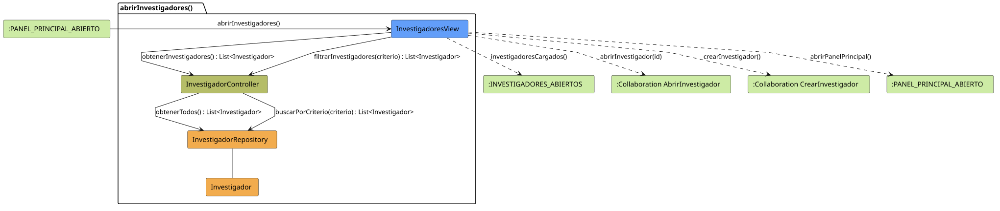

# FUNIBER GIPF > abrirInvestigadores > Análisis

## información del artefacto

- **Proyecto**: FUNIBER GIPF - Plataforma Interna de Investigación
- **Fase**: Análisis
- **Disciplina**: Análisis y Diseño
- **Versión**: 1.0
- **Fecha**: 2026-05-23
- **Autor**: Diego Martínez

## propósito

Análisis de colaboración del caso de uso `abrirInvestigadores()` mediante el patrón MVC, identificando las clases de análisis, sus responsabilidades y colaboraciones necesarias para que el coordinador consulte el listado de investigadores de la plataforma, con opción de filtrado por criterio.

## diagrama de colaboración

||
|-|
|Código fuente: [abrirInvestigadores.puml](../../../modelosUML/analisis/coordinador/abrirInvestigadores.puml)|

## clases de análisis identificadas

### clases de vista (boundary)

#### InvestigadoresView
**Estereotipo**: Vista (Boundary)  
**Responsabilidades**:
- Recibir la solicitud `abrirInvestigadores()` desde `:PANEL_PRINCIPAL_ABIERTO`
- Solicitar al controlador el listado completo de investigadores mediante `obtenerInvestigadores()`
- Solicitar al controlador la lista filtrada mediante `filtrarInvestigadores(criterio)`
- Mostrar el listado resultante al coordinador
- Ofrecer navegación al perfil de un investigador, crear investigador o volver al panel principal

**Colaboraciones**:
- **Entrada**: Desde `:PANEL_PRINCIPAL_ABIERTO` con `abrirInvestigadores()`
- **Control**: Se comunica con `InvestigadorController` mediante `obtenerInvestigadores() : List<Investigador>` y `filtrarInvestigadores(criterio) : List<Investigador>`
- **Salida**: Transita a `:INVESTIGADORES_ABIERTOS` (`investigadoresCargados()`), a `:Collaboration AbrirInvestigador` (`abrirInvestigador(id)`), a `:Collaboration CrearInvestigador` (`crearInvestigador()`) o a `:PANEL_PRINCIPAL_ABIERTO` (`abrirPanelPrincipal()`)

### clases de control

#### InvestigadorController
**Estereotipo**: Control  
**Responsabilidades**:
- Recibir `obtenerInvestigadores()` y devolver la lista completa
- Recibir `filtrarInvestigadores(criterio)` y devolver la lista filtrada

**Colaboraciones**:
- **Vista**: Responde a solicitudes de `InvestigadoresView`
- **Repositorio**: Delega el acceso a datos a `InvestigadorRepository` mediante `obtenerTodos()` y `buscarPorCriterio(criterio)`

### clases de entidad (entity)

#### InvestigadorRepository
**Estereotipo**: Entidad  
**Responsabilidades**:
- Recuperar todos los investigadores mediante `obtenerTodos() : List<Investigador>`
- Recuperar investigadores filtrados mediante `buscarPorCriterio(criterio) : List<Investigador>`

**Colaboraciones**:
- **Control**: Responde a `InvestigadorController`
- **Entidad**: Gestiona instancias de `Investigador`

#### Investigador
**Estereotipo**: Entidad  
**Responsabilidades**:
- Representar los datos de un investigador de la red FUNIBER

**Colaboraciones**:
- **Repositorio**: Es gestionado por `InvestigadorRepository`

## flujo de colaboración

### secuencia de operaciones

1. El sistema está en `:PANEL_PRINCIPAL_ABIERTO`
2. El coordinador solicita ver investigadores: `InvestigadoresView` recibe `abrirInvestigadores()`
3. `InvestigadoresView` invoca `obtenerInvestigadores()` en `InvestigadorController`
4. `InvestigadorController` delega en `InvestigadorRepository.obtenerTodos()` y obtiene `List<Investigador>`
5. El listado se muestra → estado `:INVESTIGADORES_ABIERTOS` con `investigadoresCargados()`
6. El coordinador puede filtrar: `InvestigadoresView` invoca `filtrarInvestigadores(criterio)` en `InvestigadorController`, que delega en `InvestigadorRepository.buscarPorCriterio(criterio)`
7. Desde la vista el coordinador puede:
   - Abrir un investigador → `:Collaboration AbrirInvestigador` con `abrirInvestigador(id)`
   - Crear un investigador → `:Collaboration CrearInvestigador` con `crearInvestigador()`
   - Volver al panel principal → `:PANEL_PRINCIPAL_ABIERTO` con `abrirPanelPrincipal()`

## correspondencia con requisitos

|Requisito del caso de uso|Clase responsable|Método/Colaboración|
|-|-|-|
|Mostrar listado de investigadores|`InvestigadoresView`|`obtenerInvestigadores() : List<Investigador>`|
|Filtrar investigadores por criterio|`InvestigadorController`|`filtrarInvestigadores(criterio) : List<Investigador>`|
|Acceder a todos los investigadores|`InvestigadorRepository`|`obtenerTodos() : List<Investigador>`|
|Buscar investigadores por criterio|`InvestigadorRepository`|`buscarPorCriterio(criterio) : List<Investigador>`|
|Navegar al perfil de un investigador|`InvestigadoresView`|`abrirInvestigador(id)`|
|Navegar a crear investigador|`InvestigadoresView`|`crearInvestigador()`|
|Volver al panel principal|`InvestigadoresView`|`abrirPanelPrincipal()`|

## características del análisis

### separación de responsabilidades MVC

- **Vista**: Solo presentación e interacción con el coordinador
- **Control**: Solo coordinación, obtención y filtrado del listado de investigadores
- **Entidad**: Solo datos y reglas de negocio de los investigadores

### agnóstico tecnológicamente

- No especifica tecnología de interfaz de usuario
- No asume implementación específica de base de datos
- Mantiene independencia de frameworks

### trazabilidad completa

- **Origen**: Caso de uso detallado `abrirInvestigadores()`
- **Destino**: Base para diseño arquitectónico
- **Conexión**: Diagrama de estados → Análisis de colaboración

## patrones aplicados

### repository pattern
`InvestigadorRepository` abstrae el acceso a datos, permitiendo diferentes implementaciones sin afectar al controlador.

### mvc pattern
Separación clara entre presentación (`InvestigadoresView`), lógica de aplicación (`InvestigadorController`) y datos (`Investigador`, `InvestigadorRepository`).

## referencias

- [Especificación detallada: abrirInvestigadores()](../../../context/casosDeUso/detalle/coordinador/abrirInvestigadores/abrirInvestigadores.md)
- [Modelo del dominio](../../../context/modeloDelDominio/modeloDominio.md)
