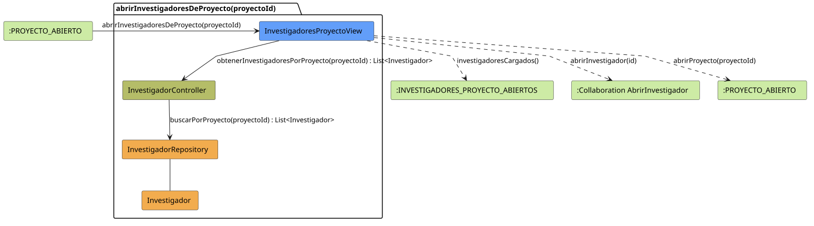

# FUNIBER GIPF > abrirInvestigadoresDeProyecto > Análisis

## información del artefacto

- **Proyecto**: FUNIBER GIPF - Plataforma Interna de Investigación
- **Fase**: Análisis
- **Disciplina**: Análisis y Diseño
- **Versión**: 1.0
- **Fecha**: 2026-05-23
- **Autor**: Diego Martínez

## propósito

Análisis de colaboración del caso de uso `abrirInvestigadoresDeProyecto(proyectoId)` mediante el patrón MVC, identificando las clases de análisis, sus responsabilidades y colaboraciones necesarias para que el coordinador consulte el listado de investigadores asignados a un proyecto concreto.

## diagrama de colaboración

||
|-|
|Código fuente: [abrirInvestigadoresDeProyecto.puml](../../../modelosUML/analisis/coordinador/abrirInvestigadoresDeProyecto.puml)|

## clases de análisis identificadas

### clases de vista (boundary)

#### InvestigadoresProyectoView
**Estereotipo**: Vista (Boundary)  
**Responsabilidades**:
- Recibir la solicitud `abrirInvestigadoresDeProyecto(proyectoId)` desde `:PROYECTO_ABIERTO`
- Solicitar al controlador el listado de investigadores del proyecto mediante `obtenerInvestigadoresPorProyecto(proyectoId) : List<Investigador>`
- Mostrar el listado al coordinador
- Ofrecer navegación al perfil de un investigador concreto o volver al proyecto

**Colaboraciones**:
- **Entrada**: Desde `:PROYECTO_ABIERTO` con `abrirInvestigadoresDeProyecto(proyectoId)`
- **Control**: Se comunica con `InvestigadorController` mediante `obtenerInvestigadoresPorProyecto(proyectoId) : List<Investigador>`
- **Salida**: Transita a `:INVESTIGADORES_PROYECTO_ABIERTOS` (`investigadoresCargados()`), a `:Collaboration AbrirInvestigador` (`abrirInvestigador(id)`) o a `:PROYECTO_ABIERTO` (`abrirProyecto(proyectoId)`)

### clases de control

#### InvestigadorController
**Estereotipo**: Control  
**Responsabilidades**:
- Recibir la petición `obtenerInvestigadoresPorProyecto(proyectoId)` y devolver la lista filtrada
- Delegar en el repositorio la búsqueda por proyecto

**Colaboraciones**:
- **Vista**: Responde a solicitudes de `InvestigadoresProyectoView`
- **Repositorio**: Delega el acceso a datos a `InvestigadorRepository` mediante `buscarPorProyecto(proyectoId) : List<Investigador>`

### clases de entidad (entity)

#### InvestigadorRepository
**Estereotipo**: Entidad  
**Responsabilidades**:
- Recuperar investigadores filtrados por proyecto mediante `buscarPorProyecto(proyectoId) : List<Investigador>`

**Colaboraciones**:
- **Control**: Responde a `InvestigadorController`
- **Entidad**: Gestiona instancias de `Investigador`

#### Investigador
**Estereotipo**: Entidad  
**Responsabilidades**:
- Representar los datos de un investigador de la red FUNIBER

**Colaboraciones**:
- **Repositorio**: Es gestionado por `InvestigadorRepository`

## flujo de colaboración

### secuencia de operaciones

1. El sistema está en `:PROYECTO_ABIERTO`
2. El coordinador solicita ver los investigadores del proyecto: `InvestigadoresProyectoView` recibe `abrirInvestigadoresDeProyecto(proyectoId)`
3. `InvestigadoresProyectoView` invoca `obtenerInvestigadoresPorProyecto(proyectoId)` en `InvestigadorController`
4. `InvestigadorController` delega en `InvestigadorRepository.buscarPorProyecto(proyectoId)` y obtiene `List<Investigador>`
5. El listado se muestra → estado `:INVESTIGADORES_PROYECTO_ABIERTOS` con `investigadoresCargados()`
6. Desde la vista el coordinador puede:
   - Abrir un investigador → `:Collaboration AbrirInvestigador` con `abrirInvestigador(id)`
   - Volver al proyecto → `:PROYECTO_ABIERTO` con `abrirProyecto(proyectoId)`

## correspondencia con requisitos

|Requisito del caso de uso|Clase responsable|Método/Colaboración|
|-|-|-|
|Mostrar investigadores de un proyecto|`InvestigadoresProyectoView`|`obtenerInvestigadoresPorProyecto(proyectoId) : List<Investigador>`|
|Recuperar investigadores por proyecto|`InvestigadorController`|`obtenerInvestigadoresPorProyecto(proyectoId) : List<Investigador>`|
|Acceder a datos filtrados por proyecto|`InvestigadorRepository`|`buscarPorProyecto(proyectoId) : List<Investigador>`|
|Navegar al perfil de un investigador|`InvestigadoresProyectoView`|`abrirInvestigador(id)`|
|Volver al proyecto|`InvestigadoresProyectoView`|`abrirProyecto(proyectoId)`|

## características del análisis

### separación de responsabilidades MVC

- **Vista**: Solo presentación e interacción con el coordinador
- **Control**: Solo coordinación y recuperación del listado filtrado por proyecto
- **Entidad**: Solo datos y reglas de negocio de los investigadores

### agnóstico tecnológicamente

- No especifica tecnología de interfaz de usuario
- No asume implementación específica de base de datos
- Mantiene independencia de frameworks

### trazabilidad completa

- **Origen**: Caso de uso detallado `abrirInvestigadoresDeProyecto(proyectoId)`
- **Destino**: Base para diseño arquitectónico
- **Conexión**: Diagrama de estados → Análisis de colaboración

## patrones aplicados

### repository pattern
`InvestigadorRepository` abstrae el acceso a datos, permitiendo diferentes implementaciones sin afectar al controlador.

### mvc pattern
Separación clara entre presentación (`InvestigadoresProyectoView`), lógica de aplicación (`InvestigadorController`) y datos (`Investigador`, `InvestigadorRepository`).

## referencias

- [Especificación detallada: abrirInvestigadoresDeProyecto()](../../../context/casosDeUso/detalle/coordinador/abrirInvestigadoresDeProyecto/abrirInvestigadoresDeProyecto.md)
- [Modelo del dominio](../../../context/modeloDelDominio/modeloDominio.md)
