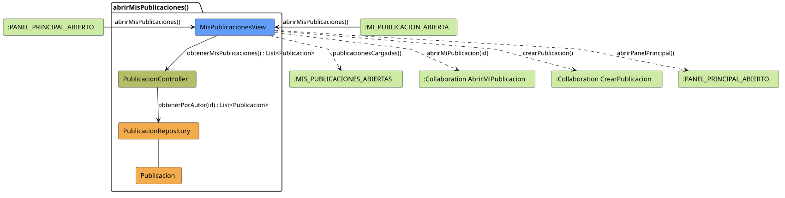

# FUNIBER GIPF > abrirMisPublicaciones > Análisis

## información del artefacto

- **Proyecto**: FUNIBER GIPF - Plataforma Interna de Investigación
- **Fase**: Análisis
- **Disciplina**: Análisis y Diseño
- **Versión**: 1.0
- **Fecha**: 2026-05-23
- **Autor**: Diego Martínez

## propósito

Análisis de colaboración del caso de uso `abrirMisPublicaciones()` mediante el patrón MVC, identificando las clases de análisis, sus responsabilidades y colaboraciones necesarias para que el coordinador consulte el listado de sus propias publicaciones.

## diagrama de colaboración

||
|-|
|Código fuente: [abrirMisPublicaciones.puml](../../../modelosUML/analisis/coordinador/abrirMisPublicaciones.puml)|

## clases de análisis identificadas

### clases de vista (boundary)

#### MisPublicacionesView
**Estereotipo**: Vista (Boundary)  
**Responsabilidades**:
- Recibir la solicitud `abrirMisPublicaciones()` desde `:PANEL_PRINCIPAL_ABIERTO` o `:MI_PUBLICACION_ABIERTA`
- Solicitar al controlador el listado de publicaciones propias mediante `obtenerMisPublicaciones() : List<Publicacion>`
- Mostrar el listado al coordinador
- Ofrecer navegación a una publicación concreta, crear nueva publicación o volver al panel principal

**Colaboraciones**:
- **Entrada**: Desde `:PANEL_PRINCIPAL_ABIERTO` o `:MI_PUBLICACION_ABIERTA` con `abrirMisPublicaciones()`
- **Control**: Se comunica con `PublicacionController` mediante `obtenerMisPublicaciones() : List<Publicacion>`
- **Salida**: Transita a `:MIS_PUBLICACIONES_ABIERTAS` (`publicacionesCargadas()`), a `:Collaboration AbrirMiPublicacion` (`abrirMiPublicacion(id)`), a `:Collaboration CrearPublicacion` (`crearPublicacion()`) o a `:PANEL_PRINCIPAL_ABIERTO` (`abrirPanelPrincipal()`)

### clases de control

#### PublicacionController
**Estereotipo**: Control  
**Responsabilidades**:
- Recibir la petición `obtenerMisPublicaciones()` y devolver las publicaciones del autor
- Delegar en el repositorio la búsqueda por autor

**Colaboraciones**:
- **Vista**: Responde a solicitudes de `MisPublicacionesView`
- **Repositorio**: Delega el acceso a datos a `PublicacionRepository` mediante `obtenerPorAutor(id) : List<Publicacion>`

### clases de entidad (entity)

#### PublicacionRepository
**Estereotipo**: Entidad  
**Responsabilidades**:
- Recuperar las publicaciones de un autor concreto mediante `obtenerPorAutor(id) : List<Publicacion>`

**Colaboraciones**:
- **Control**: Responde a `PublicacionController`
- **Entidad**: Gestiona instancias de `Publicacion`

#### Publicacion
**Estereotipo**: Entidad  
**Responsabilidades**:
- Representar los datos de una publicación del coordinador

**Colaboraciones**:
- **Repositorio**: Es gestionado por `PublicacionRepository`

## flujo de colaboración

### secuencia de operaciones

1. El sistema está en `:PANEL_PRINCIPAL_ABIERTO` o en `:MI_PUBLICACION_ABIERTA`
2. El coordinador solicita ver sus publicaciones: `MisPublicacionesView` recibe `abrirMisPublicaciones()`
3. `MisPublicacionesView` invoca `obtenerMisPublicaciones()` en `PublicacionController`
4. `PublicacionController` delega en `PublicacionRepository.obtenerPorAutor(id)` y obtiene `List<Publicacion>`
5. El listado se muestra → estado `:MIS_PUBLICACIONES_ABIERTAS` con `publicacionesCargadas()`
6. Desde la vista el coordinador puede:
   - Abrir una publicación → `:Collaboration AbrirMiPublicacion` con `abrirMiPublicacion(id)`
   - Crear nueva publicación → `:Collaboration CrearPublicacion` con `crearPublicacion()`
   - Volver al panel principal → `:PANEL_PRINCIPAL_ABIERTO` con `abrirPanelPrincipal()`

## correspondencia con requisitos

|Requisito del caso de uso|Clase responsable|Método/Colaboración|
|-|-|-|
|Mostrar listado de publicaciones propias|`MisPublicacionesView`|`obtenerMisPublicaciones() : List<Publicacion>`|
|Recuperar publicaciones por autor|`PublicacionController`|`obtenerMisPublicaciones() : List<Publicacion>`|
|Acceder a publicaciones del autor|`PublicacionRepository`|`obtenerPorAutor(id) : List<Publicacion>`|
|Navegar al detalle de una publicación|`MisPublicacionesView`|`abrirMiPublicacion(id)`|
|Navegar a crear publicación|`MisPublicacionesView`|`crearPublicacion()`|
|Volver al panel principal|`MisPublicacionesView`|`abrirPanelPrincipal()`|

## características del análisis

### separación de responsabilidades MVC

- **Vista**: Solo presentación e interacción con el coordinador
- **Control**: Solo coordinación y recuperación de publicaciones del autor
- **Entidad**: Solo datos y reglas de negocio de las publicaciones

### agnóstico tecnológicamente

- No especifica tecnología de interfaz de usuario
- No asume implementación específica de base de datos
- Mantiene independencia de frameworks

### trazabilidad completa

- **Origen**: Caso de uso detallado `abrirMisPublicaciones()`
- **Destino**: Base para diseño arquitectónico
- **Conexión**: Diagrama de estados → Análisis de colaboración

## patrones aplicados

### repository pattern
`PublicacionRepository` abstrae el acceso a datos, permitiendo diferentes implementaciones sin afectar al controlador.

### mvc pattern
Separación clara entre presentación (`MisPublicacionesView`), lógica de aplicación (`PublicacionController`) y datos (`Publicacion`, `PublicacionRepository`).

## referencias

- [Especificación detallada: abrirMisPublicaciones()](../../../context/casosDeUso/detalle/coordinador/abrirMisPublicaciones/abrirMisPublicaciones.md)
- [Modelo del dominio](../../../context/modeloDelDominio/modeloDominio.md)
