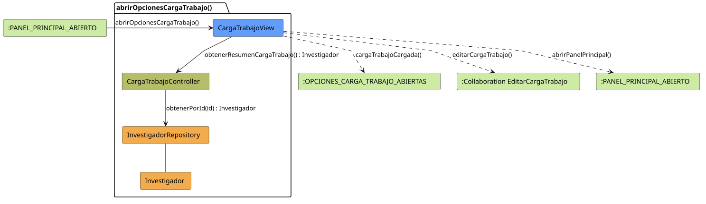

# FUNIBER GIPF > abrirOpcionesCargaTrabajo > Análisis

## información del artefacto

- **Proyecto**: FUNIBER GIPF - Plataforma Interna de Investigación
- **Fase**: Análisis
- **Disciplina**: Análisis y Diseño
- **Versión**: 1.0
- **Fecha**: 2026-05-23
- **Autor**: Diego Martínez

## propósito

Análisis de colaboración del caso de uso `abrirOpcionesCargaTrabajo()` mediante el patrón MVC, identificando las clases de análisis, sus responsabilidades y colaboraciones necesarias para que el coordinador consulte el resumen de carga de trabajo de un investigador y acceda a las opciones de edición.

## diagrama de colaboración

||
|-|
|Código fuente: [abrirOpcionesCargaTrabajo.puml](../../../modelosUML/analisis/coordinador/abrirOpcionesCargaTrabajo.puml)|

## clases de análisis identificadas

### clases de vista (boundary)

#### CargaTrabajoView
**Estereotipo**: Vista (Boundary)  
**Responsabilidades**:
- Recibir la solicitud `abrirOpcionesCargaTrabajo()` desde `:PANEL_PRINCIPAL_ABIERTO`
- Solicitar al controlador el resumen de carga de trabajo mediante `obtenerResumenCargaTrabajo() : Investigador`
- Mostrar el resumen al coordinador
- Ofrecer la opción de editar la carga de trabajo o volver al panel principal

**Colaboraciones**:
- **Entrada**: Desde `:PANEL_PRINCIPAL_ABIERTO` con `abrirOpcionesCargaTrabajo()`
- **Control**: Se comunica con `CargaTrabajoController` mediante `obtenerResumenCargaTrabajo() : Investigador`
- **Salida**: Transita a `:OPCIONES_CARGA_TRABAJO_ABIERTAS` (`cargaTrabajoCargada()`), a `:Collaboration EditarCargaTrabajo` (`editarCargaTrabajo()`) o a `:PANEL_PRINCIPAL_ABIERTO` (`abrirPanelPrincipal()`)

### clases de control

#### CargaTrabajoController
**Estereotipo**: Control  
**Responsabilidades**:
- Recibir la petición `obtenerResumenCargaTrabajo()` desde la vista
- Delegar la recuperación del investigador al repositorio mediante `obtenerPorId(id)`

**Colaboraciones**:
- **Vista**: Responde a solicitudes de `CargaTrabajoView`
- **Repositorio**: Delega el acceso a datos a `InvestigadorRepository` mediante `obtenerPorId(id) : Investigador`

### clases de entidad (entity)

#### InvestigadorRepository
**Estereotipo**: Entidad  
**Responsabilidades**:
- Recuperar un investigador concreto por su identificador mediante `obtenerPorId(id) : Investigador`

**Colaboraciones**:
- **Control**: Responde a `CargaTrabajoController`
- **Entidad**: Gestiona instancias de `Investigador`

#### Investigador
**Estereotipo**: Entidad  
**Responsabilidades**:
- Representar los datos del investigador incluyendo su información de carga de trabajo

**Colaboraciones**:
- **Repositorio**: Es gestionado por `InvestigadorRepository`

## flujo de colaboración

### secuencia de operaciones

1. El sistema está en `:PANEL_PRINCIPAL_ABIERTO`
2. El coordinador solicita ver opciones de carga de trabajo: `CargaTrabajoView` recibe `abrirOpcionesCargaTrabajo()`
3. `CargaTrabajoView` invoca `obtenerResumenCargaTrabajo()` en `CargaTrabajoController`
4. `CargaTrabajoController` delega en `InvestigadorRepository.obtenerPorId(id)` y obtiene un objeto `Investigador`
5. `CargaTrabajoView` muestra el resumen → estado `:OPCIONES_CARGA_TRABAJO_ABIERTAS` con `cargaTrabajoCargada()`
6. Desde la vista el coordinador puede:
   - Editar la carga de trabajo → `:Collaboration EditarCargaTrabajo` con `editarCargaTrabajo()`
   - Volver al panel principal → `:PANEL_PRINCIPAL_ABIERTO` con `abrirPanelPrincipal()`

## correspondencia con requisitos

|Requisito del caso de uso|Clase responsable|Método/Colaboración|
|-|-|-|
|Mostrar resumen de carga de trabajo|`CargaTrabajoView`|`obtenerResumenCargaTrabajo() : Investigador`|
|Recuperar datos del investigador|`CargaTrabajoController`|`obtenerResumenCargaTrabajo() : Investigador`|
|Acceder a datos del investigador|`InvestigadorRepository`|`obtenerPorId(id) : Investigador`|
|Navegar a editar carga de trabajo|`CargaTrabajoView`|`editarCargaTrabajo()`|
|Volver al panel principal|`CargaTrabajoView`|`abrirPanelPrincipal()`|

## características del análisis

### separación de responsabilidades MVC

- **Vista**: Solo presentación e interacción con el coordinador
- **Control**: Solo coordinación y recuperación del resumen de carga de trabajo
- **Entidad**: Solo datos y reglas de negocio de los investigadores

### agnóstico tecnológicamente

- No especifica tecnología de interfaz de usuario
- No asume implementación específica de base de datos
- Mantiene independencia de frameworks

### trazabilidad completa

- **Origen**: Caso de uso detallado `abrirOpcionesCargaTrabajo()`
- **Destino**: Base para diseño arquitectónico
- **Conexión**: Diagrama de estados → Análisis de colaboración

## patrones aplicados

### repository pattern
`InvestigadorRepository` abstrae el acceso a datos, permitiendo diferentes implementaciones sin afectar al controlador.

### mvc pattern
Separación clara entre presentación (`CargaTrabajoView`), lógica de aplicación (`CargaTrabajoController`) y datos (`Investigador`, `InvestigadorRepository`).

## referencias

- [Especificación detallada: abrirOpcionesCargaTrabajo()](../../../context/casosDeUso/detalle/coordinador/abrirOpcionesCargaTrabajo/abrirOpcionesCargaTrabajo.md)
- [Modelo del dominio](../../../context/modeloDelDominio/modeloDominio.md)
