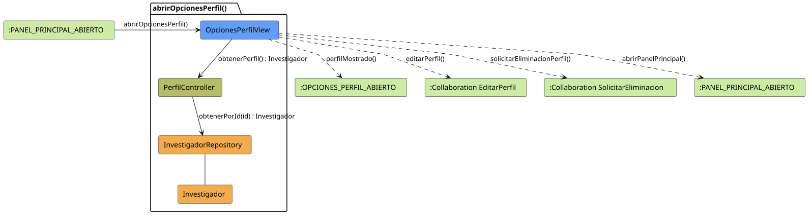

# FUNIBER GIPF > abrirOpcionesPerfil > Análisis

## información del artefacto

- **Proyecto**: FUNIBER GIPF - Plataforma Interna de Investigación
- **Fase**: Análisis
- **Disciplina**: Análisis y Diseño
- **Versión**: 1.0
- **Fecha**: 2026-05-23
- **Autor**: Diego Martínez

## propósito

Análisis de colaboración del caso de uso `abrirOpcionesPerfil()` mediante el patrón MVC, identificando las clases de análisis, sus responsabilidades y colaboraciones necesarias para que el coordinador consulte su propio perfil y acceda a las opciones de edición o solicitud de eliminación.

## diagrama de colaboración

||
|-|
|Código fuente: [abrirOpcionesPerfil.puml](../../../modelosUML/analisis/coordinador/abrirOpcionesPerfil.puml)|

## clases de análisis identificadas

### clases de vista (boundary)

#### OpcionesPerfilView
**Estereotipo**: Vista (Boundary)  
**Responsabilidades**:
- Recibir la solicitud `abrirOpcionesPerfil()` desde `:PANEL_PRINCIPAL_ABIERTO`
- Solicitar al controlador los datos del perfil propio mediante `obtenerPerfil() : Investigador`
- Mostrar el perfil al coordinador
- Ofrecer las opciones de editar perfil, solicitar eliminación del perfil o volver al panel principal

**Colaboraciones**:
- **Entrada**: Desde `:PANEL_PRINCIPAL_ABIERTO` con `abrirOpcionesPerfil()`
- **Control**: Se comunica con `PerfilController` mediante `obtenerPerfil() : Investigador`
- **Salida**: Transita a `:OPCIONES_PERFIL_ABIERTO` (`perfilMostrado()`), a `:Collaboration EditarPerfil` (`editarPerfil()`), a `:Collaboration SolicitarEliminacion` (`solicitarEliminacionPerfil()`) o a `:PANEL_PRINCIPAL_ABIERTO` (`abrirPanelPrincipal()`)

### clases de control

#### PerfilController
**Estereotipo**: Control  
**Responsabilidades**:
- Recibir la petición `obtenerPerfil()` desde la vista
- Delegar la recuperación del investigador al repositorio mediante `obtenerPorId(id)`

**Colaboraciones**:
- **Vista**: Responde a solicitudes de `OpcionesPerfilView`
- **Repositorio**: Delega el acceso a datos a `InvestigadorRepository` mediante `obtenerPorId(id) : Investigador`

### clases de entidad (entity)

#### InvestigadorRepository
**Estereotipo**: Entidad  
**Responsabilidades**:
- Recuperar un investigador concreto por su identificador mediante `obtenerPorId(id) : Investigador`

**Colaboraciones**:
- **Control**: Responde a `PerfilController`
- **Entidad**: Gestiona instancias de `Investigador`

#### Investigador
**Estereotipo**: Entidad  
**Responsabilidades**:
- Representar los datos de perfil del coordinador

**Colaboraciones**:
- **Repositorio**: Es gestionado por `InvestigadorRepository`

## flujo de colaboración

### secuencia de operaciones

1. El sistema está en `:PANEL_PRINCIPAL_ABIERTO`
2. El coordinador solicita ver su perfil: `OpcionesPerfilView` recibe `abrirOpcionesPerfil()`
3. `OpcionesPerfilView` invoca `obtenerPerfil()` en `PerfilController`
4. `PerfilController` delega en `InvestigadorRepository.obtenerPorId(id)` y obtiene un objeto `Investigador`
5. `OpcionesPerfilView` muestra el perfil → estado `:OPCIONES_PERFIL_ABIERTO` con `perfilMostrado()`
6. Desde la vista el coordinador puede:
   - Editar su perfil → `:Collaboration EditarPerfil` con `editarPerfil()`
   - Solicitar eliminación → `:Collaboration SolicitarEliminacion` con `solicitarEliminacionPerfil()`
   - Volver al panel principal → `:PANEL_PRINCIPAL_ABIERTO` con `abrirPanelPrincipal()`

## correspondencia con requisitos

|Requisito del caso de uso|Clase responsable|Método/Colaboración|
|-|-|-|
|Mostrar perfil propio del coordinador|`OpcionesPerfilView`|`obtenerPerfil() : Investigador`|
|Recuperar datos del perfil|`PerfilController`|`obtenerPerfil() : Investigador`|
|Acceder a datos del investigador|`InvestigadorRepository`|`obtenerPorId(id) : Investigador`|
|Navegar a editar perfil|`OpcionesPerfilView`|`editarPerfil()`|
|Navegar a solicitar eliminación de perfil|`OpcionesPerfilView`|`solicitarEliminacionPerfil()`|
|Volver al panel principal|`OpcionesPerfilView`|`abrirPanelPrincipal()`|

## características del análisis

### separación de responsabilidades MVC

- **Vista**: Solo presentación e interacción con el coordinador
- **Control**: Solo coordinación y recuperación del perfil propio
- **Entidad**: Solo datos y reglas de negocio de los investigadores

### agnóstico tecnológicamente

- No especifica tecnología de interfaz de usuario
- No asume implementación específica de base de datos
- Mantiene independencia de frameworks

### trazabilidad completa

- **Origen**: Caso de uso detallado `abrirOpcionesPerfil()`
- **Destino**: Base para diseño arquitectónico
- **Conexión**: Diagrama de estados → Análisis de colaboración

## patrones aplicados

### repository pattern
`InvestigadorRepository` abstrae el acceso a datos, permitiendo diferentes implementaciones sin afectar al controlador.

### mvc pattern
Separación clara entre presentación (`OpcionesPerfilView`), lógica de aplicación (`PerfilController`) y datos (`Investigador`, `InvestigadorRepository`).

## referencias

- [Especificación detallada: abrirOpcionesPerfil()](../../../context/casosDeUso/detalle/coordinador/abrirOpcionesPerfil/abrirOpcionesPerfil.md)
- [Modelo del dominio](../../../context/modeloDelDominio/modeloDominio.md)
