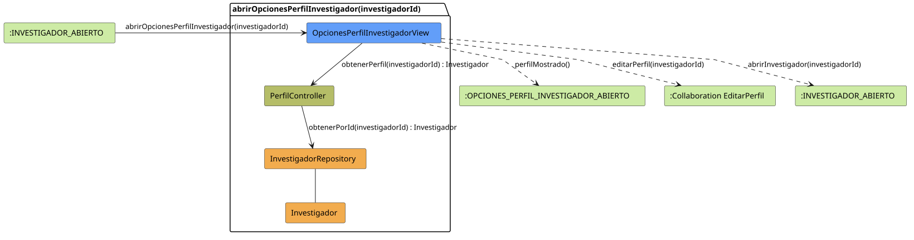

# FUNIBER GIPF > abrirOpcionesPerfilInvestigador > Análisis

## información del artefacto

- **Proyecto**: FUNIBER GIPF - Plataforma Interna de Investigación
- **Fase**: Análisis
- **Disciplina**: Análisis y Diseño
- **Versión**: 1.0
- **Fecha**: 2026-05-23
- **Autor**: Diego Martínez

## propósito

Análisis de colaboración del caso de uso `abrirOpcionesPerfilInvestigador(investigadorId)` mediante el patrón MVC, identificando las clases de análisis, sus responsabilidades y colaboraciones necesarias para que el coordinador consulte el perfil de un investigador concreto y acceda a las opciones de edición de ese perfil.

## diagrama de colaboración

||
|-|
|Código fuente: [abrirOpcionesPerfilInvestigador.puml](../../../modelosUML/analisis/coordinador/abrirOpcionesPerfilInvestigador.puml)|

## clases de análisis identificadas

### clases de vista (boundary)

#### OpcionesPerfilInvestigadorView
**Estereotipo**: Vista (Boundary)  
**Responsabilidades**:
- Recibir la solicitud `abrirOpcionesPerfilInvestigador(investigadorId)` desde `:INVESTIGADOR_ABIERTO`
- Solicitar al controlador los datos del perfil del investigador mediante `obtenerPerfil(investigadorId) : Investigador`
- Mostrar el perfil del investigador al coordinador
- Ofrecer las opciones de editar el perfil del investigador o volver al perfil del investigador

**Colaboraciones**:
- **Entrada**: Desde `:INVESTIGADOR_ABIERTO` con `abrirOpcionesPerfilInvestigador(investigadorId)`
- **Control**: Se comunica con `PerfilController` mediante `obtenerPerfil(investigadorId) : Investigador`
- **Salida**: Transita a `:OPCIONES_PERFIL_INVESTIGADOR_ABIERTO` (`perfilMostrado()`), a `:Collaboration EditarPerfil` (`editarPerfil(investigadorId)`) o a `:INVESTIGADOR_ABIERTO` (`abrirInvestigador(investigadorId)`)

### clases de control

#### PerfilController
**Estereotipo**: Control  
**Responsabilidades**:
- Recibir la petición `obtenerPerfil(investigadorId)` desde la vista
- Delegar la recuperación del investigador al repositorio mediante `obtenerPorId(investigadorId)`

**Colaboraciones**:
- **Vista**: Responde a solicitudes de `OpcionesPerfilInvestigadorView`
- **Repositorio**: Delega el acceso a datos a `InvestigadorRepository` mediante `obtenerPorId(investigadorId) : Investigador`

### clases de entidad (entity)

#### InvestigadorRepository
**Estereotipo**: Entidad  
**Responsabilidades**:
- Recuperar un investigador concreto por su identificador mediante `obtenerPorId(investigadorId) : Investigador`

**Colaboraciones**:
- **Control**: Responde a `PerfilController`
- **Entidad**: Gestiona instancias de `Investigador`

#### Investigador
**Estereotipo**: Entidad  
**Responsabilidades**:
- Representar los datos de perfil de un investigador

**Colaboraciones**:
- **Repositorio**: Es gestionado por `InvestigadorRepository`

## flujo de colaboración

### secuencia de operaciones

1. El sistema está en `:INVESTIGADOR_ABIERTO`
2. El coordinador solicita ver opciones de perfil del investigador: `OpcionesPerfilInvestigadorView` recibe `abrirOpcionesPerfilInvestigador(investigadorId)`
3. `OpcionesPerfilInvestigadorView` invoca `obtenerPerfil(investigadorId)` en `PerfilController`
4. `PerfilController` delega en `InvestigadorRepository.obtenerPorId(investigadorId)` y obtiene un objeto `Investigador`
5. `OpcionesPerfilInvestigadorView` muestra el perfil → estado `:OPCIONES_PERFIL_INVESTIGADOR_ABIERTO` con `perfilMostrado()`
6. Desde la vista el coordinador puede:
   - Editar el perfil del investigador → `:Collaboration EditarPerfil` con `editarPerfil(investigadorId)`
   - Volver al perfil del investigador → `:INVESTIGADOR_ABIERTO` con `abrirInvestigador(investigadorId)`

## correspondencia con requisitos

|Requisito del caso de uso|Clase responsable|Método/Colaboración|
|-|-|-|
|Mostrar perfil del investigador|`OpcionesPerfilInvestigadorView`|`obtenerPerfil(investigadorId) : Investigador`|
|Recuperar datos del perfil del investigador|`PerfilController`|`obtenerPerfil(investigadorId) : Investigador`|
|Acceder a datos del investigador|`InvestigadorRepository`|`obtenerPorId(investigadorId) : Investigador`|
|Navegar a editar perfil del investigador|`OpcionesPerfilInvestigadorView`|`editarPerfil(investigadorId)`|
|Volver al perfil del investigador|`OpcionesPerfilInvestigadorView`|`abrirInvestigador(investigadorId)`|

## características del análisis

### separación de responsabilidades MVC

- **Vista**: Solo presentación e interacción con el coordinador
- **Control**: Solo coordinación y recuperación del perfil del investigador
- **Entidad**: Solo datos y reglas de negocio de los investigadores

### agnóstico tecnológicamente

- No especifica tecnología de interfaz de usuario
- No asume implementación específica de base de datos
- Mantiene independencia de frameworks

### trazabilidad completa

- **Origen**: Caso de uso detallado `abrirOpcionesPerfilInvestigador(investigadorId)`
- **Destino**: Base para diseño arquitectónico
- **Conexión**: Diagrama de estados → Análisis de colaboración

## patrones aplicados

### repository pattern
`InvestigadorRepository` abstrae el acceso a datos, permitiendo diferentes implementaciones sin afectar al controlador.

### mvc pattern
Separación clara entre presentación (`OpcionesPerfilInvestigadorView`), lógica de aplicación (`PerfilController`) y datos (`Investigador`, `InvestigadorRepository`).

## referencias

- [Especificación detallada: abrirOpcionesPerfilInvestigador()](../../../context/casosDeUso/detalle/coordinador/abrirOpcionesPerfilInvestigador/abrirOpcionesPerfilInvestigador.md)
- [Modelo del dominio](../../../context/modeloDelDominio/modeloDominio.md)
