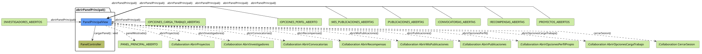

# FUNIBER GIPF > abrirPanelPrincipal > Análisis

## información del artefacto

- **Proyecto**: FUNIBER GIPF - Plataforma Interna de Investigación
- **Fase**: Análisis
- **Disciplina**: Análisis y Diseño
- **Versión**: 1.0
- **Fecha**: 2026-05-23
- **Autor**: Diego Martínez

## propósito

Análisis de colaboración del caso de uso `abrirPanelPrincipal()` mediante el patrón MVC, identificando las clases de análisis, sus responsabilidades y colaboraciones necesarias para que el coordinador acceda al panel principal y navegue a todas las funcionalidades del sistema.

## diagrama de colaboración

||
|-|
|Código fuente: [abrirPanelPrincipal.puml](../../../modelosUML/analisis/coordinador/abrirPanelPrincipal.puml)|

## clases de análisis identificadas

### clases de vista (boundary)

#### PanelPrincipalView
**Estereotipo**: Vista (Boundary)  
**Responsabilidades**:
- Recibir la solicitud `abrirPanelPrincipal()` desde múltiples estados del sistema
- Solicitar al controlador la carga del panel mediante `cargarPanel() : void`
- Mostrar el panel principal al coordinador
- Ofrecer navegación a proyectos, investigadores, convocatorias, recompensas, mis publicaciones, publicaciones, perfil propio, carga de trabajo y cierre de sesión

**Colaboraciones**:
- **Entrada**: Desde `:INVESTIGADORES_ABIERTOS`, `:OPCIONES_CARGA_TRABAJO_ABIERTAS`, `:OPCIONES_PERFIL_ABIERTO`, `:MIS_PUBLICACIONES_ABIERTAS`, `:PUBLICACIONES_ABIERTAS`, `:CONVOCATORIAS_ABIERTAS`, `:RECOMPENSAS_ABIERTAS`, `:PROYECTOS_ABIERTOS` con `abrirPanelPrincipal()`
- **Control**: Se comunica con `PanelController` mediante `cargarPanel() : void`
- **Salida**: Transita a `:PANEL_PRINCIPAL_ABIERTO` (`panelMostrado()`) y ofrece las colaboraciones: `AbrirProyectos`, `AbrirInvestigadores`, `AbrirConvocatorias`, `AbrirRecompensas`, `AbrirMisPublicaciones`, `AbrirPublicaciones`, `AbrirOpcionesPerfilPropio`, `AbrirOpcionesCargaTrabajo`, `CerrarSesion`

### clases de control

#### PanelController
**Estereotipo**: Control  
**Responsabilidades**:
- Recibir la petición `cargarPanel()` desde la vista
- Coordinar la inicialización del estado del panel principal

**Colaboraciones**:
- **Vista**: Responde a solicitudes de `PanelPrincipalView`

## flujo de colaboración

### secuencia de operaciones

1. El sistema está en cualquiera de los estados que permiten volver al panel: `:INVESTIGADORES_ABIERTOS`, `:OPCIONES_CARGA_TRABAJO_ABIERTAS`, `:OPCIONES_PERFIL_ABIERTO`, `:MIS_PUBLICACIONES_ABIERTAS`, `:PUBLICACIONES_ABIERTAS`, `:CONVOCATORIAS_ABIERTAS`, `:RECOMPENSAS_ABIERTAS` o `:PROYECTOS_ABIERTOS`
2. El coordinador solicita volver al panel: `PanelPrincipalView` recibe `abrirPanelPrincipal()`
3. `PanelPrincipalView` invoca `cargarPanel()` en `PanelController`
4. `PanelPrincipalView` muestra el panel → estado `:PANEL_PRINCIPAL_ABIERTO` con `panelMostrado()`
5. Desde el panel el coordinador puede acceder a:
   - Proyectos → `:Collaboration AbrirProyectos` con `abrirProyectos()`
   - Investigadores → `:Collaboration AbrirInvestigadores` con `abrirInvestigadores()`
   - Convocatorias → `:Collaboration AbrirConvocatorias` con `abrirConvocatorias()`
   - Recompensas → `:Collaboration AbrirRecompensas` con `abrirRecompensas()`
   - Mis publicaciones → `:Collaboration AbrirMisPublicaciones` con `abrirMisPublicaciones()`
   - Publicaciones → `:Collaboration AbrirPublicaciones` con `abrirPublicaciones()`
   - Opciones de perfil propio → `:Collaboration AbrirOpcionesPerfilPropio` con `abrirOpcionesPerfil()`
   - Carga de trabajo → `:Collaboration AbrirOpcionesCargaTrabajo` con `abrirOpcionesCargaTrabajo()`
   - Cerrar sesión → `:Collaboration CerrarSesion` con `cerrarSesion()`

## correspondencia con requisitos

|Requisito del caso de uso|Clase responsable|Método/Colaboración|
|-|-|-|
|Mostrar panel principal|`PanelPrincipalView`|`cargarPanel() : void`|
|Navegar a proyectos|`PanelPrincipalView`|`abrirProyectos()`|
|Navegar a investigadores|`PanelPrincipalView`|`abrirInvestigadores()`|
|Navegar a convocatorias|`PanelPrincipalView`|`abrirConvocatorias()`|
|Navegar a recompensas|`PanelPrincipalView`|`abrirRecompensas()`|
|Navegar a mis publicaciones|`PanelPrincipalView`|`abrirMisPublicaciones()`|
|Navegar a publicaciones|`PanelPrincipalView`|`abrirPublicaciones()`|
|Navegar a opciones de perfil|`PanelPrincipalView`|`abrirOpcionesPerfil()`|
|Navegar a carga de trabajo|`PanelPrincipalView`|`abrirOpcionesCargaTrabajo()`|
|Cerrar sesión|`PanelPrincipalView`|`cerrarSesion()`|

## características del análisis

### separación de responsabilidades MVC

- **Vista**: Solo presentación del panel e interacción con el coordinador
- **Control**: Solo coordinación de la carga del panel principal
- **Entidad**: No aplica en este caso de uso (el panel no accede a datos del dominio)

### agnóstico tecnológicamente

- No especifica tecnología de interfaz de usuario
- Mantiene independencia de frameworks

### trazabilidad completa

- **Origen**: Caso de uso detallado `abrirPanelPrincipal()`
- **Destino**: Base para diseño arquitectónico
- **Conexión**: Diagrama de estados → Análisis de colaboración

## patrones aplicados

### mvc pattern
Separación clara entre presentación (`PanelPrincipalView`) y lógica de aplicación (`PanelController`). El panel actúa como hub de navegación hacia el resto del sistema.

## referencias

- [Especificación detallada: abrirPanelPrincipal()](../../../context/casosDeUso/detalle/coordinador/abrirPanelPrincipal/abrirPanelPrincipal.md)
- [Modelo del dominio](../../../context/modeloDelDominio/modeloDominio.md)
