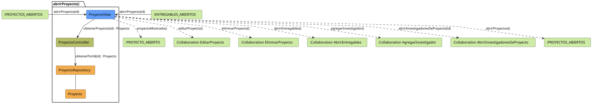

# FUNIBER GIPF > abrirProyecto > Análisis

## información del artefacto

- **Proyecto**: FUNIBER GIPF - Plataforma Interna de Investigación
- **Fase**: Análisis
- **Disciplina**: Análisis y Diseño
- **Versión**: 1.0
- **Fecha**: 2026-05-23
- **Autor**: Diego Martínez

## propósito

Análisis de colaboración del caso de uso `abrirProyecto()` mediante el patrón MVC, identificando las clases de análisis, sus responsabilidades y colaboraciones necesarias para que el coordinador consulte el detalle de un proyecto concreto con todas sus opciones de gestión.

## diagrama de colaboración

||
|-|
|Código fuente: [abrirProyecto.puml](../../../modelosUML/analisis/coordinador/abrirProyecto.puml)|

## clases de análisis identificadas

### clases de vista (boundary)

#### ProyectoView
**Estereotipo**: Vista (Boundary)  
**Responsabilidades**:
- Recibir la solicitud `abrirProyecto(id)` desde `:PROYECTOS_ABIERTOS` o `:ENTREGABLES_ABIERTOS`
- Solicitar al controlador los datos del proyecto mediante `obtenerProyecto(id) : Proyecto`
- Mostrar el detalle del proyecto al coordinador
- Ofrecer las opciones: editar proyecto, eliminar proyecto, abrir entregables, agregar investigador, abrir investigadores del proyecto o volver al listado

**Colaboraciones**:
- **Entrada**: Desde `:PROYECTOS_ABIERTOS` o `:ENTREGABLES_ABIERTOS` con `abrirProyecto(id)`
- **Control**: Se comunica con `ProyectoController` mediante `obtenerProyecto(id) : Proyecto`
- **Salida**: Transita a `:PROYECTO_ABIERTO` (`proyectoMostrado()`), a `:Collaboration EditarProyecto` (`editarProyecto()`), a `:Collaboration EliminarProyecto` (`eliminarProyecto()`), a `:Collaboration AbrirEntregables` (`abrirEntregables()`), a `:Collaboration AgregarInvestigador` (`agregarInvestigador()`), a `:Collaboration AbrirInvestigadoresDeProyecto` (`abrirInvestigadoresDeProyecto(id)`) o a `:PROYECTOS_ABIERTOS` (`abrirProyectos()`)

### clases de control

#### ProyectoController
**Estereotipo**: Control  
**Responsabilidades**:
- Recibir la petición `obtenerProyecto(id)` desde la vista
- Delegar la recuperación del proyecto al repositorio mediante `obtenerPorId(id)`

**Colaboraciones**:
- **Vista**: Responde a solicitudes de `ProyectoView`
- **Repositorio**: Delega el acceso a datos a `ProyectoRepository` mediante `obtenerPorId(id) : Proyecto`

### clases de entidad (entity)

#### ProyectoRepository
**Estereotipo**: Entidad  
**Responsabilidades**:
- Recuperar un proyecto concreto por su identificador mediante `obtenerPorId(id) : Proyecto`

**Colaboraciones**:
- **Control**: Responde a `ProyectoController`
- **Entidad**: Gestiona instancias de `Proyecto`

#### Proyecto
**Estereotipo**: Entidad  
**Responsabilidades**:
- Representar los datos de un proyecto de investigación

**Colaboraciones**:
- **Repositorio**: Es gestionado por `ProyectoRepository`

## flujo de colaboración

### secuencia de operaciones

1. El sistema está en `:PROYECTOS_ABIERTOS` o `:ENTREGABLES_ABIERTOS`
2. El coordinador selecciona un proyecto: `ProyectoView` recibe `abrirProyecto(id)`
3. `ProyectoView` invoca `obtenerProyecto(id)` en `ProyectoController`
4. `ProyectoController` delega en `ProyectoRepository.obtenerPorId(id)` y obtiene un objeto `Proyecto`
5. `ProyectoView` muestra el detalle → estado `:PROYECTO_ABIERTO` con `proyectoMostrado()`
6. Desde la vista el coordinador puede:
   - Editar el proyecto → `:Collaboration EditarProyecto` con `editarProyecto()`
   - Eliminar el proyecto → `:Collaboration EliminarProyecto` con `eliminarProyecto()`
   - Abrir entregables → `:Collaboration AbrirEntregables` con `abrirEntregables()`
   - Agregar investigador → `:Collaboration AgregarInvestigador` con `agregarInvestigador()`
   - Ver investigadores del proyecto → `:Collaboration AbrirInvestigadoresDeProyecto` con `abrirInvestigadoresDeProyecto(id)`
   - Volver al listado → `:PROYECTOS_ABIERTOS` con `abrirProyectos()`

## correspondencia con requisitos

|Requisito del caso de uso|Clase responsable|Método/Colaboración|
|-|-|-|
|Mostrar detalle de un proyecto|`ProyectoView`|`abrirProyecto(id)`|
|Recuperar el proyecto por id|`ProyectoController`|`obtenerProyecto(id) : Proyecto`|
|Acceder a datos del proyecto|`ProyectoRepository`|`obtenerPorId(id) : Proyecto`|
|Navegar a editar proyecto|`ProyectoView`|`editarProyecto()`|
|Navegar a eliminar proyecto|`ProyectoView`|`eliminarProyecto()`|
|Navegar a entregables|`ProyectoView`|`abrirEntregables()`|
|Agregar investigador al proyecto|`ProyectoView`|`agregarInvestigador()`|
|Ver investigadores del proyecto|`ProyectoView`|`abrirInvestigadoresDeProyecto(id)`|
|Volver al listado de proyectos|`ProyectoView`|`abrirProyectos()`|

## características del análisis

### separación de responsabilidades MVC

- **Vista**: Solo presentación e interacción con el coordinador
- **Control**: Solo coordinación y recuperación del objeto `Proyecto`
- **Entidad**: Solo datos y reglas de negocio de los proyectos

### agnóstico tecnológicamente

- No especifica tecnología de interfaz de usuario
- No asume implementación específica de base de datos
- Mantiene independencia de frameworks

### trazabilidad completa

- **Origen**: Caso de uso detallado `abrirProyecto()`
- **Destino**: Base para diseño arquitectónico
- **Conexión**: Diagrama de estados → Análisis de colaboración

## patrones aplicados

### repository pattern
`ProyectoRepository` abstrae el acceso a datos, permitiendo diferentes implementaciones sin afectar al controlador.

### mvc pattern
Separación clara entre presentación (`ProyectoView`), lógica de aplicación (`ProyectoController`) y datos (`Proyecto`, `ProyectoRepository`).

## referencias

- [Especificación detallada: abrirProyecto()](../../../context/casosDeUso/detalle/coordinador/abrirProyecto/abrirProyecto.md)
- [Modelo del dominio](../../../context/modeloDelDominio/modeloDominio.md)
