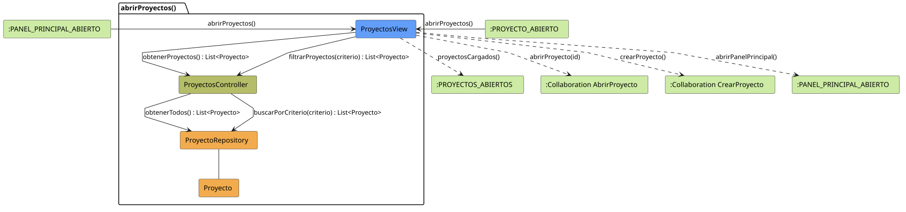

# FUNIBER GIPF > abrirProyectos > Análisis

## información del artefacto

- **Proyecto**: FUNIBER GIPF - Plataforma Interna de Investigación
- **Fase**: Análisis
- **Disciplina**: Análisis y Diseño
- **Versión**: 1.0
- **Fecha**: 2026-05-23
- **Autor**: Diego Martínez

## propósito

Análisis de colaboración del caso de uso `abrirProyectos()` mediante el patrón MVC, identificando las clases de análisis, sus responsabilidades y colaboraciones necesarias para que el coordinador consulte el listado de proyectos de investigación, con opción de filtrado por criterio.

## diagrama de colaboración

||
|-|
|Código fuente: [abrirProyectos.puml](../../../modelosUML/analisis/coordinador/abrirProyectos.puml)|

## clases de análisis identificadas

### clases de vista (boundary)

#### ProyectosView
**Estereotipo**: Vista (Boundary)  
**Responsabilidades**:
- Recibir la solicitud `abrirProyectos()` desde `:PANEL_PRINCIPAL_ABIERTO` o `:PROYECTO_ABIERTO`
- Solicitar al controlador el listado completo de proyectos mediante `obtenerProyectos() : List<Proyecto>`
- Solicitar al controlador el listado filtrado mediante `filtrarProyectos(criterio) : List<Proyecto>`
- Mostrar el listado resultante al coordinador
- Ofrecer navegación a un proyecto concreto, crear proyecto o volver al panel principal

**Colaboraciones**:
- **Entrada**: Desde `:PANEL_PRINCIPAL_ABIERTO` o `:PROYECTO_ABIERTO` con `abrirProyectos()`
- **Control**: Se comunica con `ProyectosController` mediante `obtenerProyectos() : List<Proyecto>` y `filtrarProyectos(criterio) : List<Proyecto>`
- **Salida**: Transita a `:PROYECTOS_ABIERTOS` (`proyectosCargados()`), a `:Collaboration AbrirProyecto` (`abrirProyecto(id)`), a `:Collaboration CrearProyecto` (`crearProyecto()`) o a `:PANEL_PRINCIPAL_ABIERTO` (`abrirPanelPrincipal()`)

### clases de control

#### ProyectosController
**Estereotipo**: Control  
**Responsabilidades**:
- Recibir `obtenerProyectos()` y devolver la lista completa
- Recibir `filtrarProyectos(criterio)` y devolver la lista filtrada

**Colaboraciones**:
- **Vista**: Responde a solicitudes de `ProyectosView`
- **Repositorio**: Delega en `ProyectoRepository` mediante `obtenerTodos()` y `buscarPorCriterio(criterio)`

### clases de entidad (entity)

#### ProyectoRepository
**Estereotipo**: Entidad  
**Responsabilidades**:
- Recuperar todos los proyectos mediante `obtenerTodos() : List<Proyecto>`
- Recuperar proyectos filtrados mediante `buscarPorCriterio(criterio) : List<Proyecto>`

**Colaboraciones**:
- **Control**: Responde a `ProyectosController`
- **Entidad**: Gestiona instancias de `Proyecto`

#### Proyecto
**Estereotipo**: Entidad  
**Responsabilidades**:
- Representar los datos de un proyecto de investigación

**Colaboraciones**:
- **Repositorio**: Es gestionado por `ProyectoRepository`

## flujo de colaboración

### secuencia de operaciones

1. El sistema está en `:PANEL_PRINCIPAL_ABIERTO` o en `:PROYECTO_ABIERTO`
2. El coordinador solicita ver proyectos: `ProyectosView` recibe `abrirProyectos()`
3. `ProyectosView` invoca `obtenerProyectos()` en `ProyectosController`
4. `ProyectosController` delega en `ProyectoRepository.obtenerTodos()` y obtiene `List<Proyecto>`
5. El listado se muestra → estado `:PROYECTOS_ABIERTOS` con `proyectosCargados()`
6. El coordinador puede filtrar: `ProyectosView` invoca `filtrarProyectos(criterio)` en `ProyectosController`, que delega en `ProyectoRepository.buscarPorCriterio(criterio)`
7. Desde la vista el coordinador puede:
   - Abrir un proyecto → `:Collaboration AbrirProyecto` con `abrirProyecto(id)`
   - Crear un proyecto → `:Collaboration CrearProyecto` con `crearProyecto()`
   - Volver al panel principal → `:PANEL_PRINCIPAL_ABIERTO` con `abrirPanelPrincipal()`

## correspondencia con requisitos

|Requisito del caso de uso|Clase responsable|Método/Colaboración|
|-|-|-|
|Mostrar listado de proyectos|`ProyectosView`|`obtenerProyectos() : List<Proyecto>`|
|Filtrar proyectos por criterio|`ProyectosController`|`filtrarProyectos(criterio) : List<Proyecto>`|
|Acceder a todos los proyectos|`ProyectoRepository`|`obtenerTodos() : List<Proyecto>`|
|Buscar proyectos por criterio|`ProyectoRepository`|`buscarPorCriterio(criterio) : List<Proyecto>`|
|Navegar al detalle de un proyecto|`ProyectosView`|`abrirProyecto(id)`|
|Navegar a crear proyecto|`ProyectosView`|`crearProyecto()`|
|Volver al panel principal|`ProyectosView`|`abrirPanelPrincipal()`|

## características del análisis

### separación de responsabilidades MVC

- **Vista**: Solo presentación e interacción con el coordinador
- **Control**: Solo coordinación, obtención y filtrado del listado de proyectos
- **Entidad**: Solo datos y reglas de negocio de los proyectos

### agnóstico tecnológicamente

- No especifica tecnología de interfaz de usuario
- No asume implementación específica de base de datos
- Mantiene independencia de frameworks

### trazabilidad completa

- **Origen**: Caso de uso detallado `abrirProyectos()`
- **Destino**: Base para diseño arquitectónico
- **Conexión**: Diagrama de estados → Análisis de colaboración

## patrones aplicados

### repository pattern
`ProyectoRepository` abstrae el acceso a datos, permitiendo diferentes implementaciones sin afectar al controlador.

### mvc pattern
Separación clara entre presentación (`ProyectosView`), lógica de aplicación (`ProyectosController`) y datos (`Proyecto`, `ProyectoRepository`).

## referencias

- [Especificación detallada: abrirProyectos()](../../../context/casosDeUso/detalle/coordinador/abrirProyectos/abrirProyectos.md)
- [Modelo del dominio](../../../context/modeloDelDominio/modeloDominio.md)
