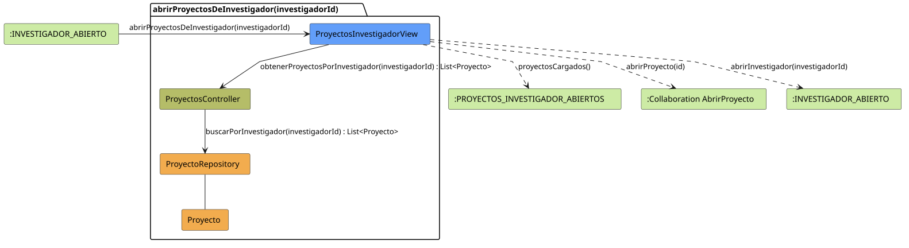

# FUNIBER GIPF > abrirProyectosDeInvestigador > Análisis

## información del artefacto

- **Proyecto**: FUNIBER GIPF - Plataforma Interna de Investigación
- **Fase**: Análisis
- **Disciplina**: Análisis y Diseño
- **Versión**: 1.0
- **Fecha**: 2026-05-23
- **Autor**: Diego Martínez

## propósito

Análisis de colaboración del caso de uso `abrirProyectosDeInvestigador(investigadorId)` mediante el patrón MVC, identificando las clases de análisis, sus responsabilidades y colaboraciones necesarias para que el coordinador consulte los proyectos asociados a un investigador concreto.

## diagrama de colaboración

||
|-|
|Código fuente: [abrirProyectosDeInvestigador.puml](../../../modelosUML/analisis/coordinador/abrirProyectosDeInvestigador.puml)|

## clases de análisis identificadas

### clases de vista (boundary)

#### ProyectosInvestigadorView
**Estereotipo**: Vista (Boundary)  
**Responsabilidades**:
- Recibir la solicitud `abrirProyectosDeInvestigador(investigadorId)` desde `:INVESTIGADOR_ABIERTO`
- Solicitar al controlador el listado de proyectos del investigador mediante `obtenerProyectosPorInvestigador(investigadorId) : List<Proyecto>`
- Mostrar el listado al coordinador
- Ofrecer navegación a un proyecto concreto o volver al perfil del investigador

**Colaboraciones**:
- **Entrada**: Desde `:INVESTIGADOR_ABIERTO` con `abrirProyectosDeInvestigador(investigadorId)`
- **Control**: Se comunica con `ProyectosController` mediante `obtenerProyectosPorInvestigador(investigadorId) : List<Proyecto>`
- **Salida**: Transita a `:PROYECTOS_INVESTIGADOR_ABIERTOS` (`proyectosCargados()`), a `:Collaboration AbrirProyecto` (`abrirProyecto(id)`) o a `:INVESTIGADOR_ABIERTO` (`abrirInvestigador(investigadorId)`)

### clases de control

#### ProyectosController
**Estereotipo**: Control  
**Responsabilidades**:
- Recibir la petición `obtenerProyectosPorInvestigador(investigadorId)` y devolver la lista filtrada
- Delegar en el repositorio la búsqueda por investigador

**Colaboraciones**:
- **Vista**: Responde a solicitudes de `ProyectosInvestigadorView`
- **Repositorio**: Delega el acceso a datos a `ProyectoRepository` mediante `buscarPorInvestigador(investigadorId) : List<Proyecto>`

### clases de entidad (entity)

#### ProyectoRepository
**Estereotipo**: Entidad  
**Responsabilidades**:
- Recuperar proyectos filtrados por investigador mediante `buscarPorInvestigador(investigadorId) : List<Proyecto>`

**Colaboraciones**:
- **Control**: Responde a `ProyectosController`
- **Entidad**: Gestiona instancias de `Proyecto`

#### Proyecto
**Estereotipo**: Entidad  
**Responsabilidades**:
- Representar los datos de un proyecto de investigación

**Colaboraciones**:
- **Repositorio**: Es gestionado por `ProyectoRepository`

## flujo de colaboración

### secuencia de operaciones

1. El sistema está en `:INVESTIGADOR_ABIERTO`
2. El coordinador solicita ver proyectos del investigador: `ProyectosInvestigadorView` recibe `abrirProyectosDeInvestigador(investigadorId)`
3. `ProyectosInvestigadorView` invoca `obtenerProyectosPorInvestigador(investigadorId)` en `ProyectosController`
4. `ProyectosController` delega en `ProyectoRepository.buscarPorInvestigador(investigadorId)` y obtiene `List<Proyecto>`
5. El listado se muestra → estado `:PROYECTOS_INVESTIGADOR_ABIERTOS` con `proyectosCargados()`
6. Desde la vista el coordinador puede:
   - Abrir un proyecto → `:Collaboration AbrirProyecto` con `abrirProyecto(id)`
   - Volver al perfil del investigador → `:INVESTIGADOR_ABIERTO` con `abrirInvestigador(investigadorId)`

## correspondencia con requisitos

|Requisito del caso de uso|Clase responsable|Método/Colaboración|
|-|-|-|
|Mostrar proyectos de un investigador|`ProyectosInvestigadorView`|`obtenerProyectosPorInvestigador(investigadorId) : List<Proyecto>`|
|Recuperar proyectos filtrados por investigador|`ProyectosController`|`obtenerProyectosPorInvestigador(investigadorId) : List<Proyecto>`|
|Acceder a datos filtrados|`ProyectoRepository`|`buscarPorInvestigador(investigadorId) : List<Proyecto>`|
|Navegar al detalle de un proyecto|`ProyectosInvestigadorView`|`abrirProyecto(id)`|
|Volver al perfil del investigador|`ProyectosInvestigadorView`|`abrirInvestigador(investigadorId)`|

## características del análisis

### separación de responsabilidades MVC

- **Vista**: Solo presentación e interacción con el coordinador
- **Control**: Solo coordinación y recuperación del listado filtrado por investigador
- **Entidad**: Solo datos y reglas de negocio de los proyectos

### agnóstico tecnológicamente

- No especifica tecnología de interfaz de usuario
- No asume implementación específica de base de datos
- Mantiene independencia de frameworks

### trazabilidad completa

- **Origen**: Caso de uso detallado `abrirProyectosDeInvestigador(investigadorId)`
- **Destino**: Base para diseño arquitectónico
- **Conexión**: Diagrama de estados → Análisis de colaboración

## patrones aplicados

### repository pattern
`ProyectoRepository` abstrae el acceso a datos, permitiendo diferentes implementaciones sin afectar al controlador.

### mvc pattern
Separación clara entre presentación (`ProyectosInvestigadorView`), lógica de aplicación (`ProyectosController`) y datos (`Proyecto`, `ProyectoRepository`).

## referencias

- [Especificación detallada: abrirProyectosDeInvestigador()](../../../context/casosDeUso/detalle/coordinador/abrirProyectosDeInvestigador/abrirProyectosDeInvestigador.md)
- [Modelo del dominio](../../../context/modeloDelDominio/modeloDominio.md)
