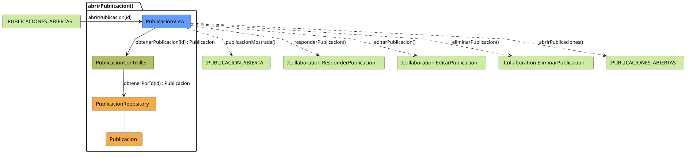

# FUNIBER GIPF > abrirPublicacion > Análisis

## información del artefacto

- **Proyecto**: FUNIBER GIPF - Plataforma Interna de Investigación
- **Fase**: Análisis
- **Disciplina**: Análisis y Diseño
- **Versión**: 1.0
- **Fecha**: 2026-05-23
- **Autor**: Diego Martínez

## propósito

Análisis de colaboración del caso de uso `abrirPublicacion()` mediante el patrón MVC, identificando las clases de análisis, sus responsabilidades y colaboraciones necesarias para que el coordinador consulte el detalle de una publicación del sistema y acceda a las opciones de responder, editar o eliminar.

## diagrama de colaboración

||
|-|
|Código fuente: [abrirPublicacion.puml](../../../modelosUML/analisis/coordinador/abrirPublicacion.puml)|

## clases de análisis identificadas

### clases de vista (boundary)

#### PublicacionView
**Estereotipo**: Vista (Boundary)  
**Responsabilidades**:
- Recibir la solicitud `abrirPublicacion(id)` desde `:PUBLICACIONES_ABIERTAS`
- Solicitar al controlador los datos de la publicación mediante `obtenerPublicacion(id) : Publicacion`
- Mostrar el detalle de la publicación al coordinador
- Ofrecer las opciones de responder, editar, eliminar o volver al listado

**Colaboraciones**:
- **Entrada**: Desde `:PUBLICACIONES_ABIERTAS` con `abrirPublicacion(id)`
- **Control**: Se comunica con `PublicacionController` mediante `obtenerPublicacion(id) : Publicacion`
- **Salida**: Transita a `:PUBLICACION_ABIERTA` (`publicacionMostrada()`), a `:Collaboration ResponderPublicacion` (`responderPublicacion()`), a `:Collaboration EditarPublicacion` (`editarPublicacion()`), a `:Collaboration EliminarPublicacion` (`eliminarPublicacion()`) o a `:PUBLICACIONES_ABIERTAS` (`abrirPublicaciones()`)

### clases de control

#### PublicacionController
**Estereotipo**: Control  
**Responsabilidades**:
- Recibir la petición `obtenerPublicacion(id)` desde la vista
- Delegar la recuperación de la publicación al repositorio mediante `obtenerPorId(id)`

**Colaboraciones**:
- **Vista**: Responde a solicitudes de `PublicacionView`
- **Repositorio**: Delega el acceso a datos a `PublicacionRepository` mediante `obtenerPorId(id) : Publicacion`

### clases de entidad (entity)

#### PublicacionRepository
**Estereotipo**: Entidad  
**Responsabilidades**:
- Recuperar una publicación concreta por su identificador mediante `obtenerPorId(id) : Publicacion`

**Colaboraciones**:
- **Control**: Responde a `PublicacionController`
- **Entidad**: Gestiona instancias de `Publicacion`

#### Publicacion
**Estereotipo**: Entidad  
**Responsabilidades**:
- Representar los datos de una publicación del sistema

**Colaboraciones**:
- **Repositorio**: Es gestionado por `PublicacionRepository`

## flujo de colaboración

### secuencia de operaciones

1. El sistema llega al estado `:PUBLICACIONES_ABIERTAS`
2. El coordinador selecciona una publicación: `PublicacionView` recibe `abrirPublicacion(id)`
3. `PublicacionView` invoca `obtenerPublicacion(id)` en `PublicacionController`
4. `PublicacionController` delega en `PublicacionRepository.obtenerPorId(id)` y obtiene un objeto `Publicacion`
5. `PublicacionView` muestra el detalle → estado `:PUBLICACION_ABIERTA` con `publicacionMostrada()`
6. Desde la vista el coordinador puede:
   - Responder la publicación → `:Collaboration ResponderPublicacion` con `responderPublicacion()`
   - Editar la publicación → `:Collaboration EditarPublicacion` con `editarPublicacion()`
   - Eliminar la publicación → `:Collaboration EliminarPublicacion` con `eliminarPublicacion()`
   - Volver al listado → `:PUBLICACIONES_ABIERTAS` con `abrirPublicaciones()`

## correspondencia con requisitos

|Requisito del caso de uso|Clase responsable|Método/Colaboración|
|-|-|-|
|Mostrar detalle de una publicación|`PublicacionView`|`abrirPublicacion(id)`|
|Recuperar la publicación por id|`PublicacionController`|`obtenerPublicacion(id) : Publicacion`|
|Acceder a datos de la publicación|`PublicacionRepository`|`obtenerPorId(id) : Publicacion`|
|Navegar a responder publicación|`PublicacionView`|`responderPublicacion()`|
|Navegar a editar publicación|`PublicacionView`|`editarPublicacion()`|
|Navegar a eliminar publicación|`PublicacionView`|`eliminarPublicacion()`|
|Volver al listado de publicaciones|`PublicacionView`|`abrirPublicaciones()`|

## características del análisis

### separación de responsabilidades MVC

- **Vista**: Solo presentación e interacción con el coordinador
- **Control**: Solo coordinación y recuperación del objeto `Publicacion`
- **Entidad**: Solo datos y reglas de negocio de las publicaciones

### agnóstico tecnológicamente

- No especifica tecnología de interfaz de usuario
- No asume implementación específica de base de datos
- Mantiene independencia de frameworks

### trazabilidad completa

- **Origen**: Caso de uso detallado `abrirPublicacion()`
- **Destino**: Base para diseño arquitectónico
- **Conexión**: Diagrama de estados → Análisis de colaboración

## patrones aplicados

### repository pattern
`PublicacionRepository` abstrae el acceso a datos, permitiendo diferentes implementaciones sin afectar al controlador.

### mvc pattern
Separación clara entre presentación (`PublicacionView`), lógica de aplicación (`PublicacionController`) y datos (`Publicacion`, `PublicacionRepository`).

## referencias

- [Especificación detallada: abrirPublicacion()](../../../context/casosDeUso/detalle/coordinador/abrirPublicacion/abrirPublicacion.md)
- [Modelo del dominio](../../../context/modeloDelDominio/modeloDominio.md)
