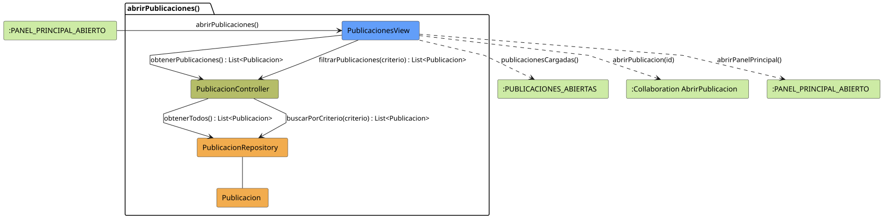

# FUNIBER GIPF > abrirPublicaciones > Análisis

## información del artefacto

- **Proyecto**: FUNIBER GIPF - Plataforma Interna de Investigación
- **Fase**: Análisis
- **Disciplina**: Análisis y Diseño
- **Versión**: 1.0
- **Fecha**: 2026-05-23
- **Autor**: Diego Martínez

## propósito

Análisis de colaboración del caso de uso `abrirPublicaciones()` mediante el patrón MVC, identificando las clases de análisis, sus responsabilidades y colaboraciones necesarias para que el coordinador consulte el listado de todas las publicaciones del sistema, con opción de filtrado por criterio.

## diagrama de colaboración

||
|-|
|Código fuente: [abrirPublicaciones.puml](../../../modelosUML/analisis/coordinador/abrirPublicaciones.puml)|

## clases de análisis identificadas

### clases de vista (boundary)

#### PublicacionesView
**Estereotipo**: Vista (Boundary)  
**Responsabilidades**:
- Recibir la solicitud `abrirPublicaciones()` desde `:PANEL_PRINCIPAL_ABIERTO`
- Solicitar al controlador el listado completo mediante `obtenerPublicaciones() : List<Publicacion>`
- Solicitar al controlador el listado filtrado mediante `filtrarPublicaciones(criterio) : List<Publicacion>`
- Mostrar el listado resultante al coordinador
- Ofrecer navegación a una publicación concreta o volver al panel principal

**Colaboraciones**:
- **Entrada**: Desde `:PANEL_PRINCIPAL_ABIERTO` con `abrirPublicaciones()`
- **Control**: Se comunica con `PublicacionController` mediante `obtenerPublicaciones() : List<Publicacion>` y `filtrarPublicaciones(criterio) : List<Publicacion>`
- **Salida**: Transita a `:PUBLICACIONES_ABIERTAS` (`publicacionesCargadas()`), a `:Collaboration AbrirPublicacion` (`abrirPublicacion(id)`) o a `:PANEL_PRINCIPAL_ABIERTO` (`abrirPanelPrincipal()`)

### clases de control

#### PublicacionController
**Estereotipo**: Control  
**Responsabilidades**:
- Recibir `obtenerPublicaciones()` y devolver todas las publicaciones
- Recibir `filtrarPublicaciones(criterio)` y devolver la lista filtrada

**Colaboraciones**:
- **Vista**: Responde a solicitudes de `PublicacionesView`
- **Repositorio**: Delega en `PublicacionRepository` mediante `obtenerTodos()` y `buscarPorCriterio(criterio)`

### clases de entidad (entity)

#### PublicacionRepository
**Estereotipo**: Entidad  
**Responsabilidades**:
- Recuperar todas las publicaciones mediante `obtenerTodos() : List<Publicacion>`
- Recuperar publicaciones filtradas mediante `buscarPorCriterio(criterio) : List<Publicacion>`

**Colaboraciones**:
- **Control**: Responde a `PublicacionController`
- **Entidad**: Gestiona instancias de `Publicacion`

#### Publicacion
**Estereotipo**: Entidad  
**Responsabilidades**:
- Representar los datos de una publicación del sistema

**Colaboraciones**:
- **Repositorio**: Es gestionado por `PublicacionRepository`

## flujo de colaboración

### secuencia de operaciones

1. El sistema está en `:PANEL_PRINCIPAL_ABIERTO`
2. El coordinador solicita ver publicaciones: `PublicacionesView` recibe `abrirPublicaciones()`
3. `PublicacionesView` invoca `obtenerPublicaciones()` en `PublicacionController`
4. `PublicacionController` delega en `PublicacionRepository.obtenerTodos()` y obtiene `List<Publicacion>`
5. El listado se muestra → estado `:PUBLICACIONES_ABIERTAS` con `publicacionesCargadas()`
6. El coordinador puede filtrar: `PublicacionesView` invoca `filtrarPublicaciones(criterio)` en `PublicacionController`, que delega en `PublicacionRepository.buscarPorCriterio(criterio)`
7. Desde la vista el coordinador puede:
   - Abrir una publicación → `:Collaboration AbrirPublicacion` con `abrirPublicacion(id)`
   - Volver al panel principal → `:PANEL_PRINCIPAL_ABIERTO` con `abrirPanelPrincipal()`

## correspondencia con requisitos

|Requisito del caso de uso|Clase responsable|Método/Colaboración|
|-|-|-|
|Mostrar listado de publicaciones|`PublicacionesView`|`obtenerPublicaciones() : List<Publicacion>`|
|Filtrar publicaciones por criterio|`PublicacionController`|`filtrarPublicaciones(criterio) : List<Publicacion>`|
|Acceder a todas las publicaciones|`PublicacionRepository`|`obtenerTodos() : List<Publicacion>`|
|Buscar publicaciones por criterio|`PublicacionRepository`|`buscarPorCriterio(criterio) : List<Publicacion>`|
|Navegar al detalle de una publicación|`PublicacionesView`|`abrirPublicacion(id)`|
|Volver al panel principal|`PublicacionesView`|`abrirPanelPrincipal()`|

## características del análisis

### separación de responsabilidades MVC

- **Vista**: Solo presentación e interacción con el coordinador
- **Control**: Solo coordinación, obtención y filtrado del listado de publicaciones
- **Entidad**: Solo datos y reglas de negocio de las publicaciones

### agnóstico tecnológicamente

- No especifica tecnología de interfaz de usuario
- No asume implementación específica de base de datos
- Mantiene independencia de frameworks

### trazabilidad completa

- **Origen**: Caso de uso detallado `abrirPublicaciones()`
- **Destino**: Base para diseño arquitectónico
- **Conexión**: Diagrama de estados → Análisis de colaboración

## patrones aplicados

### repository pattern
`PublicacionRepository` abstrae el acceso a datos, permitiendo diferentes implementaciones sin afectar al controlador.

### mvc pattern
Separación clara entre presentación (`PublicacionesView`), lógica de aplicación (`PublicacionController`) y datos (`Publicacion`, `PublicacionRepository`).

## referencias

- [Especificación detallada: abrirPublicaciones()](../../../context/casosDeUso/detalle/coordinador/abrirPublicaciones/abrirPublicaciones.md)
- [Modelo del dominio](../../../context/modeloDelDominio/modeloDominio.md)
