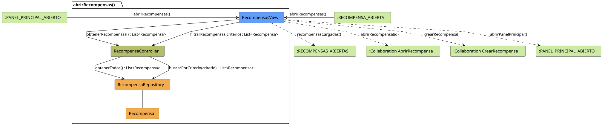

# FUNIBER GIPF > abrirRecompensas > Análisis

## información del artefacto

- **Proyecto**: FUNIBER GIPF - Plataforma Interna de Investigación
- **Fase**: Análisis
- **Disciplina**: Análisis y Diseño
- **Versión**: 1.0
- **Fecha**: 2026-05-23
- **Autor**: Diego Martínez

## propósito

Análisis de colaboración del caso de uso `abrirRecompensas()` mediante el patrón MVC, identificando las clases de análisis, sus responsabilidades y colaboraciones necesarias para que el coordinador consulte el listado de recompensas del sistema, con opción de filtrado por criterio.

## diagrama de colaboración

||
|-|
|Código fuente: [abrirRecompensas.puml](../../../modelosUML/analisis/coordinador/abrirRecompensas.puml)|

## clases de análisis identificadas

### clases de vista (boundary)

#### RecompensasView
**Estereotipo**: Vista (Boundary)  
**Responsabilidades**:
- Recibir la solicitud `abrirRecompensas()` desde `:PANEL_PRINCIPAL_ABIERTO` o `:RECOMPENSA_ABIERTA`
- Solicitar al controlador el listado completo mediante `obtenerRecompensas() : List<Recompensa>`
- Solicitar al controlador el listado filtrado mediante `filtrarRecompensas(criterio) : List<Recompensa>`
- Mostrar el listado al coordinador
- Ofrecer navegación a una recompensa concreta, crear recompensa o volver al panel principal

**Colaboraciones**:
- **Entrada**: Desde `:PANEL_PRINCIPAL_ABIERTO` o `:RECOMPENSA_ABIERTA` con `abrirRecompensas()`
- **Control**: Se comunica con `RecompensaController` mediante `obtenerRecompensas() : List<Recompensa>` y `filtrarRecompensas(criterio) : List<Recompensa>`
- **Salida**: Transita a `:RECOMPENSAS_ABIERTAS` (`recompensasCargadas()`), a `:Collaboration AbrirRecompensa` (`abrirRecompensa(id)`), a `:Collaboration CrearRecompensa` (`crearRecompensa()`) o a `:PANEL_PRINCIPAL_ABIERTO` (`abrirPanelPrincipal()`)

### clases de control

#### RecompensaController
**Estereotipo**: Control  
**Responsabilidades**:
- Recibir `obtenerRecompensas()` y devolver todas las recompensas
- Recibir `filtrarRecompensas(criterio)` y devolver la lista filtrada

**Colaboraciones**:
- **Vista**: Responde a solicitudes de `RecompensasView`
- **Repositorio**: Delega en `RecompensaRepository` mediante `obtenerTodos()` y `buscarPorCriterio(criterio)`

### clases de entidad (entity)

#### RecompensaRepository
**Estereotipo**: Entidad  
**Responsabilidades**:
- Recuperar todas las recompensas mediante `obtenerTodos() : List<Recompensa>`
- Recuperar recompensas filtradas mediante `buscarPorCriterio(criterio) : List<Recompensa>`

**Colaboraciones**:
- **Control**: Responde a `RecompensaController`
- **Entidad**: Gestiona instancias de `Recompensa`

#### Recompensa
**Estereotipo**: Entidad  
**Responsabilidades**:
- Representar los datos de una recompensa del sistema

**Colaboraciones**:
- **Repositorio**: Es gestionado por `RecompensaRepository`

## flujo de colaboración

### secuencia de operaciones

1. El sistema está en `:PANEL_PRINCIPAL_ABIERTO` o en `:RECOMPENSA_ABIERTA`
2. El coordinador solicita ver recompensas: `RecompensasView` recibe `abrirRecompensas()`
3. `RecompensasView` invoca `obtenerRecompensas()` en `RecompensaController`
4. `RecompensaController` delega en `RecompensaRepository.obtenerTodos()` y obtiene `List<Recompensa>`
5. El listado se muestra → estado `:RECOMPENSAS_ABIERTAS` con `recompensasCargadas()`
6. El coordinador puede filtrar: `RecompensasView` invoca `filtrarRecompensas(criterio)` en `RecompensaController`, que delega en `RecompensaRepository.buscarPorCriterio(criterio)`
7. Desde la vista el coordinador puede:
   - Abrir una recompensa → `:Collaboration AbrirRecompensa` con `abrirRecompensa(id)`
   - Crear nueva recompensa → `:Collaboration CrearRecompensa` con `crearRecompensa()`
   - Volver al panel principal → `:PANEL_PRINCIPAL_ABIERTO` con `abrirPanelPrincipal()`

## correspondencia con requisitos

|Requisito del caso de uso|Clase responsable|Método/Colaboración|
|-|-|-|
|Mostrar listado de recompensas|`RecompensasView`|`obtenerRecompensas() : List<Recompensa>`|
|Filtrar recompensas por criterio|`RecompensaController`|`filtrarRecompensas(criterio) : List<Recompensa>`|
|Acceder a todas las recompensas|`RecompensaRepository`|`obtenerTodos() : List<Recompensa>`|
|Buscar recompensas por criterio|`RecompensaRepository`|`buscarPorCriterio(criterio) : List<Recompensa>`|
|Navegar al detalle de una recompensa|`RecompensasView`|`abrirRecompensa(id)`|
|Navegar a crear recompensa|`RecompensasView`|`crearRecompensa()`|
|Volver al panel principal|`RecompensasView`|`abrirPanelPrincipal()`|

## características del análisis

### separación de responsabilidades MVC

- **Vista**: Solo presentación e interacción con el coordinador
- **Control**: Solo coordinación, obtención y filtrado del listado de recompensas
- **Entidad**: Solo datos y reglas de negocio de las recompensas

### agnóstico tecnológicamente

- No especifica tecnología de interfaz de usuario
- No asume implementación específica de base de datos
- Mantiene independencia de frameworks

### trazabilidad completa

- **Origen**: Caso de uso detallado `abrirRecompensas()`
- **Destino**: Base para diseño arquitectónico
- **Conexión**: Diagrama de estados → Análisis de colaboración

## patrones aplicados

### repository pattern
`RecompensaRepository` abstrae el acceso a datos, permitiendo diferentes implementaciones sin afectar al controlador.

### mvc pattern
Separación clara entre presentación (`RecompensasView`), lógica de aplicación (`RecompensaController`) y datos (`Recompensa`, `RecompensaRepository`).

## referencias

- [Especificación detallada: abrirRecompensas()](../../../context/casosDeUso/detalle/coordinador/abrirRecompensas/abrirRecompensas.md)
- [Modelo del dominio](../../../context/modeloDelDominio/modeloDominio.md)
