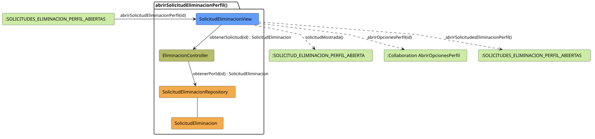

# FUNIBER GIPF > abrirSolicitudEliminacionPerfil > Análisis

## información del artefacto

- **Proyecto**: FUNIBER GIPF - Plataforma Interna de Investigación
- **Fase**: Análisis
- **Disciplina**: Análisis y Diseño
- **Versión**: 1.0
- **Fecha**: 2026-05-23
- **Autor**: Diego Martínez

## propósito

Análisis de colaboración del caso de uso `abrirSolicitudEliminacionPerfil()` mediante el patrón MVC, identificando las clases de análisis, sus responsabilidades y colaboraciones necesarias para que el coordinador consulte el detalle de una solicitud de eliminación de perfil y acceda a las opciones de perfil del investigador.

## diagrama de colaboración

||
|-|
|Código fuente: [abrirSolicitudEliminacionPerfil.puml](../../../modelosUML/analisis/coordinador/abrirSolicitudEliminacionPerfil.puml)|

## clases de análisis identificadas

### clases de vista (boundary)

#### SolicitudEliminacionView
**Estereotipo**: Vista (Boundary)  
**Responsabilidades**:
- Recibir la solicitud `abrirSolicitudEliminacionPerfil(id)` desde `:SOLICITUDES_ELIMINACION_PERFIL_ABIERTAS`
- Solicitar al controlador los datos de la solicitud mediante `obtenerSolicitud(id) : SolicitudEliminacion`
- Mostrar el detalle de la solicitud al coordinador
- Ofrecer navegación: abrir opciones de perfil del investigador o volver al listado

**Colaboraciones**:
- **Entrada**: Desde `:SOLICITUDES_ELIMINACION_PERFIL_ABIERTAS` con `abrirSolicitudEliminacionPerfil(id)`
- **Control**: Se comunica con `EliminacionController` mediante `obtenerSolicitud(id) : SolicitudEliminacion`
- **Salida**: Transita a `:SOLICITUD_ELIMINACION_PERFIL_ABIERTA` (`solicitudMostrada()`), a `:Collaboration AbrirOpcionesPerfil` (`abrirOpcionesPerfil(id)`) o a `:SOLICITUDES_ELIMINACION_PERFIL_ABIERTAS` (`abrirSolicitudesEliminacionPerfil()`)

### clases de control

#### EliminacionController
**Estereotipo**: Control  
**Responsabilidades**:
- Recibir la petición `obtenerSolicitud(id)` desde la vista
- Delegar la recuperación de la solicitud al repositorio mediante `obtenerPorId(id)`

**Colaboraciones**:
- **Vista**: Responde a solicitudes de `SolicitudEliminacionView`
- **Repositorio**: Delega el acceso a datos a `SolicitudEliminacionRepository` mediante `obtenerPorId(id) : SolicitudEliminacion`

### clases de entidad (entity)

#### SolicitudEliminacionRepository
**Estereotipo**: Entidad  
**Responsabilidades**:
- Recuperar una solicitud de eliminación concreta por su identificador mediante `obtenerPorId(id) : SolicitudEliminacion`

**Colaboraciones**:
- **Control**: Responde a `EliminacionController`
- **Entidad**: Gestiona instancias de `SolicitudEliminacion`

#### SolicitudEliminacion
**Estereotipo**: Entidad  
**Responsabilidades**:
- Representar los datos de una solicitud de eliminación de perfil

**Colaboraciones**:
- **Repositorio**: Es gestionado por `SolicitudEliminacionRepository`

## flujo de colaboración

### secuencia de operaciones

1. El sistema llega al estado `:SOLICITUDES_ELIMINACION_PERFIL_ABIERTAS`
2. El coordinador selecciona una solicitud: `SolicitudEliminacionView` recibe `abrirSolicitudEliminacionPerfil(id)`
3. `SolicitudEliminacionView` invoca `obtenerSolicitud(id)` en `EliminacionController`
4. `EliminacionController` delega en `SolicitudEliminacionRepository.obtenerPorId(id)` y obtiene un objeto `SolicitudEliminacion`
5. `SolicitudEliminacionView` muestra el detalle → estado `:SOLICITUD_ELIMINACION_PERFIL_ABIERTA` con `solicitudMostrada()`
6. Desde la vista el coordinador puede:
   - Abrir opciones de perfil del investigador → `:Collaboration AbrirOpcionesPerfil` con `abrirOpcionesPerfil(id)`
   - Volver al listado → `:SOLICITUDES_ELIMINACION_PERFIL_ABIERTAS` con `abrirSolicitudesEliminacionPerfil()`

## correspondencia con requisitos

|Requisito del caso de uso|Clase responsable|Método/Colaboración|
|-|-|-|
|Mostrar detalle de una solicitud de eliminación|`SolicitudEliminacionView`|`abrirSolicitudEliminacionPerfil(id)`|
|Recuperar la solicitud por id|`EliminacionController`|`obtenerSolicitud(id) : SolicitudEliminacion`|
|Acceder a datos de la solicitud|`SolicitudEliminacionRepository`|`obtenerPorId(id) : SolicitudEliminacion`|
|Navegar a opciones de perfil del investigador|`SolicitudEliminacionView`|`abrirOpcionesPerfil(id)`|
|Volver al listado de solicitudes|`SolicitudEliminacionView`|`abrirSolicitudesEliminacionPerfil()`|

## características del análisis

### separación de responsabilidades MVC

- **Vista**: Solo presentación e interacción con el coordinador
- **Control**: Solo coordinación y recuperación del objeto `SolicitudEliminacion`
- **Entidad**: Solo datos y reglas de negocio de las solicitudes de eliminación

### agnóstico tecnológicamente

- No especifica tecnología de interfaz de usuario
- No asume implementación específica de base de datos
- Mantiene independencia de frameworks

### trazabilidad completa

- **Origen**: Caso de uso detallado `abrirSolicitudEliminacionPerfil()`
- **Destino**: Base para diseño arquitectónico
- **Conexión**: Diagrama de estados → Análisis de colaboración

## patrones aplicados

### repository pattern
`SolicitudEliminacionRepository` abstrae el acceso a datos, permitiendo diferentes implementaciones sin afectar al controlador.

### mvc pattern
Separación clara entre presentación (`SolicitudEliminacionView`), lógica de aplicación (`EliminacionController`) y datos (`SolicitudEliminacion`, `SolicitudEliminacionRepository`).

## referencias

- [Especificación detallada: abrirSolicitudEliminacionPerfil()](../../../context/casosDeUso/detalle/coordinador/abrirSolicitudEliminacionPerfil/abrirSolicitudEliminacionPerfil.md)
- [Modelo del dominio](../../../context/modeloDelDominio/modeloDominio.md)
