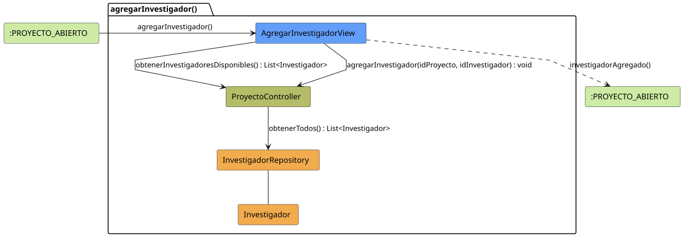

# FUNIBER GIPF > agregarInvestigador > Análisis

## información del artefacto

- **Proyecto**: FUNIBER GIPF - Plataforma Interna de Investigación
- **Fase**: Análisis
- **Disciplina**: Análisis y Diseño
- **Versión**: 1.0
- **Fecha**: 2026-05-23
- **Autor**: Diego Martínez

## propósito

Análisis de colaboración del caso de uso `agregarInvestigador()` mediante el patrón MVC, identificando las clases de análisis, sus responsabilidades y colaboraciones necesarias para que el coordinador incorpore un investigador existente a un proyecto de investigación.

## diagrama de colaboración

||
|-|
|Código fuente: [agregarInvestigador.puml](../../../modelosUML/analisis/coordinador/agregarInvestigador.puml)|

## clases de análisis identificadas

### clases de vista (boundary)

#### AgregarInvestigadorView
**Estereotipo**: Vista (Boundary)  
**Responsabilidades**:
- Recibir la solicitud `agregarInvestigador()` desde `:PROYECTO_ABIERTO`
- Solicitar al controlador la lista de investigadores disponibles mediante `obtenerInvestigadoresDisponibles() : List<Investigador>`
- Mostrar la lista al coordinador para que seleccione el investigador a agregar
- Invocar la asociación al seleccionarse un investigador mediante `agregarInvestigador(idProyecto, idInvestigador) : void`
- Navegar de vuelta al proyecto tras la operación

**Colaboraciones**:
- **Entrada**: Desde `:PROYECTO_ABIERTO` con `agregarInvestigador()`
- **Control**: Se comunica con `ProyectoController` mediante `obtenerInvestigadoresDisponibles() : List<Investigador>` y `agregarInvestigador(idProyecto, idInvestigador) : void`
- **Salida**: Transita a `:PROYECTO_ABIERTO` con `investigadorAgregado()`

### clases de control

#### ProyectoController
**Estereotipo**: Control  
**Responsabilidades**:
- Recibir `obtenerInvestigadoresDisponibles()` y devolver todos los investigadores
- Recibir `agregarInvestigador(idProyecto, idInvestigador)` y gestionar la asociación

**Colaboraciones**:
- **Vista**: Responde a solicitudes de `AgregarInvestigadorView`
- **Repositorio**: Delega el acceso a datos a `InvestigadorRepository` mediante `obtenerTodos() : List<Investigador>`

### clases de entidad (entity)

#### InvestigadorRepository
**Estereotipo**: Entidad  
**Responsabilidades**:
- Recuperar todos los investigadores mediante `obtenerTodos() : List<Investigador>`

**Colaboraciones**:
- **Control**: Responde a `ProyectoController`
- **Entidad**: Gestiona instancias de `Investigador`

#### Investigador
**Estereotipo**: Entidad  
**Responsabilidades**:
- Representar los datos de un investigador disponible para asignar al proyecto

**Colaboraciones**:
- **Repositorio**: Es gestionado por `InvestigadorRepository`

## flujo de colaboración

### secuencia de operaciones

1. El sistema está en `:PROYECTO_ABIERTO`
2. El coordinador solicita agregar investigador: `AgregarInvestigadorView` recibe `agregarInvestigador()`
3. `AgregarInvestigadorView` invoca `obtenerInvestigadoresDisponibles()` en `ProyectoController`
4. `ProyectoController` delega en `InvestigadorRepository.obtenerTodos()` y obtiene `List<Investigador>`
5. El coordinador selecciona el investigador a agregar
6. `AgregarInvestigadorView` invoca `agregarInvestigador(idProyecto, idInvestigador)` en `ProyectoController`
7. La operación se completa → estado `:PROYECTO_ABIERTO` con `investigadorAgregado()`

## correspondencia con requisitos

|Requisito del caso de uso|Clase responsable|Método/Colaboración|
|-|-|-|
|Obtener investigadores disponibles|`ProyectoController`|`obtenerInvestigadoresDisponibles() : List<Investigador>`|
|Listar todos los investigadores|`InvestigadorRepository`|`obtenerTodos() : List<Investigador>`|
|Asociar investigador al proyecto|`ProyectoController`|`agregarInvestigador(idProyecto, idInvestigador) : void`|
|Confirmar adición y volver al proyecto|`AgregarInvestigadorView`|`investigadorAgregado()`|

## características del análisis

### separación de responsabilidades MVC

- **Vista**: Solo presentación e interacción con el coordinador
- **Control**: Solo coordinación, obtención de disponibles y gestión de la asociación
- **Entidad**: Solo datos y reglas de negocio de los investigadores

### agnóstico tecnológicamente

- No especifica tecnología de interfaz de usuario
- No asume implementación específica de base de datos
- Mantiene independencia de frameworks

### trazabilidad completa

- **Origen**: Caso de uso detallado `agregarInvestigador()`
- **Destino**: Base para diseño arquitectónico
- **Conexión**: Diagrama de estados → Análisis de colaboración

## patrones aplicados

### repository pattern
`InvestigadorRepository` abstrae el acceso a datos, permitiendo diferentes implementaciones sin afectar al controlador.

### mvc pattern
Separación clara entre presentación (`AgregarInvestigadorView`), lógica de aplicación (`ProyectoController`) y datos (`Investigador`, `InvestigadorRepository`).

## referencias

- [Especificación detallada: agregarInvestigador()](../../../context/casosDeUso/detalle/coordinador/agregarInvestigador/agregarInvestigador.md)
- [Modelo del dominio](../../../context/modeloDelDominio/modeloDominio.md)
