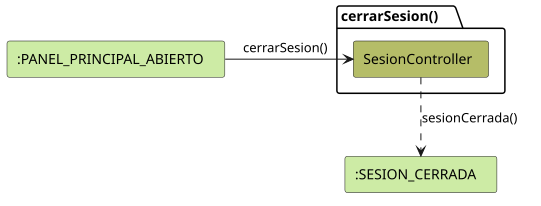

# FUNIBER GIPF > cerrarSesion > Análisis

## información del artefacto

- **Proyecto**: FUNIBER GIPF - Plataforma Interna de Investigación
- **Fase**: Análisis
- **Disciplina**: Análisis y Diseño
- **Versión**: 1.0
- **Fecha**: 2026-05-23
- **Autor**: Diego Martínez

## propósito

Análisis de colaboración del caso de uso `cerrarSesion()` mediante el patrón MVC, identificando las clases de análisis, sus responsabilidades y colaboraciones necesarias para que el coordinador finalice su sesión activa en el sistema.

## diagrama de colaboración

||
|-|
|Código fuente: [cerrarSesion.puml](../../../modelosUML/analisis/coordinador/cerrarSesion.puml)|

## clases de análisis identificadas

### clases de control

#### SesionController
**Estereotipo**: Control  
**Responsabilidades**:
- Recibir la solicitud `cerrarSesion()` desde `:PANEL_PRINCIPAL_ABIERTO`
- Coordinar el proceso de cierre de sesión
- Transitar al estado `:SESION_CERRADA`

**Colaboraciones**:
- **Entrada**: Desde `:PANEL_PRINCIPAL_ABIERTO` con `cerrarSesion()`
- **Salida**: Transita a `:SESION_CERRADA` con `sesionCerrada()`

## flujo de colaboración

### secuencia de operaciones

1. El sistema está en `:PANEL_PRINCIPAL_ABIERTO`
2. El coordinador solicita cerrar sesión: `SesionController` recibe `cerrarSesion()`
3. `SesionController` coordina el cierre de la sesión activa
4. El sistema transita a `:SESION_CERRADA` con `sesionCerrada()`

## correspondencia con requisitos

|Requisito del caso de uso|Clase responsable|Método/Colaboración|
|-|-|-|
|Cerrar la sesión activa del coordinador|`SesionController`|`cerrarSesion()`|
|Transitar al estado de sesión cerrada|`SesionController`|`sesionCerrada()`|

## características del análisis

### separación de responsabilidades MVC

- **Vista**: No aplica — la acción se dispara directamente desde el panel principal sin vista propia
- **Control**: Coordina el cierre de sesión sin acceso a datos del dominio
- **Entidad**: No aplica — no se accede a datos persistentes

### agnóstico tecnológicamente

- No especifica tecnología de interfaz de usuario
- Mantiene independencia de frameworks

### trazabilidad completa

- **Origen**: Caso de uso detallado `cerrarSesion()`
- **Destino**: Base para diseño arquitectónico
- **Conexión**: Diagrama de estados → Análisis de colaboración

## patrones aplicados

### mvc pattern
Solo interviene la clase de control `SesionController`. No se requiere vista propia (acción directa desde el panel) ni entidad (no se accede a datos persistentes).

## referencias

- [Especificación detallada: cerrarSesion()](../../../context/casosDeUso/detalle/coordinador/cerrarSesion/cerrarSesion.md)
- [Modelo del dominio](../../../context/modeloDelDominio/modeloDominio.md)
