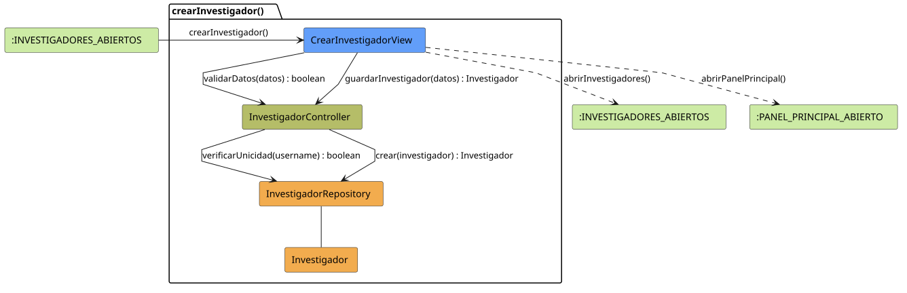

# FUNIBER GIPF > crearInvestigador > Análisis

## información del artefacto

- **Proyecto**: FUNIBER GIPF - Plataforma Interna de Investigación
- **Fase**: Análisis
- **Disciplina**: Análisis y Diseño
- **Versión**: 1.0
- **Fecha**: 2026-05-23
- **Autor**: Diego Martínez

## propósito

Análisis de colaboración del caso de uso `crearInvestigador()` mediante el patrón MVC, identificando las clases de análisis, sus responsabilidades y colaboraciones necesarias para que el coordinador registre un nuevo investigador en la plataforma.

## diagrama de colaboración

||
|-|
|Código fuente: [crearInvestigador.puml](../../../modelosUML/analisis/coordinador/crearInvestigador.puml)|

## clases de análisis identificadas

### clases de vista (boundary)

#### CrearInvestigadorView
**Estereotipo**: Vista (Boundary)  
**Responsabilidades**:
- Recibir la solicitud `crearInvestigador()` desde `:INVESTIGADORES_ABIERTOS`
- Solicitar al controlador la validación de datos mediante `validarDatos(datos) : boolean`
- Solicitar al controlador el guardado del nuevo investigador mediante `guardarInvestigador(datos) : Investigador`
- Navegar al listado de investigadores o al panel principal

**Colaboraciones**:
- **Entrada**: Desde `:INVESTIGADORES_ABIERTOS` con `crearInvestigador()`
- **Control**: Se comunica con `InvestigadorController` mediante `validarDatos(datos) : boolean` y `guardarInvestigador(datos) : Investigador`
- **Salida**: Transita a `:INVESTIGADORES_ABIERTOS` (`abrirInvestigadores()`) o a `:PANEL_PRINCIPAL_ABIERTO` (`abrirPanelPrincipal()`)

### clases de control

#### InvestigadorController
**Estereotipo**: Control  
**Responsabilidades**:
- Recibir y ejecutar `validarDatos(datos) : boolean`, delegando la verificación de unicidad del username
- Recibir `guardarInvestigador(datos)` y delegar la creación al repositorio

**Colaboraciones**:
- **Vista**: Responde a solicitudes de `CrearInvestigadorView`
- **Repositorio**: Delega en `InvestigadorRepository` mediante `verificarUnicidad(username) : boolean` y `crear(investigador) : Investigador`

### clases de entidad (entity)

#### InvestigadorRepository
**Estereotipo**: Entidad  
**Responsabilidades**:
- Verificar la unicidad del username mediante `verificarUnicidad(username) : boolean`
- Persistir un nuevo investigador mediante `crear(investigador) : Investigador`

**Colaboraciones**:
- **Control**: Responde a `InvestigadorController`
- **Entidad**: Gestiona instancias de `Investigador`

#### Investigador
**Estereotipo**: Entidad  
**Responsabilidades**:
- Representar los datos del nuevo investigador a crear

**Colaboraciones**:
- **Repositorio**: Es gestionado por `InvestigadorRepository`

## flujo de colaboración

### secuencia de operaciones

1. El sistema está en `:INVESTIGADORES_ABIERTOS`
2. El coordinador solicita crear investigador: `CrearInvestigadorView` recibe `crearInvestigador()`
3. El coordinador rellena el formulario con los datos del investigador
4. `CrearInvestigadorView` invoca `validarDatos(datos)` en `InvestigadorController` → devuelve `boolean`
5. `InvestigadorController` delega en `InvestigadorRepository.verificarUnicidad(username)` para comprobar que no existe duplicado
6. Si la validación es correcta, `CrearInvestigadorView` invoca `guardarInvestigador(datos)` en `InvestigadorController`
7. `InvestigadorController` delega en `InvestigadorRepository.crear(investigador)` y obtiene el objeto `Investigador` creado
8. La vista navega → `:INVESTIGADORES_ABIERTOS` (`abrirInvestigadores()`) o `:PANEL_PRINCIPAL_ABIERTO` (`abrirPanelPrincipal()`)

## correspondencia con requisitos

|Requisito del caso de uso|Clase responsable|Método/Colaboración|
|-|-|-|
|Presentar formulario de creación|`CrearInvestigadorView`|`crearInvestigador()`|
|Validar datos del formulario|`InvestigadorController`|`validarDatos(datos) : boolean`|
|Verificar unicidad del username|`InvestigadorRepository`|`verificarUnicidad(username) : boolean`|
|Persistir nuevo investigador|`InvestigadorController`|`guardarInvestigador(datos) : Investigador`|
|Crear investigador en repositorio|`InvestigadorRepository`|`crear(investigador) : Investigador`|
|Volver al listado de investigadores|`CrearInvestigadorView`|`abrirInvestigadores()`|
|Volver al panel principal|`CrearInvestigadorView`|`abrirPanelPrincipal()`|

## características del análisis

### separación de responsabilidades MVC

- **Vista**: Solo presentación del formulario e interacción con el coordinador
- **Control**: Solo coordinación de la validación y persistencia
- **Entidad**: Solo datos y reglas de negocio de los investigadores

### agnóstico tecnológicamente

- No especifica tecnología de interfaz de usuario
- No asume implementación específica de base de datos
- Mantiene independencia de frameworks

### trazabilidad completa

- **Origen**: Caso de uso detallado `crearInvestigador()`
- **Destino**: Base para diseño arquitectónico
- **Conexión**: Diagrama de estados → Análisis de colaboración

## patrones aplicados

### repository pattern
`InvestigadorRepository` abstrae el acceso a datos, permitiendo diferentes implementaciones sin afectar al controlador.

### mvc pattern
Separación clara entre presentación (`CrearInvestigadorView`), lógica de aplicación (`InvestigadorController`) y datos (`Investigador`, `InvestigadorRepository`).

## referencias

- [Especificación detallada: crearInvestigador()](../../../context/casosDeUso/detalle/coordinador/crearInvestigador/crearInvestigador.md)
- [Modelo del dominio](../../../context/modeloDelDominio/modeloDominio.md)
