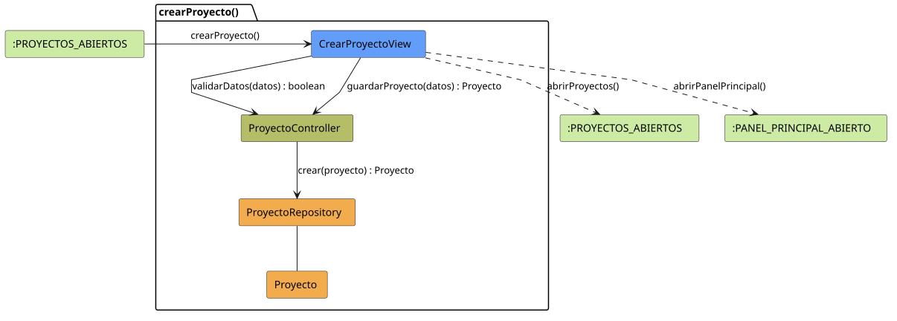

# FUNIBER GIPF > crearProyecto > Análisis

## información del artefacto

- **Proyecto**: FUNIBER GIPF - Plataforma Interna de Investigación
- **Fase**: Análisis
- **Disciplina**: Análisis y Diseño
- **Versión**: 1.0
- **Fecha**: 2026-05-23
- **Autor**: Diego Martínez

## propósito

Análisis de colaboración del caso de uso `crearProyecto()` mediante el patrón MVC, identificando las clases de análisis, sus responsabilidades y colaboraciones necesarias para que el coordinador registre un nuevo proyecto de investigación en el sistema.

## diagrama de colaboración

||
|-|
|Código fuente: [crearProyecto.puml](../../../modelosUML/analisis/coordinador/crearProyecto.puml)|

## clases de análisis identificadas

### clases de vista (boundary)

#### CrearProyectoView
**Estereotipo**: Vista (Boundary)  
**Responsabilidades**:
- Recibir la solicitud `crearProyecto()` desde `:PROYECTOS_ABIERTOS`
- Solicitar al controlador la validación de datos mediante `validarDatos(datos) : boolean`
- Solicitar al controlador el guardado del nuevo proyecto mediante `guardarProyecto(datos) : Proyecto`
- Navegar al listado de proyectos o al panel principal

**Colaboraciones**:
- **Entrada**: Desde `:PROYECTOS_ABIERTOS` con `crearProyecto()`
- **Control**: Se comunica con `ProyectoController` mediante `validarDatos(datos) : boolean` y `guardarProyecto(datos) : Proyecto`
- **Salida**: Transita a `:PROYECTOS_ABIERTOS` (`abrirProyectos()`) o a `:PANEL_PRINCIPAL_ABIERTO` (`abrirPanelPrincipal()`)

### clases de control

#### ProyectoController
**Estereotipo**: Control  
**Responsabilidades**:
- Recibir y ejecutar `validarDatos(datos) : boolean`
- Recibir `guardarProyecto(datos)` y delegar la creación al repositorio

**Colaboraciones**:
- **Vista**: Responde a solicitudes de `CrearProyectoView`
- **Repositorio**: Delega la persistencia a `ProyectoRepository` mediante `crear(proyecto) : Proyecto`

### clases de entidad (entity)

#### ProyectoRepository
**Estereotipo**: Entidad  
**Responsabilidades**:
- Persistir un nuevo proyecto mediante `crear(proyecto) : Proyecto`

**Colaboraciones**:
- **Control**: Responde a `ProyectoController`
- **Entidad**: Gestiona instancias de `Proyecto`

#### Proyecto
**Estereotipo**: Entidad  
**Responsabilidades**:
- Representar los datos del nuevo proyecto de investigación a crear

**Colaboraciones**:
- **Repositorio**: Es gestionado por `ProyectoRepository`

## flujo de colaboración

### secuencia de operaciones

1. El sistema está en `:PROYECTOS_ABIERTOS`
2. El coordinador solicita crear proyecto: `CrearProyectoView` recibe `crearProyecto()`
3. El coordinador rellena el formulario con los datos del proyecto
4. `CrearProyectoView` invoca `validarDatos(datos)` en `ProyectoController` → devuelve `boolean`
5. Si la validación es correcta, `CrearProyectoView` invoca `guardarProyecto(datos)` en `ProyectoController`
6. `ProyectoController` delega en `ProyectoRepository.crear(proyecto)` y obtiene el objeto `Proyecto` creado
7. La vista navega → `:PROYECTOS_ABIERTOS` (`abrirProyectos()`) o `:PANEL_PRINCIPAL_ABIERTO` (`abrirPanelPrincipal()`)

## correspondencia con requisitos

|Requisito del caso de uso|Clase responsable|Método/Colaboración|
|-|-|-|
|Presentar formulario de creación|`CrearProyectoView`|`crearProyecto()`|
|Validar datos del formulario|`ProyectoController`|`validarDatos(datos) : boolean`|
|Persistir nuevo proyecto|`ProyectoController`|`guardarProyecto(datos) : Proyecto`|
|Crear proyecto en repositorio|`ProyectoRepository`|`crear(proyecto) : Proyecto`|
|Volver al listado de proyectos|`CrearProyectoView`|`abrirProyectos()`|
|Volver al panel principal|`CrearProyectoView`|`abrirPanelPrincipal()`|

## características del análisis

### separación de responsabilidades MVC

- **Vista**: Solo presentación del formulario e interacción con el coordinador
- **Control**: Solo coordinación de la validación y persistencia
- **Entidad**: Solo datos y reglas de negocio de los proyectos

### agnóstico tecnológicamente

- No especifica tecnología de interfaz de usuario
- No asume implementación específica de base de datos
- Mantiene independencia de frameworks

### trazabilidad completa

- **Origen**: Caso de uso detallado `crearProyecto()`
- **Destino**: Base para diseño arquitectónico
- **Conexión**: Diagrama de estados → Análisis de colaboración

## patrones aplicados

### repository pattern
`ProyectoRepository` abstrae el acceso a datos, permitiendo diferentes implementaciones sin afectar al controlador.

### mvc pattern
Separación clara entre presentación (`CrearProyectoView`), lógica de aplicación (`ProyectoController`) y datos (`Proyecto`, `ProyectoRepository`).

## referencias

- [Especificación detallada: crearProyecto()](../../../context/casosDeUso/detalle/coordinador/crearProyecto/crearProyecto.md)
- [Modelo del dominio](../../../context/modeloDelDominio/modeloDominio.md)
