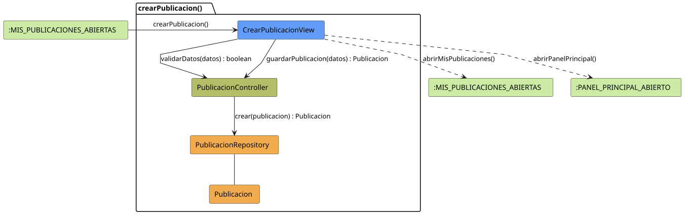

# FUNIBER GIPF > crearPublicacion > Análisis

## información del artefacto

- **Proyecto**: FUNIBER GIPF - Plataforma Interna de Investigación
- **Fase**: Análisis
- **Disciplina**: Análisis y Diseño
- **Versión**: 1.0
- **Fecha**: 2026-05-23
- **Autor**: Diego Martínez

## propósito

Análisis de colaboración del caso de uso `crearPublicacion()` mediante el patrón MVC, identificando las clases de análisis, sus responsabilidades y colaboraciones necesarias para que el coordinador registre una nueva publicación propia en el sistema.

## diagrama de colaboración

||
|-|
|Código fuente: [crearPublicacion.puml](../../../modelosUML/analisis/coordinador/crearPublicacion.puml)|

## clases de análisis identificadas

### clases de vista (boundary)

#### CrearPublicacionView
**Estereotipo**: Vista (Boundary)  
**Responsabilidades**:
- Recibir la solicitud `crearPublicacion()` desde `:MIS_PUBLICACIONES_ABIERTAS`
- Solicitar al controlador la validación de datos mediante `validarDatos(datos) : boolean`
- Solicitar al controlador el guardado de la nueva publicación mediante `guardarPublicacion(datos) : Publicacion`
- Navegar al listado de mis publicaciones o al panel principal

**Colaboraciones**:
- **Entrada**: Desde `:MIS_PUBLICACIONES_ABIERTAS` con `crearPublicacion()`
- **Control**: Se comunica con `PublicacionController` mediante `validarDatos(datos) : boolean` y `guardarPublicacion(datos) : Publicacion`
- **Salida**: Transita a `:MIS_PUBLICACIONES_ABIERTAS` (`abrirMisPublicaciones()`) o a `:PANEL_PRINCIPAL_ABIERTO` (`abrirPanelPrincipal()`)

### clases de control

#### PublicacionController
**Estereotipo**: Control  
**Responsabilidades**:
- Recibir y ejecutar `validarDatos(datos) : boolean`
- Recibir `guardarPublicacion(datos)` y delegar la creación al repositorio

**Colaboraciones**:
- **Vista**: Responde a solicitudes de `CrearPublicacionView`
- **Repositorio**: Delega la persistencia a `PublicacionRepository` mediante `crear(publicacion) : Publicacion`

### clases de entidad (entity)

#### PublicacionRepository
**Estereotipo**: Entidad  
**Responsabilidades**:
- Persistir una nueva publicación mediante `crear(publicacion) : Publicacion`

**Colaboraciones**:
- **Control**: Responde a `PublicacionController`
- **Entidad**: Gestiona instancias de `Publicacion`

#### Publicacion
**Estereotipo**: Entidad  
**Responsabilidades**:
- Representar los datos de la nueva publicación a crear

**Colaboraciones**:
- **Repositorio**: Es gestionado por `PublicacionRepository`

## flujo de colaboración

### secuencia de operaciones

1. El sistema está en `:MIS_PUBLICACIONES_ABIERTAS`
2. El coordinador solicita crear publicación: `CrearPublicacionView` recibe `crearPublicacion()`
3. El coordinador rellena el formulario con los datos de la publicación
4. `CrearPublicacionView` invoca `validarDatos(datos)` en `PublicacionController` → devuelve `boolean`
5. Si la validación es correcta, `CrearPublicacionView` invoca `guardarPublicacion(datos)` en `PublicacionController`
6. `PublicacionController` delega en `PublicacionRepository.crear(publicacion)` y obtiene el objeto `Publicacion` creado
7. La vista navega → `:MIS_PUBLICACIONES_ABIERTAS` (`abrirMisPublicaciones()`) o `:PANEL_PRINCIPAL_ABIERTO` (`abrirPanelPrincipal()`)

## correspondencia con requisitos

|Requisito del caso de uso|Clase responsable|Método/Colaboración|
|-|-|-|
|Presentar formulario de creación|`CrearPublicacionView`|`crearPublicacion()`|
|Validar datos del formulario|`PublicacionController`|`validarDatos(datos) : boolean`|
|Persistir nueva publicación|`PublicacionController`|`guardarPublicacion(datos) : Publicacion`|
|Crear publicación en repositorio|`PublicacionRepository`|`crear(publicacion) : Publicacion`|
|Volver al listado de mis publicaciones|`CrearPublicacionView`|`abrirMisPublicaciones()`|
|Volver al panel principal|`CrearPublicacionView`|`abrirPanelPrincipal()`|

## características del análisis

### separación de responsabilidades MVC

- **Vista**: Solo presentación del formulario e interacción con el coordinador
- **Control**: Solo coordinación de la validación y persistencia
- **Entidad**: Solo datos y reglas de negocio de las publicaciones

### agnóstico tecnológicamente

- No especifica tecnología de interfaz de usuario
- No asume implementación específica de base de datos
- Mantiene independencia de frameworks

### trazabilidad completa

- **Origen**: Caso de uso detallado `crearPublicacion()`
- **Destino**: Base para diseño arquitectónico
- **Conexión**: Diagrama de estados → Análisis de colaboración

## patrones aplicados

### repository pattern
`PublicacionRepository` abstrae el acceso a datos, permitiendo diferentes implementaciones sin afectar al controlador.

### mvc pattern
Separación clara entre presentación (`CrearPublicacionView`), lógica de aplicación (`PublicacionController`) y datos (`Publicacion`, `PublicacionRepository`).

## referencias

- [Especificación detallada: crearPublicacion()](../../../context/casosDeUso/detalle/coordinador/crearPublicacion/crearPublicacion.md)
- [Modelo del dominio](../../../context/modeloDelDominio/modeloDominio.md)
