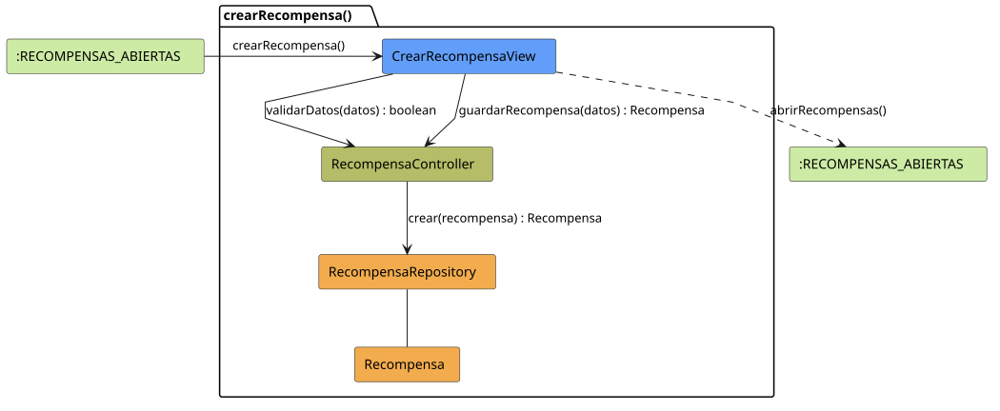

# FUNIBER GIPF > crearRecompensa > Análisis

## información del artefacto

- **Proyecto**: FUNIBER GIPF - Plataforma Interna de Investigación
- **Fase**: Análisis
- **Disciplina**: Análisis y Diseño
- **Versión**: 1.0
- **Fecha**: 2026-05-23
- **Autor**: Diego Martínez

## propósito

Análisis de colaboración del caso de uso `crearRecompensa()` mediante el patrón MVC, identificando las clases de análisis, sus responsabilidades y colaboraciones necesarias para que el coordinador registre una nueva recompensa en el sistema.

## diagrama de colaboración

||
|-|
|Código fuente: [crearRecompensa.puml](../../../modelosUML/analisis/coordinador/crearRecompensa.puml)|

## clases de análisis identificadas

### clases de vista (boundary)

#### CrearRecompensaView
**Estereotipo**: Vista (Boundary)  
**Responsabilidades**:
- Recibir la solicitud `crearRecompensa()` desde `:RECOMPENSAS_ABIERTAS`
- Solicitar al controlador la validación de datos mediante `validarDatos(datos) : boolean`
- Solicitar al controlador el guardado de la nueva recompensa mediante `guardarRecompensa(datos) : Recompensa`
- Navegar de vuelta al listado de recompensas

**Colaboraciones**:
- **Entrada**: Desde `:RECOMPENSAS_ABIERTAS` con `crearRecompensa()`
- **Control**: Se comunica con `RecompensaController` mediante `validarDatos(datos) : boolean` y `guardarRecompensa(datos) : Recompensa`
- **Salida**: Transita a `:RECOMPENSAS_ABIERTAS` con `abrirRecompensas()`

### clases de control

#### RecompensaController
**Estereotipo**: Control  
**Responsabilidades**:
- Recibir y ejecutar `validarDatos(datos) : boolean`
- Recibir `guardarRecompensa(datos)` y delegar la creación al repositorio

**Colaboraciones**:
- **Vista**: Responde a solicitudes de `CrearRecompensaView`
- **Repositorio**: Delega la persistencia a `RecompensaRepository` mediante `crear(recompensa) : Recompensa`

### clases de entidad (entity)

#### RecompensaRepository
**Estereotipo**: Entidad  
**Responsabilidades**:
- Persistir una nueva recompensa mediante `crear(recompensa) : Recompensa`

**Colaboraciones**:
- **Control**: Responde a `RecompensaController`
- **Entidad**: Gestiona instancias de `Recompensa`

#### Recompensa
**Estereotipo**: Entidad  
**Responsabilidades**:
- Representar los datos de la nueva recompensa a crear

**Colaboraciones**:
- **Repositorio**: Es gestionado por `RecompensaRepository`

## flujo de colaboración

### secuencia de operaciones

1. El sistema está en `:RECOMPENSAS_ABIERTAS`
2. El coordinador solicita crear recompensa: `CrearRecompensaView` recibe `crearRecompensa()`
3. El coordinador rellena el formulario con los datos de la recompensa
4. `CrearRecompensaView` invoca `validarDatos(datos)` en `RecompensaController` → devuelve `boolean`
5. Si la validación es correcta, `CrearRecompensaView` invoca `guardarRecompensa(datos)` en `RecompensaController`
6. `RecompensaController` delega en `RecompensaRepository.crear(recompensa)` y obtiene el objeto `Recompensa` creado
7. La vista navega de vuelta → `:RECOMPENSAS_ABIERTAS` con `abrirRecompensas()`

## correspondencia con requisitos

|Requisito del caso de uso|Clase responsable|Método/Colaboración|
|-|-|-|
|Presentar formulario de creación|`CrearRecompensaView`|`crearRecompensa()`|
|Validar datos del formulario|`RecompensaController`|`validarDatos(datos) : boolean`|
|Persistir nueva recompensa|`RecompensaController`|`guardarRecompensa(datos) : Recompensa`|
|Crear recompensa en repositorio|`RecompensaRepository`|`crear(recompensa) : Recompensa`|
|Volver al listado de recompensas|`CrearRecompensaView`|`abrirRecompensas()`|

## características del análisis

### separación de responsabilidades MVC

- **Vista**: Solo presentación del formulario e interacción con el coordinador
- **Control**: Solo coordinación de la validación y persistencia
- **Entidad**: Solo datos y reglas de negocio de las recompensas

### agnóstico tecnológicamente

- No especifica tecnología de interfaz de usuario
- No asume implementación específica de base de datos
- Mantiene independencia de frameworks

### trazabilidad completa

- **Origen**: Caso de uso detallado `crearRecompensa()`
- **Destino**: Base para diseño arquitectónico
- **Conexión**: Diagrama de estados → Análisis de colaboración

## patrones aplicados

### repository pattern
`RecompensaRepository` abstrae el acceso a datos, permitiendo diferentes implementaciones sin afectar al controlador.

### mvc pattern
Separación clara entre presentación (`CrearRecompensaView`), lógica de aplicación (`RecompensaController`) y datos (`Recompensa`, `RecompensaRepository`).

## referencias

- [Especificación detallada: crearRecompensa()](../../../context/casosDeUso/detalle/coordinador/crearRecompensa/crearRecompensa.md)
- [Modelo del dominio](../../../context/modeloDelDominio/modeloDominio.md)
