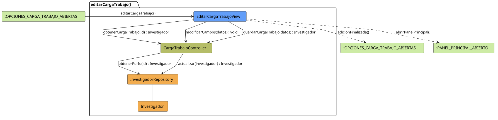

# FUNIBER GIPF > editarCargaTrabajo > Análisis

## información del artefacto

- **Proyecto**: FUNIBER GIPF - Plataforma Interna de Investigación
- **Fase**: Análisis
- **Disciplina**: Análisis y Diseño
- **Versión**: 1.0
- **Fecha**: 2026-05-23
- **Autor**: Diego Martínez

## propósito

Análisis de colaboración del caso de uso `editarCargaTrabajo()` mediante el patrón MVC, identificando las clases de análisis, sus responsabilidades y colaboraciones necesarias para que el coordinador modifique la carga de trabajo asignada a un investigador.

## diagrama de colaboración

||
|-|
|Código fuente: [editarCargaTrabajo.puml](../../../modelosUML/analisis/coordinador/editarCargaTrabajo.puml)|

## clases de análisis identificadas

### clases de vista (boundary)

#### EditarCargaTrabajoView
**Estereotipo**: Vista (Boundary)  
**Responsabilidades**:
- Recibir la solicitud `editarCargaTrabajo()` desde `:OPCIONES_CARGA_TRABAJO_ABIERTAS`
- Solicitar al controlador los datos actuales del investigador mediante `obtenerCargaTrabajo(id) : Investigador`
- Mostrar el formulario de edición con los datos actuales
- Notificar al controlador los cambios del campo mediante `modificarCampos(datos) : void`
- Solicitar al controlador el guardado mediante `guardarCargaTrabajo(datos) : Investigador`
- Navegar de vuelta a las opciones de carga de trabajo o al panel principal

**Colaboraciones**:
- **Entrada**: Desde `:OPCIONES_CARGA_TRABAJO_ABIERTAS` con `editarCargaTrabajo()`
- **Control**: Se comunica con `CargaTrabajoController` mediante `obtenerCargaTrabajo(id)`, `modificarCampos(datos)` y `guardarCargaTrabajo(datos)`
- **Salida**: Transita a `:OPCIONES_CARGA_TRABAJO_ABIERTAS` (`edicionFinalizada()`) o a `:PANEL_PRINCIPAL_ABIERTO` (`abrirPanelPrincipal()`)

### clases de control

#### CargaTrabajoController
**Estereotipo**: Control  
**Responsabilidades**:
- Recibir `obtenerCargaTrabajo(id)` y delegar en el repositorio la obtención del investigador
- Recibir `modificarCampos(datos)` para notificar cambios en tiempo real
- Recibir `guardarCargaTrabajo(datos)` y delegar la actualización al repositorio

**Colaboraciones**:
- **Vista**: Responde a solicitudes de `EditarCargaTrabajoView`
- **Repositorio**: Delega en `InvestigadorRepository` mediante `obtenerPorId(id) : Investigador` y `actualizar(investigador) : Investigador`

### clases de entidad (entity)

#### InvestigadorRepository
**Estereotipo**: Entidad  
**Responsabilidades**:
- Recuperar un investigador por id mediante `obtenerPorId(id) : Investigador`
- Persistir los cambios en la carga de trabajo mediante `actualizar(investigador) : Investigador`

**Colaboraciones**:
- **Control**: Responde a `CargaTrabajoController`
- **Entidad**: Gestiona instancias de `Investigador`

#### Investigador
**Estereotipo**: Entidad  
**Responsabilidades**:
- Representar los datos del investigador incluyendo su carga de trabajo

**Colaboraciones**:
- **Repositorio**: Es gestionado por `InvestigadorRepository`

## flujo de colaboración

### secuencia de operaciones

1. El sistema está en `:OPCIONES_CARGA_TRABAJO_ABIERTAS`
2. El coordinador solicita editar carga de trabajo: `EditarCargaTrabajoView` recibe `editarCargaTrabajo()`
3. `EditarCargaTrabajoView` invoca `obtenerCargaTrabajo(id)` en `CargaTrabajoController`
4. `CargaTrabajoController` delega en `InvestigadorRepository.obtenerPorId(id)` y obtiene un objeto `Investigador`
5. El formulario se muestra con los datos actuales
6. El coordinador modifica los campos: `EditarCargaTrabajoView` invoca `modificarCampos(datos) : void` en `CargaTrabajoController`
7. El coordinador confirma el guardado: `EditarCargaTrabajoView` invoca `guardarCargaTrabajo(datos)` en `CargaTrabajoController`
8. `CargaTrabajoController` delega en `InvestigadorRepository.actualizar(investigador)` y obtiene el objeto actualizado
9. La vista navega → `:OPCIONES_CARGA_TRABAJO_ABIERTAS` (`edicionFinalizada()`) o `:PANEL_PRINCIPAL_ABIERTO` (`abrirPanelPrincipal()`)

## correspondencia con requisitos

|Requisito del caso de uso|Clase responsable|Método/Colaboración|
|-|-|-|
|Obtener datos actuales de carga de trabajo|`CargaTrabajoController`|`obtenerCargaTrabajo(id) : Investigador`|
|Acceder al investigador por id|`InvestigadorRepository`|`obtenerPorId(id) : Investigador`|
|Notificar cambios en campos|`CargaTrabajoController`|`modificarCampos(datos) : void`|
|Guardar cambios de carga de trabajo|`CargaTrabajoController`|`guardarCargaTrabajo(datos) : Investigador`|
|Persistir actualización del investigador|`InvestigadorRepository`|`actualizar(investigador) : Investigador`|
|Volver a opciones de carga de trabajo|`EditarCargaTrabajoView`|`edicionFinalizada()`|
|Volver al panel principal|`EditarCargaTrabajoView`|`abrirPanelPrincipal()`|

## características del análisis

### separación de responsabilidades MVC

- **Vista**: Solo presentación del formulario e interacción con el coordinador
- **Control**: Solo coordinación de la obtención y persistencia de la carga de trabajo
- **Entidad**: Solo datos y reglas de negocio de los investigadores

### agnóstico tecnológicamente

- No especifica tecnología de interfaz de usuario
- No asume implementación específica de base de datos
- Mantiene independencia de frameworks

### trazabilidad completa

- **Origen**: Caso de uso detallado `editarCargaTrabajo()`
- **Destino**: Base para diseño arquitectónico
- **Conexión**: Diagrama de estados → Análisis de colaboración

## patrones aplicados

### repository pattern
`InvestigadorRepository` abstrae el acceso a datos, permitiendo diferentes implementaciones sin afectar al controlador.

### mvc pattern
Separación clara entre presentación (`EditarCargaTrabajoView`), lógica de aplicación (`CargaTrabajoController`) y datos (`Investigador`, `InvestigadorRepository`).

## referencias

- [Especificación detallada: editarCargaTrabajo()](../../../context/casosDeUso/detalle/coordinador/editarCargaTrabajo/editarCargaTrabajo.md)
- [Modelo del dominio](../../../context/modeloDelDominio/modeloDominio.md)
