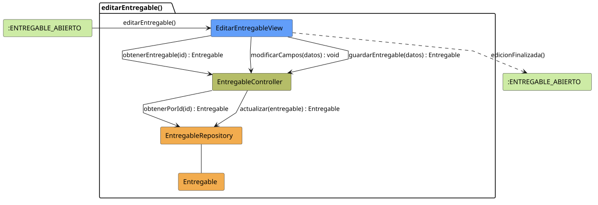

# FUNIBER GIPF > editarEntregable > Análisis

## información del artefacto

- **Proyecto**: FUNIBER GIPF - Plataforma Interna de Investigación
- **Fase**: Análisis
- **Disciplina**: Análisis y Diseño
- **Versión**: 1.0
- **Fecha**: 2026-05-23
- **Autor**: Diego Martínez

## propósito

Análisis de colaboración del caso de uso `editarEntregable()` mediante el patrón MVC, identificando las clases de análisis, sus responsabilidades y colaboraciones necesarias para que el coordinador modifique los datos de un entregable existente.

## diagrama de colaboración

||
|-|
|Código fuente: [editarEntregable.puml](../../../modelosUML/analisis/coordinador/editarEntregable.puml)|

## clases de análisis identificadas

### clases de vista (boundary)

#### EditarEntregableView
**Estereotipo**: Vista (Boundary)  
**Responsabilidades**:
- Recibir la solicitud `editarEntregable()` desde `:ENTREGABLE_ABIERTO`
- Solicitar al controlador los datos actuales del entregable mediante `obtenerEntregable(id) : Entregable`
- Mostrar el formulario de edición con los datos actuales
- Notificar al controlador los cambios del campo mediante `modificarCampos(datos) : void`
- Solicitar al controlador el guardado mediante `guardarEntregable(datos) : Entregable`
- Navegar de vuelta al entregable tras la edición

**Colaboraciones**:
- **Entrada**: Desde `:ENTREGABLE_ABIERTO` con `editarEntregable()`
- **Control**: Se comunica con `EntregableController` mediante `obtenerEntregable(id)`, `modificarCampos(datos)` y `guardarEntregable(datos)`
- **Salida**: Transita a `:ENTREGABLE_ABIERTO` con `edicionFinalizada()`

### clases de control

#### EntregableController
**Estereotipo**: Control  
**Responsabilidades**:
- Recibir `obtenerEntregable(id)` y delegar en el repositorio la obtención del entregable
- Recibir `modificarCampos(datos)` para procesar cambios en tiempo real
- Recibir `guardarEntregable(datos)` y delegar la actualización al repositorio

**Colaboraciones**:
- **Vista**: Responde a solicitudes de `EditarEntregableView`
- **Repositorio**: Delega en `EntregableRepository` mediante `obtenerPorId(id) : Entregable` y `actualizar(entregable) : Entregable`

### clases de entidad (entity)

#### EntregableRepository
**Estereotipo**: Entidad  
**Responsabilidades**:
- Recuperar un entregable por id mediante `obtenerPorId(id) : Entregable`
- Persistir los cambios en el entregable mediante `actualizar(entregable) : Entregable`

**Colaboraciones**:
- **Control**: Responde a `EntregableController`
- **Entidad**: Gestiona instancias de `Entregable`

#### Entregable
**Estereotipo**: Entidad  
**Responsabilidades**:
- Representar los datos del entregable a editar

**Colaboraciones**:
- **Repositorio**: Es gestionado por `EntregableRepository`

## flujo de colaboración

### secuencia de operaciones

1. El sistema está en `:ENTREGABLE_ABIERTO`
2. El coordinador solicita editar entregable: `EditarEntregableView` recibe `editarEntregable()`
3. `EditarEntregableView` invoca `obtenerEntregable(id)` en `EntregableController`
4. `EntregableController` delega en `EntregableRepository.obtenerPorId(id)` y obtiene un objeto `Entregable`
5. El formulario se muestra con los datos actuales
6. El coordinador modifica los campos: `EditarEntregableView` invoca `modificarCampos(datos) : void` en `EntregableController`
7. El coordinador confirma el guardado: `EditarEntregableView` invoca `guardarEntregable(datos)` en `EntregableController`
8. `EntregableController` delega en `EntregableRepository.actualizar(entregable)` y obtiene el objeto actualizado
9. La vista navega de vuelta → `:ENTREGABLE_ABIERTO` con `edicionFinalizada()`

## correspondencia con requisitos

|Requisito del caso de uso|Clase responsable|Método/Colaboración|
|-|-|-|
|Obtener datos actuales del entregable|`EntregableController`|`obtenerEntregable(id) : Entregable`|
|Acceder al entregable por id|`EntregableRepository`|`obtenerPorId(id) : Entregable`|
|Notificar cambios en campos|`EntregableController`|`modificarCampos(datos) : void`|
|Guardar cambios del entregable|`EntregableController`|`guardarEntregable(datos) : Entregable`|
|Persistir actualización del entregable|`EntregableRepository`|`actualizar(entregable) : Entregable`|
|Volver al entregable|`EditarEntregableView`|`edicionFinalizada()`|

## características del análisis

### separación de responsabilidades MVC

- **Vista**: Solo presentación del formulario e interacción con el coordinador
- **Control**: Solo coordinación de la obtención y persistencia del entregable
- **Entidad**: Solo datos y reglas de negocio del entregable

### agnóstico tecnológicamente

- No especifica tecnología de interfaz de usuario
- No asume implementación específica de base de datos
- Mantiene independencia de frameworks

### trazabilidad completa

- **Origen**: Caso de uso detallado `editarEntregable()`
- **Destino**: Base para diseño arquitectónico
- **Conexión**: Diagrama de estados → Análisis de colaboración

## patrones aplicados

### repository pattern
`EntregableRepository` abstrae el acceso a datos, permitiendo diferentes implementaciones sin afectar al controlador.

### mvc pattern
Separación clara entre presentación (`EditarEntregableView`), lógica de aplicación (`EntregableController`) y datos (`Entregable`, `EntregableRepository`).

## referencias

- [Especificación detallada: editarEntregable()](../../../context/casosDeUso/detalle/coordinador/editarEntregable/editarEntregable.md)
- [Modelo del dominio](../../../context/modeloDelDominio/modeloDominio.md)
