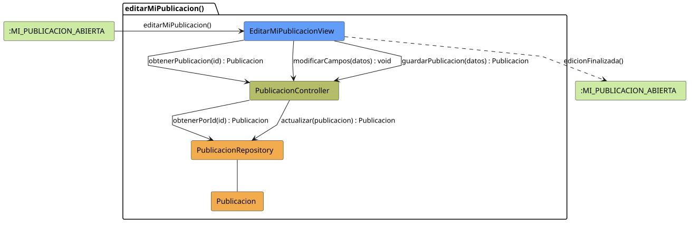

# FUNIBER GIPF > editarMiPublicacion > Análisis

## información del artefacto

- **Proyecto**: FUNIBER GIPF - Plataforma Interna de Investigación
- **Fase**: Análisis
- **Disciplina**: Análisis y Diseño
- **Versión**: 1.0
- **Fecha**: 2026-05-23
- **Autor**: Diego Martínez

## propósito

Análisis de colaboración del caso de uso `editarMiPublicacion()` mediante el patrón MVC, identificando las clases de análisis, sus responsabilidades y colaboraciones necesarias para que el coordinador modifique los datos de una publicación propia.

## diagrama de colaboración

||
|-|
|Código fuente: [editarMiPublicacion.puml](../../../modelosUML/analisis/coordinador/editarMiPublicacion.puml)|

## clases de análisis identificadas

### clases de vista (boundary)

#### EditarMiPublicacionView
**Estereotipo**: Vista (Boundary)  
**Responsabilidades**:
- Recibir la solicitud `editarMiPublicacion()` desde `:MI_PUBLICACION_ABIERTA`
- Solicitar al controlador los datos actuales de la publicación mediante `obtenerPublicacion(id) : Publicacion`
- Mostrar el formulario de edición con los datos actuales
- Notificar al controlador los cambios del campo mediante `modificarCampos(datos) : void`
- Solicitar al controlador el guardado mediante `guardarPublicacion(datos) : Publicacion`
- Navegar de vuelta a la publicación propia tras la edición

**Colaboraciones**:
- **Entrada**: Desde `:MI_PUBLICACION_ABIERTA` con `editarMiPublicacion()`
- **Control**: Se comunica con `PublicacionController` mediante `obtenerPublicacion(id)`, `modificarCampos(datos)` y `guardarPublicacion(datos)`
- **Salida**: Transita a `:MI_PUBLICACION_ABIERTA` con `edicionFinalizada()`

### clases de control

#### PublicacionController
**Estereotipo**: Control  
**Responsabilidades**:
- Recibir `obtenerPublicacion(id)` y delegar en el repositorio la obtención de la publicación
- Recibir `modificarCampos(datos)` para procesar cambios en tiempo real
- Recibir `guardarPublicacion(datos)` y delegar la actualización al repositorio

**Colaboraciones**:
- **Vista**: Responde a solicitudes de `EditarMiPublicacionView`
- **Repositorio**: Delega en `PublicacionRepository` mediante `obtenerPorId(id) : Publicacion` y `actualizar(publicacion) : Publicacion`

### clases de entidad (entity)

#### PublicacionRepository
**Estereotipo**: Entidad  
**Responsabilidades**:
- Recuperar una publicación por id mediante `obtenerPorId(id) : Publicacion`
- Persistir los cambios en la publicación mediante `actualizar(publicacion) : Publicacion`

**Colaboraciones**:
- **Control**: Responde a `PublicacionController`
- **Entidad**: Gestiona instancias de `Publicacion`

#### Publicacion
**Estereotipo**: Entidad  
**Responsabilidades**:
- Representar los datos de la publicación propia a editar

**Colaboraciones**:
- **Repositorio**: Es gestionado por `PublicacionRepository`

## flujo de colaboración

### secuencia de operaciones

1. El sistema está en `:MI_PUBLICACION_ABIERTA`
2. El coordinador solicita editar su publicación: `EditarMiPublicacionView` recibe `editarMiPublicacion()`
3. `EditarMiPublicacionView` invoca `obtenerPublicacion(id)` en `PublicacionController`
4. `PublicacionController` delega en `PublicacionRepository.obtenerPorId(id)` y obtiene un objeto `Publicacion`
5. El formulario se muestra con los datos actuales
6. El coordinador modifica los campos: `EditarMiPublicacionView` invoca `modificarCampos(datos) : void` en `PublicacionController`
7. El coordinador confirma el guardado: `EditarMiPublicacionView` invoca `guardarPublicacion(datos)` en `PublicacionController`
8. `PublicacionController` delega en `PublicacionRepository.actualizar(publicacion)` y obtiene el objeto actualizado
9. La vista navega de vuelta → `:MI_PUBLICACION_ABIERTA` con `edicionFinalizada()`

## correspondencia con requisitos

|Requisito del caso de uso|Clase responsable|Método/Colaboración|
|-|-|-|
|Obtener datos actuales de la publicación|`PublicacionController`|`obtenerPublicacion(id) : Publicacion`|
|Acceder a la publicación por id|`PublicacionRepository`|`obtenerPorId(id) : Publicacion`|
|Notificar cambios en campos|`PublicacionController`|`modificarCampos(datos) : void`|
|Guardar cambios de la publicación|`PublicacionController`|`guardarPublicacion(datos) : Publicacion`|
|Persistir actualización de la publicación|`PublicacionRepository`|`actualizar(publicacion) : Publicacion`|
|Volver a la publicación propia|`EditarMiPublicacionView`|`edicionFinalizada()`|

## características del análisis

### separación de responsabilidades MVC

- **Vista**: Solo presentación del formulario e interacción con el coordinador
- **Control**: Solo coordinación de la obtención y persistencia de la publicación
- **Entidad**: Solo datos y reglas de negocio de la publicación

### agnóstico tecnológicamente

- No especifica tecnología de interfaz de usuario
- No asume implementación específica de base de datos
- Mantiene independencia de frameworks

### trazabilidad completa

- **Origen**: Caso de uso detallado `editarMiPublicacion()`
- **Destino**: Base para diseño arquitectónico
- **Conexión**: Diagrama de estados → Análisis de colaboración

## patrones aplicados

### repository pattern
`PublicacionRepository` abstrae el acceso a datos, permitiendo diferentes implementaciones sin afectar al controlador.

### mvc pattern
Separación clara entre presentación (`EditarMiPublicacionView`), lógica de aplicación (`PublicacionController`) y datos (`Publicacion`, `PublicacionRepository`).

## referencias

- [Especificación detallada: editarMiPublicacion()](../../../context/casosDeUso/detalle/coordinador/editarMiPublicacion/editarPublicacion.md)
- [Modelo del dominio](../../../context/modeloDelDominio/modeloDominio.md)
