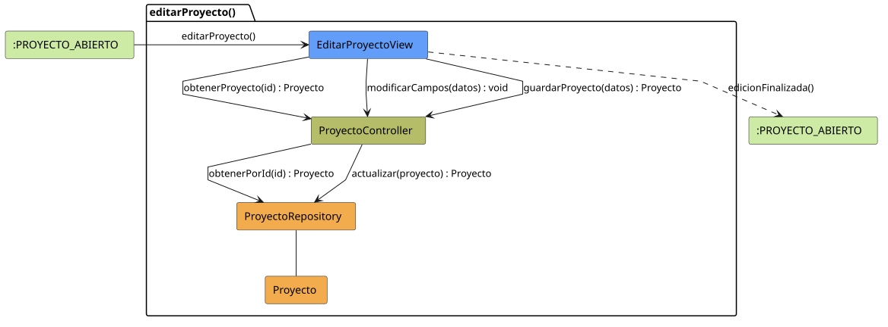

# FUNIBER GIPF > editarProyecto > Análisis

## información del artefacto

- **Proyecto**: FUNIBER GIPF - Plataforma Interna de Investigación
- **Fase**: Análisis
- **Disciplina**: Análisis y Diseño
- **Versión**: 1.0
- **Fecha**: 2026-05-23
- **Autor**: Diego Martínez

## propósito

Análisis de colaboración del caso de uso `editarProyecto()` mediante el patrón MVC, identificando las clases de análisis, sus responsabilidades y colaboraciones necesarias para que el coordinador modifique los datos de un proyecto de investigación existente.

## diagrama de colaboración

||
|-|
|Código fuente: [editarProyecto.puml](../../../modelosUML/analisis/coordinador/editarProyecto.puml)|

## clases de análisis identificadas

### clases de vista (boundary)

#### EditarProyectoView
**Estereotipo**: Vista (Boundary)  
**Responsabilidades**:
- Recibir la solicitud `editarProyecto()` desde `:PROYECTO_ABIERTO`
- Solicitar al controlador los datos actuales del proyecto mediante `obtenerProyecto(id) : Proyecto`
- Mostrar el formulario de edición con los datos actuales
- Notificar al controlador los cambios del campo mediante `modificarCampos(datos) : void`
- Solicitar al controlador el guardado mediante `guardarProyecto(datos) : Proyecto`
- Navegar de vuelta al proyecto tras la edición

**Colaboraciones**:
- **Entrada**: Desde `:PROYECTO_ABIERTO` con `editarProyecto()`
- **Control**: Se comunica con `ProyectoController` mediante `obtenerProyecto(id)`, `modificarCampos(datos)` y `guardarProyecto(datos)`
- **Salida**: Transita a `:PROYECTO_ABIERTO` con `edicionFinalizada()`

### clases de control

#### ProyectoController
**Estereotipo**: Control  
**Responsabilidades**:
- Recibir `obtenerProyecto(id)` y delegar en el repositorio la obtención del proyecto
- Recibir `modificarCampos(datos)` para procesar cambios en tiempo real
- Recibir `guardarProyecto(datos)` y delegar la actualización al repositorio

**Colaboraciones**:
- **Vista**: Responde a solicitudes de `EditarProyectoView`
- **Repositorio**: Delega en `ProyectoRepository` mediante `obtenerPorId(id) : Proyecto` y `actualizar(proyecto) : Proyecto`

### clases de entidad (entity)

#### ProyectoRepository
**Estereotipo**: Entidad  
**Responsabilidades**:
- Recuperar un proyecto por id mediante `obtenerPorId(id) : Proyecto`
- Persistir los cambios en el proyecto mediante `actualizar(proyecto) : Proyecto`

**Colaboraciones**:
- **Control**: Responde a `ProyectoController`
- **Entidad**: Gestiona instancias de `Proyecto`

#### Proyecto
**Estereotipo**: Entidad  
**Responsabilidades**:
- Representar los datos del proyecto de investigación a editar

**Colaboraciones**:
- **Repositorio**: Es gestionado por `ProyectoRepository`

## flujo de colaboración

### secuencia de operaciones

1. El sistema está en `:PROYECTO_ABIERTO`
2. El coordinador solicita editar proyecto: `EditarProyectoView` recibe `editarProyecto()`
3. `EditarProyectoView` invoca `obtenerProyecto(id)` en `ProyectoController`
4. `ProyectoController` delega en `ProyectoRepository.obtenerPorId(id)` y obtiene un objeto `Proyecto`
5. El formulario se muestra con los datos actuales
6. El coordinador modifica los campos: `EditarProyectoView` invoca `modificarCampos(datos) : void` en `ProyectoController`
7. El coordinador confirma el guardado: `EditarProyectoView` invoca `guardarProyecto(datos)` en `ProyectoController`
8. `ProyectoController` delega en `ProyectoRepository.actualizar(proyecto)` y obtiene el objeto actualizado
9. La vista navega de vuelta → `:PROYECTO_ABIERTO` con `edicionFinalizada()`

## correspondencia con requisitos

|Requisito del caso de uso|Clase responsable|Método/Colaboración|
|-|-|-|
|Obtener datos actuales del proyecto|`ProyectoController`|`obtenerProyecto(id) : Proyecto`|
|Acceder al proyecto por id|`ProyectoRepository`|`obtenerPorId(id) : Proyecto`|
|Notificar cambios en campos|`ProyectoController`|`modificarCampos(datos) : void`|
|Guardar cambios del proyecto|`ProyectoController`|`guardarProyecto(datos) : Proyecto`|
|Persistir actualización del proyecto|`ProyectoRepository`|`actualizar(proyecto) : Proyecto`|
|Volver al proyecto|`EditarProyectoView`|`edicionFinalizada()`|

## características del análisis

### separación de responsabilidades MVC

- **Vista**: Solo presentación del formulario e interacción con el coordinador
- **Control**: Solo coordinación de la obtención y persistencia del proyecto
- **Entidad**: Solo datos y reglas de negocio del proyecto

### agnóstico tecnológicamente

- No especifica tecnología de interfaz de usuario
- No asume implementación específica de base de datos
- Mantiene independencia de frameworks

### trazabilidad completa

- **Origen**: Caso de uso detallado `editarProyecto()`
- **Destino**: Base para diseño arquitectónico
- **Conexión**: Diagrama de estados → Análisis de colaboración

## patrones aplicados

### repository pattern
`ProyectoRepository` abstrae el acceso a datos, permitiendo diferentes implementaciones sin afectar al controlador.

### mvc pattern
Separación clara entre presentación (`EditarProyectoView`), lógica de aplicación (`ProyectoController`) y datos (`Proyecto`, `ProyectoRepository`).

## referencias

- [Especificación detallada: editarProyecto()](../../../context/casosDeUso/detalle/coordinador/editarProyecto/editarProyecto.md)
- [Modelo del dominio](../../../context/modeloDelDominio/modeloDominio.md)
