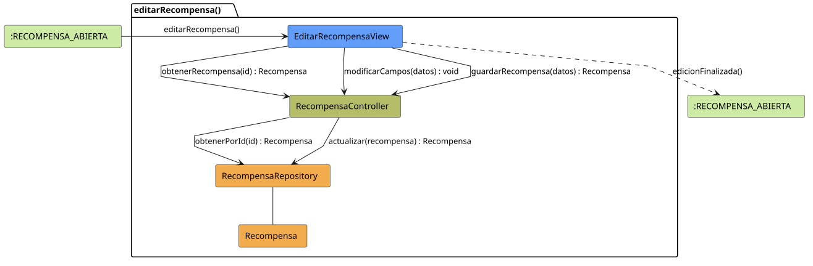

# FUNIBER GIPF > editarRecompensa > Análisis

## información del artefacto

- **Proyecto**: FUNIBER GIPF - Plataforma Interna de Investigación
- **Fase**: Análisis
- **Disciplina**: Análisis y Diseño
- **Versión**: 1.0
- **Fecha**: 2026-05-23
- **Autor**: Diego Martínez

## propósito

Análisis de colaboración del caso de uso `editarRecompensa()` mediante el patrón MVC, identificando las clases de análisis, sus responsabilidades y colaboraciones necesarias para que el coordinador modifique los datos de una recompensa existente.

## diagrama de colaboración

||
|-|
|Código fuente: [editarRecompensa.puml](../../../modelosUML/analisis/coordinador/editarRecompensa.puml)|

## clases de análisis identificadas

### clases de vista (boundary)

#### EditarRecompensaView
**Estereotipo**: Vista (Boundary)  
**Responsabilidades**:
- Recibir la solicitud `editarRecompensa()` desde `:RECOMPENSA_ABIERTA`
- Solicitar al controlador los datos actuales de la recompensa mediante `obtenerRecompensa(id) : Recompensa`
- Mostrar el formulario de edición con los datos actuales
- Notificar al controlador los cambios del campo mediante `modificarCampos(datos) : void`
- Solicitar al controlador el guardado mediante `guardarRecompensa(datos) : Recompensa`
- Navegar de vuelta a la recompensa tras la edición

**Colaboraciones**:
- **Entrada**: Desde `:RECOMPENSA_ABIERTA` con `editarRecompensa()`
- **Control**: Se comunica con `RecompensaController` mediante `obtenerRecompensa(id)`, `modificarCampos(datos)` y `guardarRecompensa(datos)`
- **Salida**: Transita a `:RECOMPENSA_ABIERTA` con `edicionFinalizada()`

### clases de control

#### RecompensaController
**Estereotipo**: Control  
**Responsabilidades**:
- Recibir `obtenerRecompensa(id)` y delegar en el repositorio la obtención de la recompensa
- Recibir `modificarCampos(datos)` para procesar cambios en tiempo real
- Recibir `guardarRecompensa(datos)` y delegar la actualización al repositorio

**Colaboraciones**:
- **Vista**: Responde a solicitudes de `EditarRecompensaView`
- **Repositorio**: Delega en `RecompensaRepository` mediante `obtenerPorId(id) : Recompensa` y `actualizar(recompensa) : Recompensa`

### clases de entidad (entity)

#### RecompensaRepository
**Estereotipo**: Entidad  
**Responsabilidades**:
- Recuperar una recompensa por id mediante `obtenerPorId(id) : Recompensa`
- Persistir los cambios en la recompensa mediante `actualizar(recompensa) : Recompensa`

**Colaboraciones**:
- **Control**: Responde a `RecompensaController`
- **Entidad**: Gestiona instancias de `Recompensa`

#### Recompensa
**Estereotipo**: Entidad  
**Responsabilidades**:
- Representar los datos de la recompensa a editar

**Colaboraciones**:
- **Repositorio**: Es gestionado por `RecompensaRepository`

## flujo de colaboración

### secuencia de operaciones

1. El sistema está en `:RECOMPENSA_ABIERTA`
2. El coordinador solicita editar recompensa: `EditarRecompensaView` recibe `editarRecompensa()`
3. `EditarRecompensaView` invoca `obtenerRecompensa(id)` en `RecompensaController`
4. `RecompensaController` delega en `RecompensaRepository.obtenerPorId(id)` y obtiene un objeto `Recompensa`
5. El formulario se muestra con los datos actuales
6. El coordinador modifica los campos: `EditarRecompensaView` invoca `modificarCampos(datos) : void` en `RecompensaController`
7. El coordinador confirma el guardado: `EditarRecompensaView` invoca `guardarRecompensa(datos)` en `RecompensaController`
8. `RecompensaController` delega en `RecompensaRepository.actualizar(recompensa)` y obtiene el objeto actualizado
9. La vista navega de vuelta → `:RECOMPENSA_ABIERTA` con `edicionFinalizada()`

## correspondencia con requisitos

|Requisito del caso de uso|Clase responsable|Método/Colaboración|
|-|-|-|
|Obtener datos actuales de la recompensa|`RecompensaController`|`obtenerRecompensa(id) : Recompensa`|
|Acceder a la recompensa por id|`RecompensaRepository`|`obtenerPorId(id) : Recompensa`|
|Notificar cambios en campos|`RecompensaController`|`modificarCampos(datos) : void`|
|Guardar cambios de la recompensa|`RecompensaController`|`guardarRecompensa(datos) : Recompensa`|
|Persistir actualización de la recompensa|`RecompensaRepository`|`actualizar(recompensa) : Recompensa`|
|Volver a la recompensa|`EditarRecompensaView`|`edicionFinalizada()`|

## características del análisis

### separación de responsabilidades MVC

- **Vista**: Solo presentación del formulario e interacción con el coordinador
- **Control**: Solo coordinación de la obtención y persistencia de la recompensa
- **Entidad**: Solo datos y reglas de negocio de la recompensa

### agnóstico tecnológicamente

- No especifica tecnología de interfaz de usuario
- No asume implementación específica de base de datos
- Mantiene independencia de frameworks

### trazabilidad completa

- **Origen**: Caso de uso detallado `editarRecompensa()`
- **Destino**: Base para diseño arquitectónico
- **Conexión**: Diagrama de estados → Análisis de colaboración

## patrones aplicados

### repository pattern
`RecompensaRepository` abstrae el acceso a datos, permitiendo diferentes implementaciones sin afectar al controlador.

### mvc pattern
Separación clara entre presentación (`EditarRecompensaView`), lógica de aplicación (`RecompensaController`) y datos (`Recompensa`, `RecompensaRepository`).

## referencias

- [Especificación detallada: editarRecompensa()](../../../context/casosDeUso/detalle/coordinador/editarRecompensa/editarRecompensa.md)
- [Modelo del dominio](../../../context/modeloDelDominio/modeloDominio.md)
