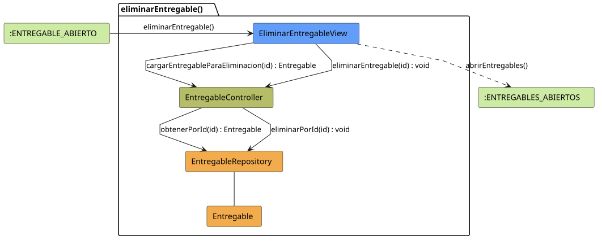

# FUNIBER GIPF > eliminarEntregable > Análisis

## información del artefacto

- **Proyecto**: FUNIBER GIPF - Plataforma Interna de Investigación
- **Fase**: Análisis
- **Disciplina**: Análisis y Diseño
- **Versión**: 1.0
- **Fecha**: 2026-05-23
- **Autor**: Diego Martínez

## propósito

Análisis de colaboración del caso de uso `eliminarEntregable()` mediante el patrón MVC, identificando las clases de análisis, sus responsabilidades y colaboraciones necesarias para que el coordinador elimine un entregable de un proyecto.

## diagrama de colaboración

||
|-|
|Código fuente: [eliminarEntregable.puml](../../../modelosUML/analisis/coordinador/eliminarEntregable.puml)|

## clases de análisis identificadas

### clases de vista (boundary)

#### EliminarEntregableView
**Estereotipo**: Vista (Boundary)  
**Responsabilidades**:
- Recibir la solicitud `eliminarEntregable()` desde `:ENTREGABLE_ABIERTO`
- Solicitar al controlador los datos del entregable a eliminar mediante `cargarEntregableParaEliminacion(id) : Entregable`
- Mostrar la pantalla de confirmación con los datos del entregable
- Solicitar al controlador la eliminación definitiva mediante `eliminarEntregable(id) : void`
- Navegar al listado de entregables tras la eliminación

**Colaboraciones**:
- **Entrada**: Desde `:ENTREGABLE_ABIERTO` con `eliminarEntregable()`
- **Control**: Se comunica con `EntregableController` mediante `cargarEntregableParaEliminacion(id)` y `eliminarEntregable(id)`
- **Salida**: Transita a `:ENTREGABLES_ABIERTOS` con `abrirEntregables()`

### clases de control

#### EntregableController
**Estereotipo**: Control  
**Responsabilidades**:
- Recibir `cargarEntregableParaEliminacion(id)` y delegar en el repositorio la obtención del entregable
- Recibir `eliminarEntregable(id)` y delegar la eliminación al repositorio

**Colaboraciones**:
- **Vista**: Responde a solicitudes de `EliminarEntregableView`
- **Repositorio**: Delega en `EntregableRepository` mediante `obtenerPorId(id) : Entregable` y `eliminarPorId(id) : void`

### clases de entidad (entity)

#### EntregableRepository
**Estereotipo**: Entidad  
**Responsabilidades**:
- Recuperar un entregable por id mediante `obtenerPorId(id) : Entregable`
- Eliminar un entregable del sistema mediante `eliminarPorId(id) : void`

**Colaboraciones**:
- **Control**: Responde a `EntregableController`
- **Entidad**: Gestiona instancias de `Entregable`

#### Entregable
**Estereotipo**: Entidad  
**Responsabilidades**:
- Representar los datos del entregable mostrados en la confirmación de eliminación

**Colaboraciones**:
- **Repositorio**: Es gestionado por `EntregableRepository`

## flujo de colaboración

### secuencia de operaciones

1. El sistema está en `:ENTREGABLE_ABIERTO`
2. El coordinador solicita eliminar entregable: `EliminarEntregableView` recibe `eliminarEntregable()`
3. `EliminarEntregableView` invoca `cargarEntregableParaEliminacion(id)` en `EntregableController`
4. `EntregableController` delega en `EntregableRepository.obtenerPorId(id)` y obtiene un objeto `Entregable`
5. La pantalla de confirmación se muestra con los datos del entregable
6. El coordinador confirma: `EliminarEntregableView` invoca `eliminarEntregable(id) : void` en `EntregableController`
7. `EntregableController` delega en `EntregableRepository.eliminarPorId(id)`
8. La vista navega → `:ENTREGABLES_ABIERTOS` con `abrirEntregables()`

## correspondencia con requisitos

|Requisito del caso de uso|Clase responsable|Método/Colaboración|
|-|-|-|
|Cargar datos para confirmación|`EntregableController`|`cargarEntregableParaEliminacion(id) : Entregable`|
|Acceder al entregable por id|`EntregableRepository`|`obtenerPorId(id) : Entregable`|
|Eliminar entregable del sistema|`EntregableController`|`eliminarEntregable(id) : void`|
|Persistir la eliminación|`EntregableRepository`|`eliminarPorId(id) : void`|
|Navegar al listado de entregables|`EliminarEntregableView`|`abrirEntregables()`|

## características del análisis

### separación de responsabilidades MVC

- **Vista**: Solo presentación de la confirmación e interacción con el coordinador
- **Control**: Solo coordinación del proceso de eliminación
- **Entidad**: Solo datos y gestión de la persistencia

### agnóstico tecnológicamente

- No especifica tecnología de interfaz de usuario
- No asume implementación específica de base de datos
- Mantiene independencia de frameworks

### trazabilidad completa

- **Origen**: Caso de uso detallado `eliminarEntregable()`
- **Destino**: Base para diseño arquitectónico
- **Conexión**: Diagrama de estados → Análisis de colaboración

## patrones aplicados

### repository pattern
`EntregableRepository` abstrae el acceso a datos, permitiendo diferentes implementaciones sin afectar al controlador.

### mvc pattern
Separación clara entre presentación (`EliminarEntregableView`), lógica de aplicación (`EntregableController`) y datos (`Entregable`, `EntregableRepository`).

## referencias

- [Especificación detallada: eliminarEntregable()](../../../context/casosDeUso/detalle/coordinador/eliminarEntregable/eliminarEntregable.md)
- [Modelo del dominio](../../../context/modeloDelDominio/modeloDominio.md)
