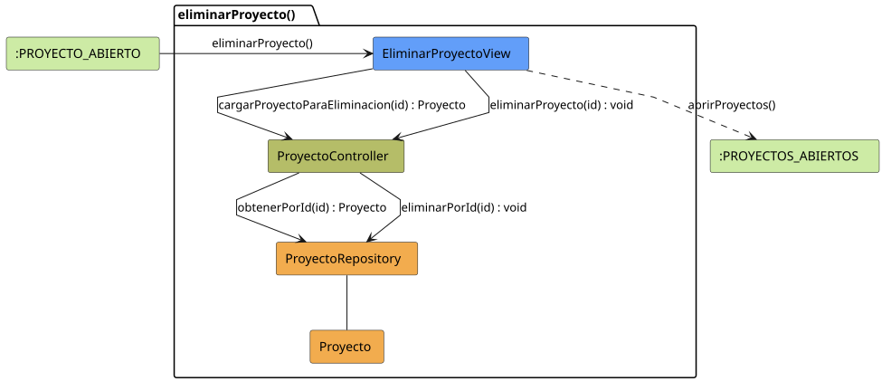

# FUNIBER GIPF > eliminarProyecto > Análisis

## información del artefacto

- **Proyecto**: FUNIBER GIPF - Plataforma Interna de Investigación
- **Fase**: Análisis
- **Disciplina**: Análisis y Diseño
- **Versión**: 1.0
- **Fecha**: 2026-05-23
- **Autor**: Diego Martínez

## propósito

Análisis de colaboración del caso de uso `eliminarProyecto()` mediante el patrón MVC, identificando las clases de análisis, sus responsabilidades y colaboraciones necesarias para que el coordinador elimine un proyecto de investigación del sistema.

## diagrama de colaboración

||
|-|
|Código fuente: [eliminarProyecto.puml](../../../modelosUML/analisis/coordinador/eliminarProyecto.puml)|

## clases de análisis identificadas

### clases de vista (boundary)

#### EliminarProyectoView
**Estereotipo**: Vista (Boundary)  
**Responsabilidades**:
- Recibir la solicitud `eliminarProyecto()` desde `:PROYECTO_ABIERTO`
- Solicitar al controlador los datos del proyecto a eliminar mediante `cargarProyectoParaEliminacion(id) : Proyecto`
- Mostrar la pantalla de confirmación con los datos del proyecto
- Solicitar al controlador la eliminación definitiva mediante `eliminarProyecto(id) : void`
- Navegar al listado de proyectos tras la eliminación

**Colaboraciones**:
- **Entrada**: Desde `:PROYECTO_ABIERTO` con `eliminarProyecto()`
- **Control**: Se comunica con `ProyectoController` mediante `cargarProyectoParaEliminacion(id)` y `eliminarProyecto(id)`
- **Salida**: Transita a `:PROYECTOS_ABIERTOS` con `abrirProyectos()`

### clases de control

#### ProyectoController
**Estereotipo**: Control  
**Responsabilidades**:
- Recibir `cargarProyectoParaEliminacion(id)` y delegar en el repositorio la obtención del proyecto
- Recibir `eliminarProyecto(id)` y delegar la eliminación al repositorio

**Colaboraciones**:
- **Vista**: Responde a solicitudes de `EliminarProyectoView`
- **Repositorio**: Delega en `ProyectoRepository` mediante `obtenerPorId(id) : Proyecto` y `eliminarPorId(id) : void`

### clases de entidad (entity)

#### ProyectoRepository
**Estereotipo**: Entidad  
**Responsabilidades**:
- Recuperar un proyecto por id mediante `obtenerPorId(id) : Proyecto`
- Eliminar un proyecto del sistema mediante `eliminarPorId(id) : void`

**Colaboraciones**:
- **Control**: Responde a `ProyectoController`
- **Entidad**: Gestiona instancias de `Proyecto`

#### Proyecto
**Estereotipo**: Entidad  
**Responsabilidades**:
- Representar los datos del proyecto mostrados en la confirmación de eliminación

**Colaboraciones**:
- **Repositorio**: Es gestionado por `ProyectoRepository`

## flujo de colaboración

### secuencia de operaciones

1. El sistema está en `:PROYECTO_ABIERTO`
2. El coordinador solicita eliminar proyecto: `EliminarProyectoView` recibe `eliminarProyecto()`
3. `EliminarProyectoView` invoca `cargarProyectoParaEliminacion(id)` en `ProyectoController`
4. `ProyectoController` delega en `ProyectoRepository.obtenerPorId(id)` y obtiene un objeto `Proyecto`
5. La pantalla de confirmación se muestra con los datos del proyecto
6. El coordinador confirma: `EliminarProyectoView` invoca `eliminarProyecto(id) : void` en `ProyectoController`
7. `ProyectoController` delega en `ProyectoRepository.eliminarPorId(id)`
8. La vista navega → `:PROYECTOS_ABIERTOS` con `abrirProyectos()`

## correspondencia con requisitos

|Requisito del caso de uso|Clase responsable|Método/Colaboración|
|-|-|-|
|Cargar datos para confirmación|`ProyectoController`|`cargarProyectoParaEliminacion(id) : Proyecto`|
|Acceder al proyecto por id|`ProyectoRepository`|`obtenerPorId(id) : Proyecto`|
|Eliminar proyecto del sistema|`ProyectoController`|`eliminarProyecto(id) : void`|
|Persistir la eliminación|`ProyectoRepository`|`eliminarPorId(id) : void`|
|Navegar al listado de proyectos|`EliminarProyectoView`|`abrirProyectos()`|

## características del análisis

### separación de responsabilidades MVC

- **Vista**: Solo presentación de la confirmación e interacción con el coordinador
- **Control**: Solo coordinación del proceso de eliminación
- **Entidad**: Solo datos y gestión de la persistencia

### agnóstico tecnológicamente

- No especifica tecnología de interfaz de usuario
- No asume implementación específica de base de datos
- Mantiene independencia de frameworks

### trazabilidad completa

- **Origen**: Caso de uso detallado `eliminarProyecto()`
- **Destino**: Base para diseño arquitectónico
- **Conexión**: Diagrama de estados → Análisis de colaboración

## patrones aplicados

### repository pattern
`ProyectoRepository` abstrae el acceso a datos, permitiendo diferentes implementaciones sin afectar al controlador.

### mvc pattern
Separación clara entre presentación (`EliminarProyectoView`), lógica de aplicación (`ProyectoController`) y datos (`Proyecto`, `ProyectoRepository`).

## referencias

- [Especificación detallada: eliminarProyecto()](../../../context/casosDeUso/detalle/coordinador/eliminarProyecto/eliminarProyecto.md)
- [Modelo del dominio](../../../context/modeloDelDominio/modeloDominio.md)
