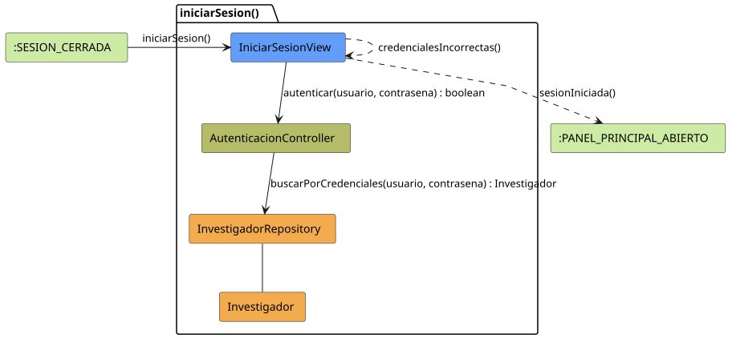

# FUNIBER GIPF > iniciarSesion > Análisis

## información del artefacto

- **Proyecto**: FUNIBER GIPF - Plataforma Interna de Investigación
- **Fase**: Análisis
- **Disciplina**: Análisis y Diseño
- **Versión**: 1.0
- **Fecha**: 2026-05-23
- **Autor**: Diego Martínez

## propósito

Análisis de colaboración del caso de uso `iniciarSesion()` mediante el patrón MVC, identificando las clases de análisis, sus responsabilidades y colaboraciones necesarias para autenticar al coordinador y abrir el panel principal.

## diagrama de colaboración

||
|-|
|Código fuente: [iniciarSesion.puml](../../../modelosUML/analisis/coordinador/iniciarSesion.puml)|

## clases de análisis identificadas

### clases de vista (boundary)

#### IniciarSesionView
**Estereotipo**: Vista (Boundary)  
**Responsabilidades**:
- Recibir la solicitud `iniciarSesion()` desde `:SESION_CERRADA`
- Solicitar al controlador la autenticación mediante `autenticar(usuario, contrasena) : boolean`
- Navegar al panel principal si la autenticación es correcta
- Mostrar error de credenciales si la autenticación falla con `credencialesIncorrectas()`

**Colaboraciones**:
- **Entrada**: Desde `:SESION_CERRADA` con `iniciarSesion()`
- **Control**: Se comunica con `AutenticacionController` mediante `autenticar(usuario, contrasena) : boolean`
- **Salida**: Transita a `:PANEL_PRINCIPAL_ABIERTO` (`sesionIniciada()`) o se mantiene en sí misma (`credencialesIncorrectas()`)

### clases de control

#### AutenticacionController
**Estereotipo**: Control  
**Responsabilidades**:
- Recibir `autenticar(usuario, contrasena)` y delegar en el repositorio la verificación de credenciales

**Colaboraciones**:
- **Vista**: Responde a solicitudes de `IniciarSesionView`
- **Repositorio**: Delega en `InvestigadorRepository` mediante `buscarPorCredenciales(usuario, contrasena) : Investigador`

### clases de entidad (entity)

#### InvestigadorRepository
**Estereotipo**: Entidad  
**Responsabilidades**:
- Buscar un investigador por sus credenciales mediante `buscarPorCredenciales(usuario, contrasena) : Investigador`

**Colaboraciones**:
- **Control**: Responde a `AutenticacionController`
- **Entidad**: Gestiona instancias de `Investigador`

#### Investigador
**Estereotipo**: Entidad  
**Responsabilidades**:
- Representar los datos del usuario autenticado incluyendo sus credenciales y rol

**Colaboraciones**:
- **Repositorio**: Es gestionado por `InvestigadorRepository`

## flujo de colaboración

### secuencia de operaciones

1. El sistema está en `:SESION_CERRADA`
2. El coordinador solicita iniciar sesión: `IniciarSesionView` recibe `iniciarSesion()`
3. El coordinador introduce usuario y contraseña
4. `IniciarSesionView` invoca `autenticar(usuario, contrasena)` en `AutenticacionController` → devuelve `boolean`
5. `AutenticacionController` delega en `InvestigadorRepository.buscarPorCredenciales(usuario, contrasena)` y obtiene un objeto `Investigador`
6. Si la autenticación es correcta: la vista navega → `:PANEL_PRINCIPAL_ABIERTO` con `sesionIniciada()`
7. Si la autenticación falla: `IniciarSesionView` muestra el error con `credencialesIncorrectas()`

## correspondencia con requisitos

|Requisito del caso de uso|Clase responsable|Método/Colaboración|
|-|-|-|
|Autenticar al coordinador|`AutenticacionController`|`autenticar(usuario, contrasena) : boolean`|
|Verificar credenciales en repositorio|`InvestigadorRepository`|`buscarPorCredenciales(usuario, contrasena) : Investigador`|
|Navegar al panel principal|`IniciarSesionView`|`sesionIniciada()`|
|Mostrar error de credenciales|`IniciarSesionView`|`credencialesIncorrectas()`|

## características del análisis

### separación de responsabilidades MVC

- **Vista**: Solo presentación del formulario e interacción con el coordinador
- **Control**: Solo coordinación de la lógica de autenticación
- **Entidad**: Solo datos y reglas de negocio del investigador

### agnóstico tecnológicamente

- No especifica tecnología de interfaz de usuario
- No asume implementación específica de base de datos
- Mantiene independencia de frameworks

### trazabilidad completa

- **Origen**: Caso de uso detallado `iniciarSesion()`
- **Destino**: Base para diseño arquitectónico
- **Conexión**: Diagrama de estados → Análisis de colaboración

## patrones aplicados

### repository pattern
`InvestigadorRepository` abstrae el acceso a datos, permitiendo diferentes implementaciones sin afectar al controlador.

### mvc pattern
Separación clara entre presentación (`IniciarSesionView`), lógica de aplicación (`AutenticacionController`) y datos (`Investigador`, `InvestigadorRepository`).

## referencias

- [Especificación detallada: iniciarSesion()](../../../context/casosDeUso/detalle/coordinador/iniciarSesion/iniciarSesion.md)
- [Modelo del dominio](../../../context/modeloDelDominio/modeloDominio.md)
