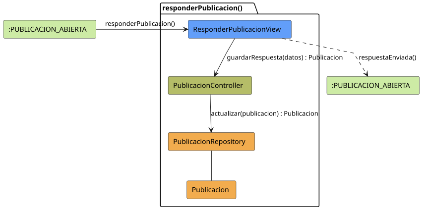

# FUNIBER GIPF > responderPublicacion > Análisis

## información del artefacto

- **Proyecto**: FUNIBER GIPF - Plataforma Interna de Investigación
- **Fase**: Análisis
- **Disciplina**: Análisis y Diseño
- **Versión**: 1.0
- **Fecha**: 2026-05-23
- **Autor**: Diego Martínez

## propósito

Análisis de colaboración del caso de uso `responderPublicacion()` mediante el patrón MVC, identificando las clases de análisis, sus responsabilidades y colaboraciones necesarias para que el coordinador añada una respuesta a una publicación.

## diagrama de colaboración

||
|-|
|Código fuente: [responderPublicacion.puml](../../../modelosUML/analisis/coordinador/responderPublicacion.puml)|

## clases de análisis identificadas

### clases de vista (boundary)

#### ResponderPublicacionView
**Estereotipo**: Vista (Boundary)  
**Responsabilidades**:
- Recibir la solicitud `responderPublicacion()` desde `:PUBLICACION_ABIERTA`
- Solicitar al controlador el guardado de la respuesta mediante `guardarRespuesta(datos) : Publicacion`
- Navegar de vuelta a la publicación tras el envío

**Colaboraciones**:
- **Entrada**: Desde `:PUBLICACION_ABIERTA` con `responderPublicacion()`
- **Control**: Se comunica con `PublicacionController` mediante `guardarRespuesta(datos) : Publicacion`
- **Salida**: Transita a `:PUBLICACION_ABIERTA` con `respuestaEnviada()`

### clases de control

#### PublicacionController
**Estereotipo**: Control  
**Responsabilidades**:
- Recibir `guardarRespuesta(datos)` y delegar la actualización al repositorio

**Colaboraciones**:
- **Vista**: Responde a solicitudes de `ResponderPublicacionView`
- **Repositorio**: Delega en `PublicacionRepository` mediante `actualizar(publicacion) : Publicacion`

### clases de entidad (entity)

#### PublicacionRepository
**Estereotipo**: Entidad  
**Responsabilidades**:
- Persistir la respuesta añadida a la publicación mediante `actualizar(publicacion) : Publicacion`

**Colaboraciones**:
- **Control**: Responde a `PublicacionController`
- **Entidad**: Gestiona instancias de `Publicacion`

#### Publicacion
**Estereotipo**: Entidad  
**Responsabilidades**:
- Representar la publicación con la respuesta del coordinador incorporada

**Colaboraciones**:
- **Repositorio**: Es gestionado por `PublicacionRepository`

## flujo de colaboración

### secuencia de operaciones

1. El sistema está en `:PUBLICACION_ABIERTA`
2. El coordinador solicita responder la publicación: `ResponderPublicacionView` recibe `responderPublicacion()`
3. El coordinador redacta el contenido de la respuesta
4. `ResponderPublicacionView` invoca `guardarRespuesta(datos)` en `PublicacionController` → devuelve `Publicacion`
5. `PublicacionController` delega en `PublicacionRepository.actualizar(publicacion)` y obtiene la publicación actualizada
6. La vista navega de vuelta → `:PUBLICACION_ABIERTA` con `respuestaEnviada()`

## correspondencia con requisitos

|Requisito del caso de uso|Clase responsable|Método/Colaboración|
|-|-|-|
|Guardar respuesta en la publicación|`PublicacionController`|`guardarRespuesta(datos) : Publicacion`|
|Persistir publicación actualizada|`PublicacionRepository`|`actualizar(publicacion) : Publicacion`|
|Navegar a la publicación|`ResponderPublicacionView`|`respuestaEnviada()`|

## características del análisis

### separación de responsabilidades MVC

- **Vista**: Solo presentación del formulario e interacción con el coordinador
- **Control**: Solo coordinación del proceso de respuesta
- **Entidad**: Solo datos y reglas de negocio de la publicación

### agnóstico tecnológicamente

- No especifica tecnología de interfaz de usuario
- No asume implementación específica de base de datos
- Mantiene independencia de frameworks

### trazabilidad completa

- **Origen**: Caso de uso detallado `responderPublicacion()`
- **Destino**: Base para diseño arquitectónico
- **Conexión**: Diagrama de estados → Análisis de colaboración

## patrones aplicados

### repository pattern
`PublicacionRepository` abstrae el acceso a datos, permitiendo diferentes implementaciones sin afectar al controlador.

### mvc pattern
Separación clara entre presentación (`ResponderPublicacionView`), lógica de aplicación (`PublicacionController`) y datos (`Publicacion`, `PublicacionRepository`).

## referencias

- [Especificación detallada: responderPublicacion()](../../../context/casosDeUso/detalle/coordinador/responderPublicacion/responderPublicacion.md)
- [Modelo del dominio](../../../context/modeloDelDominio/modeloDominio.md)
