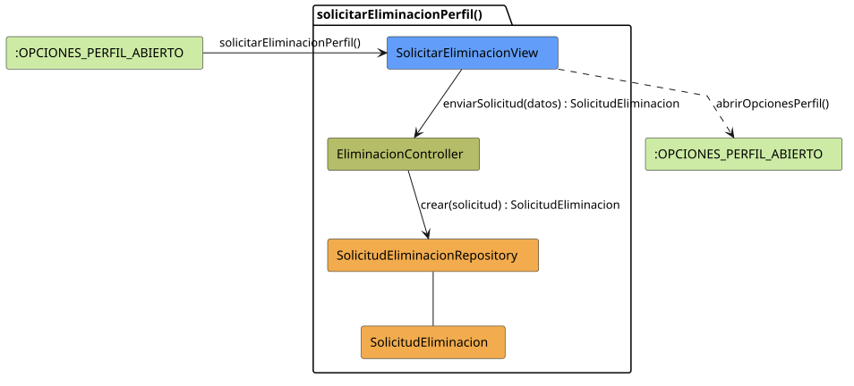

# FUNIBER GIPF > solicitarEliminacionPerfil > Análisis

## información del artefacto

- **Proyecto**: FUNIBER GIPF - Plataforma Interna de Investigación
- **Fase**: Análisis
- **Disciplina**: Análisis y Diseño
- **Versión**: 1.0
- **Fecha**: 2026-05-23
- **Autor**: Diego Martínez

## propósito

Análisis de colaboración del caso de uso `solicitarEliminacionPerfil()` mediante el patrón MVC, identificando las clases de análisis, sus responsabilidades y colaboraciones necesarias para que el coordinador registre una solicitud de eliminación de perfil.

## diagrama de colaboración

||
|-|
|Código fuente: [solicitarEliminacionPerfil.puml](../../../modelosUML/analisis/coordinador/solicitarEliminacionPerfil.puml)|

## clases de análisis identificadas

### clases de vista (boundary)

#### SolicitarEliminacionView
**Estereotipo**: Vista (Boundary)  
**Responsabilidades**:
- Recibir la solicitud `solicitarEliminacionPerfil()` desde `:OPCIONES_PERFIL_ABIERTO`
- Solicitar al controlador el envío de la solicitud mediante `enviarSolicitud(datos) : SolicitudEliminacion`
- Navegar de vuelta a las opciones de perfil

**Colaboraciones**:
- **Entrada**: Desde `:OPCIONES_PERFIL_ABIERTO` con `solicitarEliminacionPerfil()`
- **Control**: Se comunica con `EliminacionController` mediante `enviarSolicitud(datos) : SolicitudEliminacion`
- **Salida**: Transita a `:OPCIONES_PERFIL_ABIERTO` con `abrirOpcionesPerfil()`

### clases de control

#### EliminacionController
**Estereotipo**: Control  
**Responsabilidades**:
- Recibir `enviarSolicitud(datos)` y delegar la creación de la solicitud al repositorio

**Colaboraciones**:
- **Vista**: Responde a solicitudes de `SolicitarEliminacionView`
- **Repositorio**: Delega en `SolicitudEliminacionRepository` mediante `crear(solicitud) : SolicitudEliminacion`

### clases de entidad (entity)

#### SolicitudEliminacionRepository
**Estereotipo**: Entidad  
**Responsabilidades**:
- Persistir una nueva solicitud de eliminación mediante `crear(solicitud) : SolicitudEliminacion`

**Colaboraciones**:
- **Control**: Responde a `EliminacionController`
- **Entidad**: Gestiona instancias de `SolicitudEliminacion`

#### SolicitudEliminacion
**Estereotipo**: Entidad  
**Responsabilidades**:
- Representar los datos de la solicitud de eliminación de perfil a registrar

**Colaboraciones**:
- **Repositorio**: Es gestionado por `SolicitudEliminacionRepository`

## flujo de colaboración

### secuencia de operaciones

1. El sistema está en `:OPCIONES_PERFIL_ABIERTO`
2. El coordinador solicita eliminar el perfil: `SolicitarEliminacionView` recibe `solicitarEliminacionPerfil()`
3. El coordinador rellena el formulario con los datos de la solicitud
4. `SolicitarEliminacionView` invoca `enviarSolicitud(datos)` en `EliminacionController` → devuelve `SolicitudEliminacion`
5. `EliminacionController` delega en `SolicitudEliminacionRepository.crear(solicitud)` y obtiene el objeto `SolicitudEliminacion` creado
6. La vista navega de vuelta → `:OPCIONES_PERFIL_ABIERTO` con `abrirOpcionesPerfil()`

## correspondencia con requisitos

|Requisito del caso de uso|Clase responsable|Método/Colaboración|
|-|-|-|
|Registrar solicitud de eliminación|`EliminacionController`|`enviarSolicitud(datos) : SolicitudEliminacion`|
|Persistir la solicitud|`SolicitudEliminacionRepository`|`crear(solicitud) : SolicitudEliminacion`|
|Volver a opciones de perfil|`SolicitarEliminacionView`|`abrirOpcionesPerfil()`|

## características del análisis

### separación de responsabilidades MVC

- **Vista**: Solo presentación del formulario e interacción con el coordinador
- **Control**: Solo coordinación del registro de la solicitud
- **Entidad**: Solo datos y reglas de negocio de la solicitud de eliminación

### agnóstico tecnológicamente

- No especifica tecnología de interfaz de usuario
- No asume implementación específica de base de datos
- Mantiene independencia de frameworks

### trazabilidad completa

- **Origen**: Caso de uso detallado `solicitarEliminacionPerfil()`
- **Destino**: Base para diseño arquitectónico
- **Conexión**: Diagrama de estados → Análisis de colaboración

## patrones aplicados

### repository pattern
`SolicitudEliminacionRepository` abstrae el acceso a datos, permitiendo diferentes implementaciones sin afectar al controlador.

### mvc pattern
Separación clara entre presentación (`SolicitarEliminacionView`), lógica de aplicación (`EliminacionController`) y datos (`SolicitudEliminacion`, `SolicitudEliminacionRepository`).

## referencias

- [Especificación detallada: solicitarEliminacionPerfil()](../../../context/casosDeUso/detalle/coordinador/solicitarEliminacionPerfil/solicitarEliminacionPerfil.md)
- [Modelo del dominio](../../../context/modeloDelDominio/modeloDominio.md)
