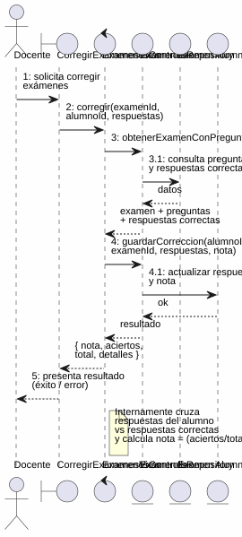
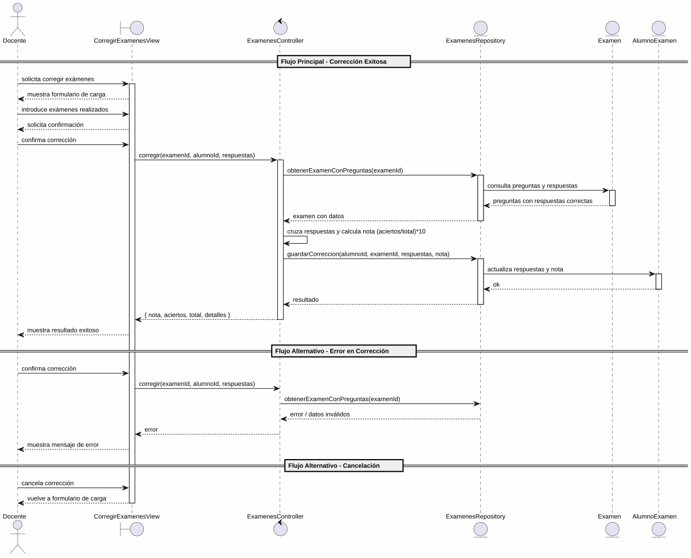

# 25-26-idsw2-sdVC > corregirExamenes > Análisis

## información del artefacto

- **Proyecto**: Sistema de Gestión de Exámenes Universitarios
- **Fase RUP**: Elaboration (Elaboración)
- **Disciplina**: Análisis y Diseño
- **Versión**: 1.0
- **Fecha**: 2026-05-25
- **Autor**: Marcos Gutierrez

## propósito

Análisis de colaboración del caso de uso `corregirExamenes()` mediante el patrón MVC, identificando las clases de análisis, sus responsabilidades y colaboraciones necesarias para cumplir con los requisitos especificados.

## diagrama de colaboración

||
|-|
|Código fuente: [colaboracion.puml](../../../modelosUML/analisis/corregirExamenes/colaboracion.puml)|

## clases de análisis identificadas

### clases de vista (boundary)

#### CorregirExamenesView
**Estereotipo**: Vista (Boundary)
**Responsabilidades**:
- Recibir la solicitud de corrección de exámenes desde el menú principal
- Permitir al docente cargar o capturar los exámenes realizados por los alumnos
- Presentar confirmación antes de ejecutar la corrección
- Mostrar progreso durante la corrección
- Visualizar el resultado final (éxito o error)
- Manejar la navegación de salida

**Colaboraciones**:
- **Entrada**: Recibe `corregirExamenes()` desde `SISTEMA_DISPONIBLE` (menú principal)
- **Control**: Se comunica con `ExamenesController`
- **Salida**: Navega a `EXAMENES_CORREGIDOS`

### clases de control

#### ExamenesController
**Estereotipo**: Control
**Responsabilidades**:
- Coordinar la lógica de corrección de exámenes
- Validar los datos de entrada (examenId, alumnoId, respuestas)
- Cruce de respuestas del alumno contra respuestas correctas
- Cálculo de la nota (escala 0-10) basado en aciertos
- Gestionar la actualización del estado del examen: `ASIGNADO` → `RESUELTO` (si quedan alumnos sin corregir) → `CORREGIDO` (cuando todos están corregidos)

**Colaboraciones**:
- **Vista**: Responde a solicitudes de `CorregirExamenesView`
- **Repositorio**: Delega operaciones de datos a `ExamenesRepository`

### clases de entidad (entity)

#### ExamenesRepository
**Estereotipo**: Entidad
**Responsabilidades**:
- Abstraer el acceso a datos de exámenes y asignaciones
- Proporcionar método para obtener examen completo con preguntas y respuestas correctas
- Implementar persistencia de la corrección (respuestas del alumno + nota)
- Mantener la consistencia del estado del examen según los alumnos corregidos

**Colaboraciones**:
- **Control**: Responde a `ExamenesController`
- **Entidad**: Gestiona instancias de `Examen` y `AlumnoExamen`

#### Examen
**Estereotipo**: Entidad
**Responsabilidades**:
- Representar el examen que contiene las preguntas a corregir
- Encapsular atributos: id, evaluacion, claveCorreccion, estado
- Mantener el ciclo de vida del estado: `ASIGNADO` → `RESUELTO` (corrección parcial) → `CORREGIDO` (todos corregidos)
- Relacionarse con sus preguntas a través de ExamenPregunta

**Atributos relevantes**:
| Campo | Tipo | Descripción |
|-------|------|-------------|
| `id` | Int (PK) | Identificador único del examen |
| `evaluacion` | Evaluacion (enum) | Tipo de evaluación |
| `claveCorreccion` | String? | JSON con ids de respuestas correctas (generado en `asignar()`, no se usa en `corregir()`) |
| `estado` | EstadoExamen (enum) | GENERADO \| ASIGNADO \| RESUELTO \| CORREGIDO |
| `asignaturaId` | Int (FK) | Referencia a la asignatura |

**Colaboraciones**:
- **ExamenesRepository**: Es gestionada por el repositorio
- **AlumnoExamen**: Relación de composición con las asignaciones de alumnos

#### AlumnoExamen
**Estereotipo**: Entidad
**Responsabilidades**:
- Representar la asignación de un alumno a un examen
- Almacenar las respuestas del alumno (JSON) y la nota calculada
- Mantener la integridad de los datos de corrección

**Atributos relevantes**:
| Campo | Tipo | Descripción |
|-------|------|-------------|
| `alumnoId` | Int (PK) | Identificador del alumno |
| `examenId` | Int (PK) | Identificador del examen |
| `hashAsignacion` | String? | Hash SHA-256 de verificación |
| `respuestas` | String? | JSON con respuestas del alumno `[{preguntaId, opcionId}]` |
| `nota` | Float? | Nota calculada (escala 0-10) |

**Colaboraciones**:
- **ExamenesRepository**: Es gestionada por el repositorio
- **Examen**: Relación de composición con el examen padre

## diagrama de secuencia

||
|-|
|Código fuente: [secuencia.puml](../../../modelosUML/analisis/corregirExamenes/secuencia.puml)|

## flujo de colaboración

### secuencia de operaciones (flujo principal)

1. **Inicio**: `SISTEMA_DISPONIBLE` → `CorregirExamenesView.corregirExamenes()`
2. **Carga de respuestas**: `CorregirExamenesView` muestra formulario; Docente introduce los exámenes realizados
3. **Confirmación**: `CorregirExamenesView` solicita confirmación; Docente confirma la corrección
4. **Corrección**: `CorregirExamenesView` → `ExamenesController.corregir(examenId, alumnoId, respuestas)`
5. **Acceso a datos**: `ExamenesController` → `ExamenesRepository.obtenerExamenConPreguntas(examenId)`
6. **Consulta de entidad**: `ExamenesRepository` → `Examen` → devuelve preguntas con respuestas correctas
7. **Cruce de respuestas**: `ExamenesController` cruza respuestas del alumno vs respuestas correctas y calcula `nota = (aciertos / total) * 10`
8. **Persistencia**: `ExamenesController` → `ExamenesRepository.guardarCorreccion(alumnoId, examenId, respuestas, nota)`
9. **Actualización de entidad**: `ExamenesRepository` → `AlumnoExamen` → actualiza respuestas y nota
10. **Actualización de estado**: Si todos los alumnos están corregidos, se actualiza `Examen.estado` a `CORREGIDO`; en caso contrario a `RESUELTO`
11. **Resultado**: `ExamenesController` → `CorregirExamenesView` → `{ nota, aciertos, total, detalles }`

### flujo alternativo — error en la corrección

- Paso 4 falla por datos inválidos o error de persistencia
- `ExamenesController` retorna error a `CorregirExamenesView`
- `CorregirExamenesView` muestra mensaje de error al Docente
- El sistema regresa al estado `ProporcionandoExamenes`

### flujo alternativo — cancelación

- Docente selecciona "Cancelar" en el diálogo de confirmación
- `CorregirExamenesView` regresa al formulario de carga de exámenes
- No se ejecuta ninguna corrección ni persistencia

### opciones de navegación disponibles

| Acción | Destino | Descripción |
|--------|---------|-------------|
| `Finalizar y Salir` | `EXAMENES_CORREGIDOS` | Sale del caso de uso tras corrección exitosa |
| `Cancelar` | `ProporcionandoExamenes` | Vuelve al formulario de carga sin ejecutar corrección |
| `Salir de corrección` | `EXAMENES_CORREGIDOS` | Sale sin realizar ninguna corrección |

## estados de análisis

Los estados se corresponden con el diagrama de estados detallado en `contexto/casos-de-uso/detalladoCasosDeUso/corregirExamenes/corregirExamenes.puml`:

| Estado | Descripción |
|--------|-------------|
| `RequiriendoCorreccion` | El docente solicita corregir exámenes desde el menú principal |
| `ProporcionandoExamenes` | El sistema muestra el formulario de carga; el docente introduce los exámenes realizados o solicita salir |
| `ProporcionandoConfirmacion` | El sistema presenta confirmación; el docente confirma o cancela la corrección |
| `Corrigiendo` (choice) | Punto de decisión: corrección exitosa → finaliza; error o cancelación → vuelve a `ProporcionandoExamenes` |

**Transiciones clave:**
- `RequiriendoCorreccion` → `ProporcionandoExamenes`: Sistema muestra formulario de carga
- `ProporcionandoExamenes` → `ProporcionandoConfirmacion`: Docente introduce exámenes realizados
- `ProporcionandoConfirmacion` → `Corrigiendo`: Docente confirma corrección
- `Corrigiendo` → `ProporcionandoExamenes`: Error en corrección o cancelación
- `Corrigiendo` → `[*]`: Corrección exitosa (salida a `EXAMENES_CORREGIDOS`)
- `ProporcionandoExamenes` → `[*]`: Docente solicita salir (salida a `EXAMENES_CORREGIDOS`)

## correspondencia con requisitos

### mapeado con especificación detallada

| Requisito del caso de uso | Clase responsable | Método/Colaboración |
|--------------------------|-------------------|---------------------|
| Cargar exámenes realizados | `CorregirExamenesView` | Formulario de captura de respuestas |
| Confirmar corrección | `CorregirExamenesView` | Diálogo de confirmación |
| Cruzar respuestas y calcular nota | `ExamenesController` | `corregir(examenId, alumnoId, respuestas)` |
| Obtener preguntas con respuestas correctas | `ExamenesRepository` | `obtenerExamenConPreguntas(examenId)` |
| Guardar respuestas del alumno y nota | `ExamenesRepository` | `guardarCorreccion(alumnoId, examenId, respuestas, nota)` |
| Actualizar estado del examen | `ExamenesRepository` | `actualizarEstadoExamen(examenId, estado)` |
| Mostrar resultado (éxito/error) | `CorregirExamenesView` | Presentación de nota, aciertos y detalles |
| Salir de corrección | `CorregirExamenesView` | Navegación a `EXAMENES_CORREGIDOS` |

### patrón de colaboración establecido

Este análisis sigue el **patrón metodológico universal** establecido para el proyecto:
- **Entrada única**: Desde `SISTEMA_DISPONIBLE` (menú principal del docente)
- **Análisis MVC completo**: Vista, Control y Entidad claramente separados
- **Salida única**: `EXAMENES_CORREGIDOS` tras corrección exitosa
- **Flujo con transiciones**: Confirmación, cancelación y error contemplados en el análisis

## características del análisis

### separación de responsabilidades MVC

- **Vista**: Solo presentación, captura de respuestas e interacción con el docente
- **Control**: Solo coordinación, lógica de cruce de respuestas y cálculo de nota
- **Entidad**: Solo datos, reglas de negocio de persistencia y ciclo de vida del examen

### agnóstico tecnológicamente

- No especifica tecnología de interfaz de usuario
- No asume implementación específica de base de datos
- Mantiene independencia de frameworks

### trazabilidad completa

- **Origen**: Caso de uso detallado `corregirExamenes()` y prototipos asociados
- **Destino**: Base para diseño arquitectónico e implementación
- **Conexión**: Diagrama de contexto → Análisis de colaboración → Implementación real

### consideraciones de filtros

A diferencia de casos de uso como `verRespuestas()`, `corregirExamenes()` **no requiere filtros de búsqueda**. Es un caso de uso transaccional donde el docente:
1. Selecciona un examen
2. Carga las respuestas de los alumnos
3. El sistema procesa la corrección

No existe listado de entidades que requiera filtrado por criterios de búsqueda.

## patrones aplicados

### repository pattern
`ExamenesRepository` abstrae el acceso a datos, permitiendo diferentes implementaciones sin afectar el controlador. Encapsula las operaciones de lectura (obtener examen con preguntas) y escritura (guardar corrección, actualizar estado).

### mvc pattern
Separación clara entre presentación (`CorregirExamenesView`), lógica de aplicación (`ExamenesController`) y datos (`Examen`, `AlumnoExamen`, `ExamenesRepository`).

### navigation pattern
Las opciones de "Cancelar", "Finalizar y Salir" y "Salir de corrección" permiten al docente controlar el flujo, manteniendo flexibilidad en la navegación del sistema.
