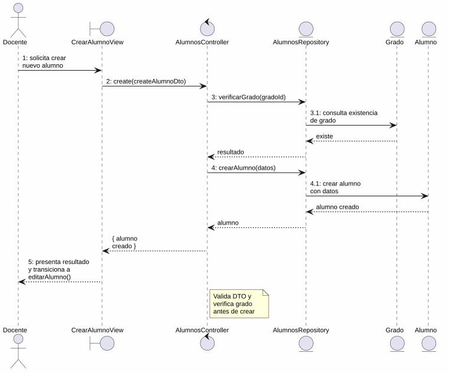
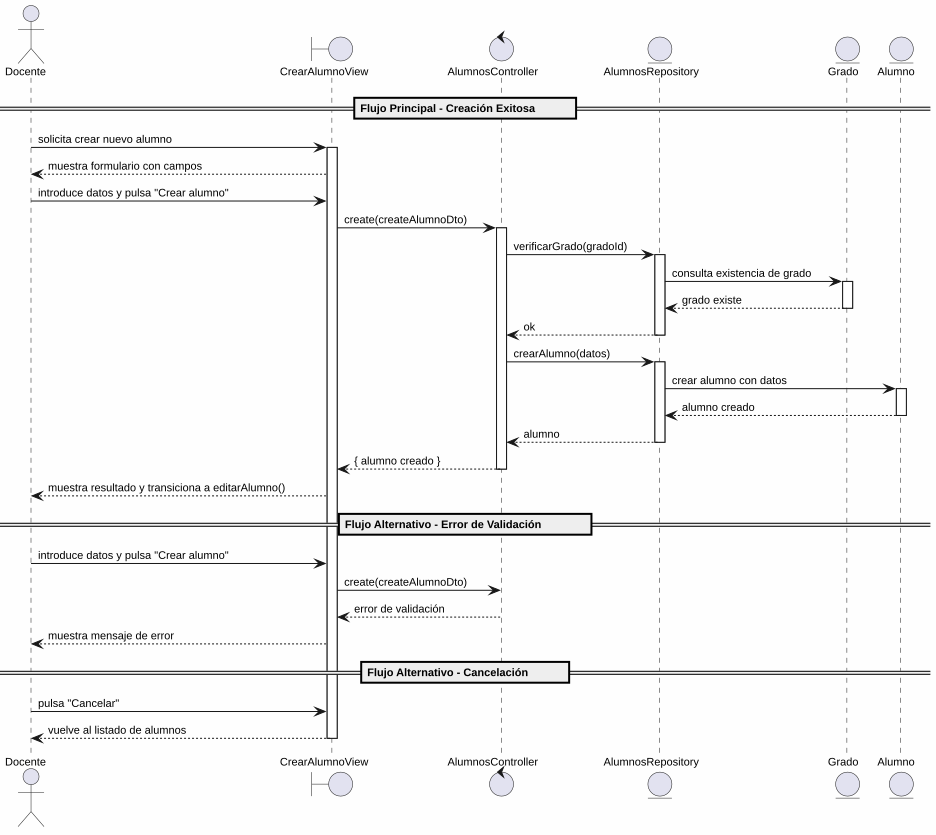

# 25-26-idsw2-sdVC > crearAlumno > Análisis

## información del artefacto

- **Proyecto**: Sistema de Gestión de Exámenes Universitarios
- **Fase RUP**: Elaboration (Elaboración)
- **Disciplina**: Análisis y Diseño
- **Versión**: 1.0
- **Fecha**: 2026-05-29
- **Autor**: Marcos Gutierrez

## propósito

Análisis de colaboración del caso de uso `crearAlumno()` mediante el patrón MVC, identificando las clases de análisis, sus responsabilidades y colaboraciones necesarias para cumplir con los requisitos especificados.

## diagrama de colaboración

||
|-|
|Código fuente: [colaboracion.puml](../../../modelosUML/analisis/crearAlumno/colaboracion.puml)|

## clases de análisis identificadas

### clases de vista (boundary)

#### CrearAlumnoView
**Estereotipo**: Vista (Boundary)
**Responsabilidades**:
- Recibir la solicitud de creación de alumno desde el listado de alumnos (`ALUMNOS_ABIERTO`)
- Presentar formulario con campos obligatorios: Nombres, Apellidos, DNI
- Validar visualmente los campos obligatorios antes de enviar
- Presentar confirmación antes de ejecutar la creación
- Visualizar el resultado final (éxito con transición a edición, o error)
- Manejar la navegación de salida y cancelación

**Colaboraciones**:
- **Entrada**: Recibe `crearAlumno()` desde `ALUMNOS_ABIERTO` (listado de alumnos)
- **Control**: Se comunica con `AlumnosController`
- **Salida**: Navega a `ALUMNO_ABIERTO` (éxito, abre edición) o `ALUMNOS_ABIERTO2` (cancelación)

### clases de control

#### AlumnosController
**Estereotipo**: Control
**Responsabilidades**:
- Coordinar la lógica de creación de un nuevo alumno
- Validar los datos de entrada (nombre, apellidos, dni, email, gradoId)
- Verificar que no exista duplicidad de DNI o email
- Verificar que el grado especificado existe
- Crear el alumno con los datos proporcionados
- Gestionar la respuesta de éxito o error

**Colaboraciones**:
- **Vista**: Responde a solicitudes de `CrearAlumnoView`
- **Repositorio**: Delega operaciones de persistencia a `AlumnosRepository`

### clases de entidad (entity)

#### AlumnosRepository
**Estereotipo**: Entidad
**Responsabilidades**:
- Abstraer el acceso a datos de alumnos y grados
- Proporcionar método para crear un alumno con los datos proporcionados
- Validar la unicidad de DNI y email antes de crear
- Verificar la existencia del grado referenciado
- Mantener la consistencia de los datos durante la creación

**Colaboraciones**:
- **Control**: Responde a `AlumnosController`
- **Entidad**: Gestiona instancias de `Alumno` y `Grado`

#### Alumno
**Estereotipo**: Entidad
**Responsabilidades**:
- Representar un alumno del sistema
- Encapsular atributos: id, nombre, apellidos, dni, email, gradoId
- Relacionarse con el grado al que pertenece

**Atributos relevantes**:
| Campo | Tipo | Descripción |
|-------|------|-------------|
| `id` | Int (PK) | Identificador único del alumno |
| `nombre` | String | Nombre del alumno |
| `apellidos` | String | Apellidos del alumno |
| `dni` | String (unique) | Documento nacional de identidad |
| `email` | String (unique) | Correo electrónico |
| `gradoId` | Int (FK) | Referencia al grado |

**Colaboraciones**:
- **AlumnosRepository**: Es gestionada por el repositorio
- **Grado**: Relación de pertenencia al grado

#### Grado
**Estereotipo**: Entidad
**Responsabilidades**:
- Representar un grado universitario
- Validar existencia del grado para asignar al nuevo alumno

**Atributos relevantes**:
| Campo | Tipo | Descripción |
|-------|------|-------------|
| `id` | Int (PK) | Identificador único del grado |
| `titulo` | String | Nombre del grado |
| `codigo` | String (unique) | Código del grado |

**Colaboraciones**:
- **AlumnosRepository**: Es consultada para verificar existencia

## diagrama de secuencia

||
|-|
|Código fuente: [secuencia.puml](../../../modelosUML/analisis/crearAlumno/secuencia.puml)|

## flujo de colaboración

### secuencia de operaciones (flujo principal)

1. **Inicio**: `ALUMNOS_ABIERTO` → `CrearAlumnoView.crearAlumno()`
2. **Carga del formulario**: `CrearAlumnoView` muestra formulario con campos: Nombres, Apellidos, DNI
3. **Introducción de datos**: Docente rellena los campos obligatorios y pulsa "Crear alumno"
4. **Creación**: `CrearAlumnoView` → `AlumnosController.create(createAlumnoDto)`
5. **Validación**: `AlumnosController` valida los datos de entrada (nombre, apellidos, dni, email, gradoId)
6. **Verificación de grado**: `AlumnosController` → `AlumnosRepository` → `Grado` → verifica existencia
7. **Persistencia**: `AlumnosController` → `AlumnosRepository.crearAlumno(datos)`
8. **Creación de entidad**: `AlumnosRepository` → `Alumno` → crea el alumno con datos
9. **Resultado**: `AlumnosRepository` → `AlumnosController` → `CrearAlumnoView` → Docente: alumno creado + transición a `editarAlumno(nuevoAlumno)`

### flujo alternativo — error en la creación

- Paso 5 falla por datos inválidos (validación del controlador) o paso 6 por grado no encontrado
- `AlumnosController` retorna error a `CrearAlumnoView`
- `CrearAlumnoView` muestra mensaje de error al Docente
- El sistema regresa al estado `SolicitandoDatos`

### flujo alternativo — cancelación

- Docente pulsa "Cancelar" en el formulario
- `CrearAlumnoView` regresa al listado de alumnos (`ALUMNOS_ABIERTO2`)
- No se ejecuta ninguna creación ni persistencia

### opciones de navegación disponibles

| Acción | Destino | Descripción |
|--------|---------|-------------|
| `Crear alumno` | `ALUMNO_ABIERTO` | Crea el alumno y abre su edición (`editarAlumno()`) |
| `Cancelar` | `ALUMNOS_ABIERTO2` | Vuelve al listado sin crear |

## estados de análisis

Los estados se corresponden con el diagrama de estados detallado en `contexto/casos-de-uso/detalladoCasosDeUso/crearAlumno/crearAlumno.puml`:

| Estado | Descripción |
|--------|-------------|
| `SolicitandoDatos` | El docente solicita crear un nuevo alumno |
| `CreandoAlumno` | El sistema presenta el formulario con campos; el docente introduce los datos, confirma la creación o cancela |

**Transiciones clave:**
- `SolicitandoDatos` → `CreandoAlumno`: Sistema presenta formulario con campos obligatorios
- `CreandoAlumno` → `[*]`: Creación exitosa (salida a `ALUMNO_ABIERTO` con transición a `editarAlumno()`)
- `CreandoAlumno` → `ALUMNOS_ABIERTO2`: Cancelación

## correspondencia con requisitos

### mapeado con especificación detallada

| Requisito del caso de uso | Clase responsable | Método/Colaboración |
|--------------------------|-------------------|---------------------|
| Mostrar formulario con campos obligatorios | `CrearAlumnoView` | Nombres, Apellidos, DNI |
| Validar campos obligatorios | `CrearAlumnoView` | Validación visual antes de enviar |
| Crear alumno con datos | `AlumnosController` | `create(createAlumnoDto)` |
| Validar integridad de datos de entrada | `AlumnosController` | Validación de DTO |
| Verificar existencia de grado | `AlumnosRepository` | Consulta de `Grado` por id |
| Verificar unicidad de DNI/email | `AlumnosRepository` | Validación de campos unique en BD |
| Persistir alumno | `AlumnosRepository` | `crearAlumno(datos)` |
| Transicionar a edición tras crear | `CrearAlumnoView` | Navegación a `ALUMNO_ABIERTO` con nuevo alumno |
| Cancelar creación | `CrearAlumnoView` | Navegación a `ALUMNOS_ABIERTO2` |

### patrón de colaboración establecido

Este análisis sigue el **patrón metodológico universal** establecido para el proyecto:
- **Entrada única**: Desde `ALUMNOS_ABIERTO` (listado de alumnos)
- **Análisis MVC completo**: Vista, Control y Entidad claramente separados
- **Salida dual**: `ALUMNO_ABIERTO` (con transición a `editarAlumno`) o `ALUMNOS_ABIERTO2` (cancelación)
- **Flujo simplificado**: Solo 2 estados internos (solicitud de datos y procesamiento)

### consideraciones de filtros

`crearAlumno()` **no requiere filtros de búsqueda**. Es un caso de uso transaccional de creación simple donde el docente introduce los datos del nuevo alumno. No existe listado que requiera filtrado.

## características del análisis

### separación de responsabilidades MVC

- **Vista**: Solo presentación del formulario, captura de datos e interacción con el docente
- **Control**: Solo coordinación, validación y lógica de creación
- **Entidad**: Solo datos, reglas de negocio de persistencia y verificación de grado

### agnóstico tecnológicamente

- No especifica tecnología de interfaz de usuario
- No asume implementación específica de base de datos
- Mantiene independencia de frameworks

### trazabilidad completa

- **Origen**: Caso de uso detallado `crearAlumno()` y prototipo asociado
- **Destino**: Base para diseño arquitectónico e implementación
- **Conexión**: Diagrama de contexto → Análisis de colaboración → Implementación real

## trazabilidad con la implementación

| Capa | Artefacto real |
|------|----------------|
| Controlador | `src/apps/backend/src/alumnos/alumnos.controller.ts` (`POST /alumnos`) |
| Servicio | `src/apps/backend/src/alumnos/alumnos.service.ts` (`create()`) |
| DTO | `src/apps/backend/src/alumnos/dto/create-alumno.dto.ts` (`CreateAlumnoDto`) |
| Vista | `src/apps/frontend/src/views/AlumnosView.vue` (diálogo de creación) |
| Modelo (BD) | `src/apps/backend/prisma/schema.prisma` (Alumno, Grado) |

> **Nota:** Este caso de uso está priorizado como #14 y ya tiene implementación completa en el backend (`AlumnosService.create()`). El análisis se ha realizado a partir de los artefactos de requisitos (diagrama de estados detallado y prototipo de interfaz) y validado contra la implementación real.

## patrones aplicados

### repository pattern
`AlumnosRepository` abstrae el acceso a datos de alumnos y grados, encapsulando la operación de creación con verificación de integridad referencial.

### mvc pattern
Separación clara entre presentación (`CrearAlumnoView`), lógica de aplicación (`AlumnosController`) y datos (`Alumno`, `Grado`, `AlumnosRepository`).

### navigation pattern
Las opciones de "Crear alumno" y "Cancelar" permiten al docente controlar el flujo. La creación exitosa transiciona automáticamente a `editarAlumno()`.
