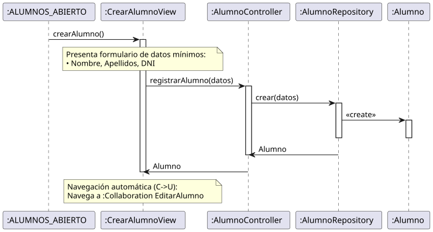

# Jorgestor > crearAlumno > Análisis

> |[🏠️](/README.md)|[ 📊](../../../archivosEsenciales/casos-de-uso/diagramasDeContexto/diagramaDeContextoDocente/diagramaContexto.svg)|[Detalle](../../../archivosEsenciales/casos-de-uso/detalladoCasosDeUso/README.md#crear-alumno-docente)|**Análisis**|Diseño|Desarrollo|Pruebas|
> |-|-|-|-|-|-|-|

## información del artefacto

- **Proyecto**: Jorgestor - Sistema de Gestión de Exámenes
- **Fase RUP**: Elaboración
- **Disciplina**: Análisis y Diseño
- **Versión**: 1.0
- **Fecha**: 2026-05-23
- **Autor**: Gemini CLI

## propósito

Análisis de colaboración del caso de uso `crearAlumno()` mediante el patrón MVC, enfocado en el alta inicial y simplificada de estudiantes.

## diagramas de análisis

### diagrama de colaboración

||
|-|
|Código fuente: [colaboracion.puml](colaboracion.puml)|

### diagrama de secuencia

||
|-|
|Código fuente: [secuencia.puml](secuencia.puml)|

## clases de análisis identificadas

### clases de vista (boundary)

#### CrearAlumnoView
**Estereotipo**: Vista (Boundary)  
**Responsabilidades**:
- Presentar el formulario de captura de datos mínimos (Nombre, Apellidos, DNI).
- Gestionar la solicitud de creación y la navegación post-proceso.

**Colaboraciones**:
- **Entrada**: Recibe `crearAlumno()` desde `:ALUMNOS_ABIERTO`.
- **Control**: Se comunica con `AlumnoController`.
- **Salida**: **<<include>>** `:Collaboration EditarAlumno` o `:Collaboration AbrirAlumnos`.

### clases de control

#### AlumnoController
**Estereotipo**: Control  
**Responsabilidades**:
- Coordinar la creación del registro de alumno.
- Validar la unicidad del DNI.
- Devolver el objeto creado para su edición inmediata.

**Colaboraciones**:
- **Vista**: Responde a `CrearAlumnoView`.
- **Repositorio**: Delega en `AlumnoRepository`.

### clases de entidad (entity)

#### AlumnoRepository
**Estereotipo**: Entidad  
**Responsabilidades**:
- Persistencia de nuevos alumnos.
- Verificación de duplicados.

**Colaboraciones**:
- **Control**: Responde a `AlumnoController`.
- **Entidad**: Gestiona instancias de `Alumno`.

#### Alumno
**Estereotipo**: Entidad  
**Responsabilidades**:
- Representar los datos de identidad de un estudiante.

## flujo de colaboración principal

### secuencia: crear alumno

1. **Inicio**: Docente solicita crear alumno desde la lista general.
2. **Captura**: `CrearAlumnoView` solicita Nombre, Apellidos y DNI.
3. **Persistencia**: `AlumnoController` y `AlumnoRepository` crean el registro.
4. **Transferencia**: El sistema redirige automáticamente a la edición detallada del alumno.

## patrón de edición básica (El Delgado)

Implementa el patrón "El Delgado", permitiendo un flujo de trabajo ágil donde el alta rápida es seguida de una edición completa opcional o automática.
