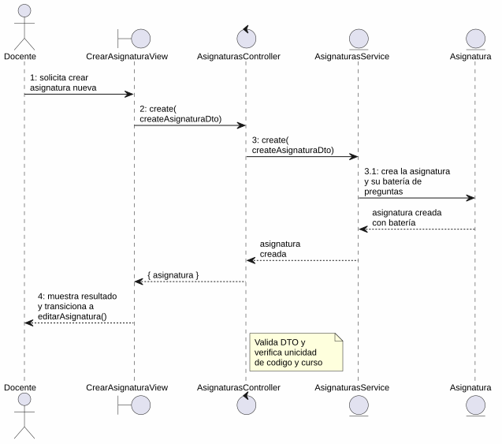
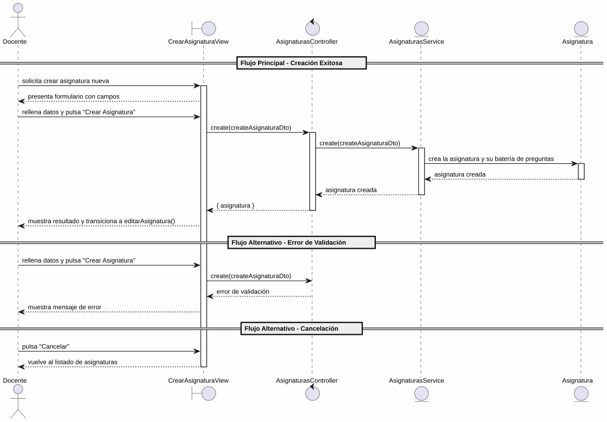

# 25-26-idsw2-sdVC > crearAsignatura > Análisis

## información del artefacto

- **Proyecto**: Sistema de Gestión de Exámenes Universitarios
- **Fase RUP**: Elaboration (Elaboración)
- **Disciplina**: Análisis y Diseño
- **Versión**: 1.0
- **Fecha**: 2026-06-01
- **Autor**: Marcos Gutierrez

## propósito

Análisis de colaboración del caso de uso `crearAsignatura()` mediante el patrón MVC, identificando las clases de análisis, sus responsabilidades y colaboraciones necesarias para cumplir con los requisitos especificados.

## diagrama de colaboración

||
|-|
|Código fuente: [colaboracion.puml](../../../modelosUML/analisis/crearAsignatura/colaboracion.puml)|

## clases de análisis identificadas

### clases de vista (boundary)

#### CrearAsignaturaView
**Estereotipo**: Vista (Boundary)
**Responsabilidades**:
- Recibir la solicitud de creación de asignatura desde el listado de asignaturas (`ASIGNATURAS_ABIERTO`)
- Presentar formulario con campos: Título, Código, Curso Académico, Grados asociados, Alumnos matriculados
- Validar visualmente los campos obligatorios antes de enviar
- Visualizar el resultado final (éxito con transición a edición, o error)
- Manejar la navegación de salida y cancelación

**Colaboraciones**:
- **Entrada**: Recibe `crearAsignatura()` desde `ASIGNATURAS_ABIERTO` (listado de asignaturas)
- **Control**: Se comunica con `AsignaturasController`
- **Salida**: Navega a `ASIGNATURA_ABIERTO` (éxito, abre edición) o `ASIGNATURAS_ABIERTO2` (cancelación)

### clases de control

#### AsignaturasController
**Estereotipo**: Control
**Responsabilidades**:
- Coordinar la lógica de creación de una nueva asignatura
- Validar los datos de entrada (título, código, curso académico, gradoId)
- Verificar que no exista duplicidad de código para el mismo curso
- Crear la asignatura y gestionar la respuesta de éxito o error

**Colaboraciones**:
- **Vista**: Responde a solicitudes de `CrearAsignaturaView`
- **Repositorio**: Delega operaciones de persistencia a `AsignaturasService`

### clases de entidad (entity)

#### AsignaturasService
**Estereotipo**: Entidad
**Responsabilidades**:
- Abstraer el acceso a datos de asignaturas
- Proporcionar método para crear una asignatura con los datos proporcionados
- Validar la unicidad del código dentro del curso académico
- Mantener la consistencia de los datos durante la creación

**Colaboraciones**:
- **Control**: Responde a `AsignaturasController`
- **Entidad**: Gestiona instancias de `Asignatura`, `Grado`, `Alumno` y `BateriaDePreguntas`

#### Asignatura
**Estereotipo**: Entidad
**Responsabilidades**:
- Representar una asignatura del sistema
- Encapsular atributos: id, titulo, codigo, cursoAcademico, gradoId, profesorId
- Relacionarse con grado, batería de preguntas, exámenes y alumnos tras su creación

**Atributos relevantes**:
| Campo | Tipo | Descripción |
|-------|------|-------------|
| `id` | Int (PK) | Identificador único de la asignatura |
| `titulo` | String | Nombre de la asignatura |
| `codigo` | String | Código identificador (unique por curso) |
| `cursoAcademico` | String | Curso académico |
| `gradoId` | Int (FK) | Referencia al grado |
| `profesorId` | Int? (FK) | Referencia al profesor responsable |

**Colaboraciones**:
- **AsignaturasService**: Es gestionada por el servicio
- **Grado**: Relación de pertenencia al grado
- **BateriaDePreguntas**: Relación 1:1 con la batería de preguntas
- **Alumno**: Relación con alumnos matriculados vía `AlumnoAsignatura`

#### Grado
**Estereotipo**: Entidad
**Responsabilidades**:
- Representar un grado universitario asociado a la asignatura
- Proporcionar la lista de grados disponibles para la selección en el formulario

**Colaboraciones**:
- **AsignaturasService**: Es consultada para validar el grado seleccionado

#### BateriaDePreguntas
**Estereotipo**: Entidad
**Responsabilidades**:
- Representar el banco de preguntas asociado a la asignatura
- Crearse automáticamente junto con la asignatura

**Colaboraciones**:
- **AsignaturasService**: Es creada como parte del proceso de creación de la asignatura

## diagrama de secuencia

||
|-|
|Código fuente: [secuencia.puml](../../../modelosUML/analisis/crearAsignatura/secuencia.puml)|

## flujo de colaboración

### secuencia de operaciones (flujo principal)

1. **Inicio**: `ASIGNATURAS_ABIERTO` → `CrearAsignaturaView.crearAsignatura()`
2. **Carga del formulario**: `CrearAsignaturaView` muestra formulario con campos: Título, Código, Curso Académico, Grados asociados, Alumnos matriculados
3. **Introducción de datos**: Docente rellena los campos y pulsa "Crear Asignatura"
4. **Creación**: `CrearAsignaturaView` → `AsignaturasController.create(createAsignaturaDto)`
5. **Validación**: `AsignaturasController` valida los datos de entrada (titulo, codigo, cursoAcademico, gradoId)
6. **Persistencia**: `AsignaturasController` → `AsignaturasService.create(createAsignaturaDto)`
7. **Creación de entidad**: `AsignaturasService` → `Asignatura` → crea la asignatura con su batería de preguntas
8. **Resultado**: `AsignaturasService` → `AsignaturasController` → `CrearAsignaturaView` → Docente: asignatura creada + transición a `editarAsignatura(nuevaAsignatura)`

### flujo alternativo — error en la creación

- Paso 5 falla por datos inválidos o paso 6 por duplicidad de código/curso (restricción @@unique en BD)
- `AsignaturasController` retorna error a `CrearAsignaturaView`
- `CrearAsignaturaView` muestra mensaje de error al Docente
- El sistema regresa al estado `SolicitandoDatosAsignatura`

### flujo alternativo — cancelación

- Docente pulsa "Cancelar" en el formulario
- `CrearAsignaturaView` regresa al listado de asignaturas (`ASIGNATURAS_ABIERTO2`)
- No se ejecuta ninguna creación ni persistencia

### opciones de navegación disponibles

| Acción | Destino | Descripción |
|--------|---------|-------------|
| `Crear Asignatura` | `ASIGNATURA_ABIERTO` | Crea la asignatura y abre su edición (`editarAsignatura()`) |
| `Cancelar` | `ASIGNATURAS_ABIERTO2` | Vuelve al listado sin crear |

## estados de análisis

Los estados se corresponden con el diagrama de estados detallado en `contexto/casos-de-uso/detalladoCasosDeUso/crearAsignatura/crearAsignatura.puml`:

| Estado | Descripción |
|--------|-------------|
| `SolicitandoDatosAsignatura` | El docente solicita crear una nueva asignatura |
| `CreandoAsignatura` | El sistema presenta el formulario con campos; el docente introduce los datos, confirma la creación o cancela |

**Transiciones clave:**
- `SolicitandoDatosAsignatura` → `CreandoAsignatura`: Sistema presenta formulario con campos
- `CreandoAsignatura` → `[*]`: Creación exitosa (salida a `ASIGNATURA_ABIERTO` con transición a `editarAsignatura()`)
- `CreandoAsignatura` → `ASIGNATURAS_ABIERTO2`: Cancelación

## correspondencia con requisitos

### mapeado con especificación detallada

| Requisito del caso de uso | Clase responsable | Método/Colaboración |
|--------------------------|-------------------|---------------------|
| Mostrar formulario con campos | `CrearAsignaturaView` | Título, Código, Curso, Grados, Alumnos |
| Validar campos obligatorios | `CrearAsignaturaView` | Validación visual antes de enviar |
| Crear asignatura con datos | `AsignaturasController` | `create(createAsignaturaDto)` |
| Validar integridad de datos de entrada | `AsignaturasController` | Validación de DTO |
| Verificar unicidad de código por curso | `AsignaturasService` | Restricción @@unique en BD |
| Crear batería de preguntas asociada | `AsignaturasService` | Creación de `BateriaDePreguntas` junto con la asignatura |
| Persistir asignatura | `AsignaturasService` | `create(createAsignaturaDto)` |
| Transicionar a edición tras crear | `CrearAsignaturaView` | Navegación a `ASIGNATURA_ABIERTO` con nueva asignatura |
| Cancelar creación | `CrearAsignaturaView` | Navegación a `ASIGNATURAS_ABIERTO2` |

### patrón de colaboración establecido

- **Entrada única**: Desde `ASIGNATURAS_ABIERTO` (listado de asignaturas)
- **Análisis MVC completo**: Vista, Control y Entidad claramente separados
- **Salida dual**: `ASIGNATURA_ABIERTO` (con transición a `editarAsignatura`) o `ASIGNATURAS_ABIERTO2` (cancelación)
- **Flujo con creación compuesta**: La creación de la asignatura incluye la creación de su batería de preguntas
- **Flujo simplificado**: Solo 2 estados internos (solicitud de datos y procesamiento)

## trazabilidad con la implementación

| Capa | Artefacto real |
|------|----------------|
| Controlador | `src/apps/backend/src/asignaturas/asignaturas.controller.ts` (`POST /asignaturas`) |
| Servicio | `src/apps/backend/src/asignaturas/asignaturas.service.ts` (`create()`) |
| DTO | `src/apps/backend/src/asignaturas/dto/create-asignatura.dto.ts` (`CreateAsignaturaDto`) |
| Vista | `src/apps/frontend/src/views/AsignaturasView.vue` (diálogo de creación) |
| Modelo (BD) | `src/apps/backend/prisma/schema.prisma` (modelos `Asignatura`, `Grado`, `BateriaDePreguntas`) |

> **Nota:** Este caso de uso está priorizado como #18 y ya tiene implementación parcial en el backend (`AsignaturasService.create()`). El diagrama de estados detallado indica que la creación incluye la batería de preguntas; la implementación actual crea únicamente la asignatura. El análisis incluye `BateriaDePreguntas` como entidad de soporte documental. El análisis se ha realizado a partir de los artefactos de requisitos y validado contra la implementación real.

## patrones aplicados

### repository pattern
`AsignaturasService` abstrae el acceso a datos de asignaturas, encapsulando la operación de creación con verificación de unicidad.

### mvc pattern
Separación clara entre presentación (`CrearAsignaturaView`), lógica de aplicación (`AsignaturasController`) y datos (`Asignatura`, `Grado`, `AsignaturasService`).

### navigation pattern
Las opciones de "Crear Asignatura" y "Cancelar" permiten al docente controlar el flujo. La creación exitosa transiciona automáticamente a `editarAsignatura()`.
