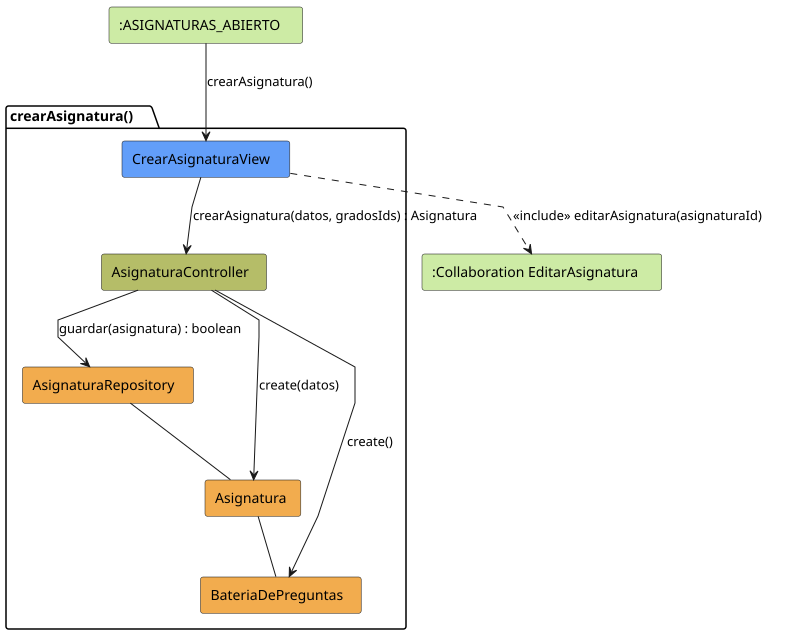
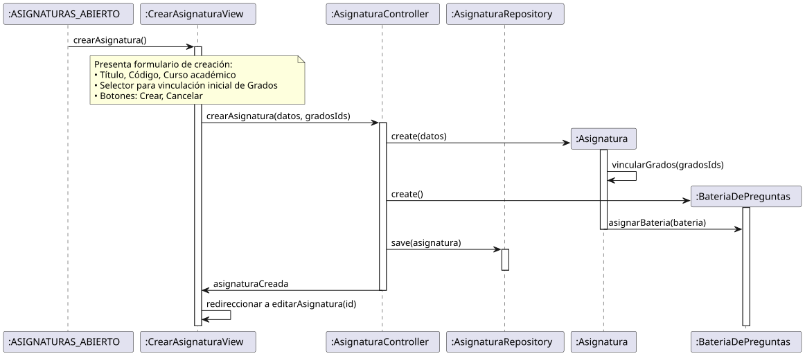

# Jorgestor > crearAsignatura > Análisis

> |[🏠️](/README.md)|[ 📊](../../../archivosEsenciales/casos-de-uso/diagramasDeContexto/diagramaDeContextoDocente/diagramaContexto.svg)|[Detalle](../../../archivosEsenciales/casos-de-uso/detalladoCasosDeUso/README.md#crear-asignatura-docente)|**Análisis**|Diseño|Desarrollo|Pruebas|
> |-|-|-|-|-|-|-|

## información del artefacto

- **Proyecto**: Jorgestor - Sistema de Gestión de Exámenes
- **Fase RUP**: Elaboración
- **Disciplina**: Análisis y Diseño
- **Versión**: 1.0
- **Fecha**: 2026-05-23
- **Autor**: Gemini CLI

## propósito

Análisis de colaboración del caso de uso `crearAsignatura()` mediante el patrón MVC, enfocado en la creación rápida de una asignatura, su vinculación inicial con grados y la creación automática de su batería de preguntas, con redirección al flujo de edición completa.

## diagramas de análisis

### diagrama de colaboración

||
|-|
|Código fuente: [colaboracion.puml](colaboracion.puml)|

### diagrama de secuencia

||
|-|
|Código fuente: [secuencia.puml](secuencia.puml)|

## clases de análisis identificadas

### clases de vista (boundary)

#### CrearAsignaturaView
**Estereotipo**: Vista (Boundary)  
**Responsabilidades**:
- Presentar el formulario de creación de asignatura.
- Permitir la selección inicial de grados para vincular.
- Capturar la intención de creación o cancelación.
- Gestionar la redirección al flujo de edición tras el éxito.

**Colaboraciones**:
- **Entrada**: Recibe `crearAsignatura()` desde `:ASIGNATURAS_ABIERTO`.
- **Control**: Se comunica con `AsignaturaController`.
- **Salida**: **<<include>>** `:Collaboration EditarAsignatura`.

### clases de control

#### AsignaturaController
**Estereotipo**: Control  
**Responsabilidades**:
- Orquestar la creación de una nueva `Asignatura`.
- Gestionar la vinculación inicial de los grados.
- Asegurar la creación de una `BateriaDePreguntas` asociada.
- Solicitar la persistencia de la nueva asignatura.

**Colaboraciones**:
- **Vista**: Responde a `CrearAsignaturaView`.
- **Repositorio**: Delega en `AsignaturaRepository`.

### clases de entidad (entity)

#### AsignaturaRepository
**Estereotipo**: Entidad  
**Responsabilidades**:
- Abstraer la persistencia de nuevas asignaturas y sus relaciones.

**Colaboraciones**:
- **Control**: Responde a `AsignaturaController`.
- **Entidad**: Gestiona instancias de `Asignatura`.

#### Asignatura
**Estereotipo**: Entidad  
**Responsabilidades**:
- Representar la información de una asignatura.
- Mantener relaciones con Grados y su Batería de Preguntas.

#### BateriaDePreguntas
**Estereotipo**: Entidad  
**Responsabilidades**:
- Contener el conjunto de preguntas asociadas a la asignatura.

## flujo de colaboración principal

### secuencia: crear asignatura

1. **Inicio**: El docente solicita crear una asignatura desde la lista.
2. **Formulario**: `CrearAsignaturaView` muestra campos básicos y selector de grados.
3. **Acción**: El docente introduce datos, selecciona grados y pulsa "Crear".
4. **Creación**: `AsignaturaController` instancia `Asignatura`, vincula grados y crea una `BateriaDePreguntas`.
5. **Persistencia**: `AsignaturaRepository` guarda la estructura completa.
6. **Redirección**: `CrearAsignaturaView` redirige a `EditarAsignatura`.

## patrón de creación rápida (El Delgado)

Sigue el patrón de "El Delgado" para la creación, permitiendo dar de alta la entidad con sus relaciones básicas y derivando la configuración detallada al flujo de edición ("El Gordo").
