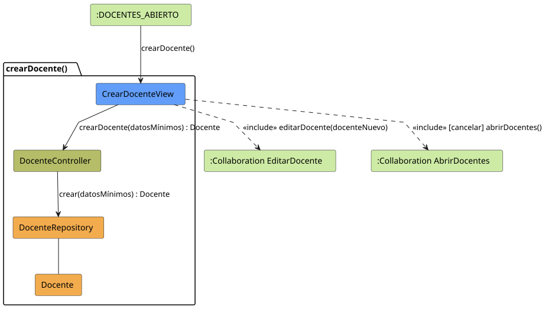
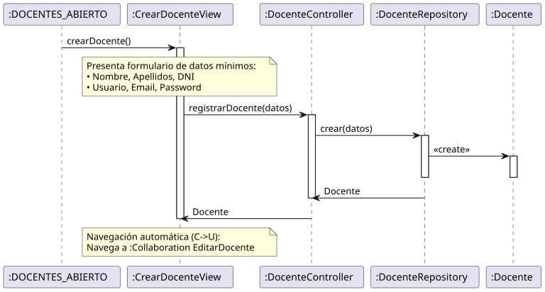

# Jorgestor > crearDocente > Análisis

> |[🏠️](/README.md)|[ 📊](../../../archivosEsenciales/casos-de-uso/diagramasDeContexto/diagramaDeContextoAdministradorInstitucional/diagramaContexto.svg)|[Detalle](../../../archivosEsenciales/casos-de-uso/detalladoCasosDeUso/README.md#crear-docente-administrador-institucional)|**Análisis**|Diseño|Desarrollo|Pruebas|
> |-|-|-|-|-|-|-|

## información del artefacto

- **Proyecto**: Jorgestor - Sistema de Gestión de Exámenes
- **Fase RUP**: Elaboración
- **Disciplina**: Análisis y Diseño
- **Versión**: 1.0
- **Fecha**: 2026-05-23
- **Autor**: Gemini CLI

## propósito

Análisis de colaboración del caso de uso `crearDocente()` mediante el patrón MVC, identificando las clases de análisis para la creación básica de perfiles de docentes.

## diagramas de análisis

### diagrama de colaboración

||
|-|
|Código fuente: [colaboracion.puml](colaboracion.puml)|

### diagrama de secuencia

||
|-|
|Código fuente: [secuencia.puml](secuencia.puml)|

## clases de análisis identificadas

### clases de vista (boundary)

#### CrearDocenteView
**Estereotipo**: Vista (Boundary)  
**Responsabilidades**:
- Presentar el formulario de captura de datos mínimos (Nombre, Apellidos, DNI, Credenciales).
- Recibir la solicitud de creación o cancelación.
- Facilitar la transición automática al modo de edición completa.

**Colaboraciones**:
- **Entrada**: Recibe `crearDocente()` desde `:DOCENTES_ABIERTO`.
- **Control**: Se comunica con `DocenteController`.
- **Salida**: **<<include>>** `:Collaboration EditarDocente` para edición completa o `:Collaboration AbrirDocentes`.

### clases de control

#### DocenteController
**Estereotipo**: Control  
**Responsabilidades**:
- Coordinar la creación inicial del objeto Docente.
- Validar requisitos mínimos de integridad (ej. DNI no duplicado).
- Delegar la persistencia al repositorio.

**Colaboraciones**:
- **Vista**: Responde a `CrearDocenteView`.
- **Repositorio**: Delega en `DocenteRepository`.

### clases de entidad (entity)

#### DocenteRepository
**Estereotipo**: Entidad  
**Responsabilidades**:
- Implementar la inserción de nuevos registros de docentes.
- Verificar unicidad de identificadores.

**Colaboraciones**:
- **Control**: Responde a `DocenteController`.
- **Entidad**: Crea instancias de `Docente`.

#### Docente
**Estereotipo**: Entidad  
**Responsabilidades**:
- Representar la identidad básica de un profesor en el sistema.

## flujo de colaboración principal

### secuencia: crear docente

1. **Inicio**: Solicitud desde la lista de docentes.
2. **Captura**: `CrearDocenteView` presenta formulario de datos mínimos.
3. **Persistencia**: `DocenteController` coordina con `DocenteRepository` la creación.
4. **Transferencia**: El sistema navega automáticamente a `editarDocente()` tras la creación exitosa.

## patrón de edición básica (El Delgado)

Este caso de uso implementa el patrón "El Delgado" enfocado en añadir el elemento al sistema con la información mínima indispensable, delegando la configuración detallada al caso de uso de edición ("El Gordo").
