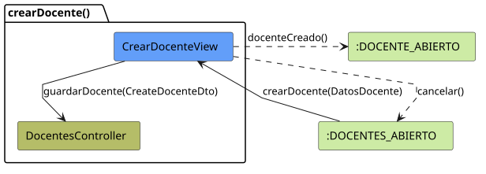
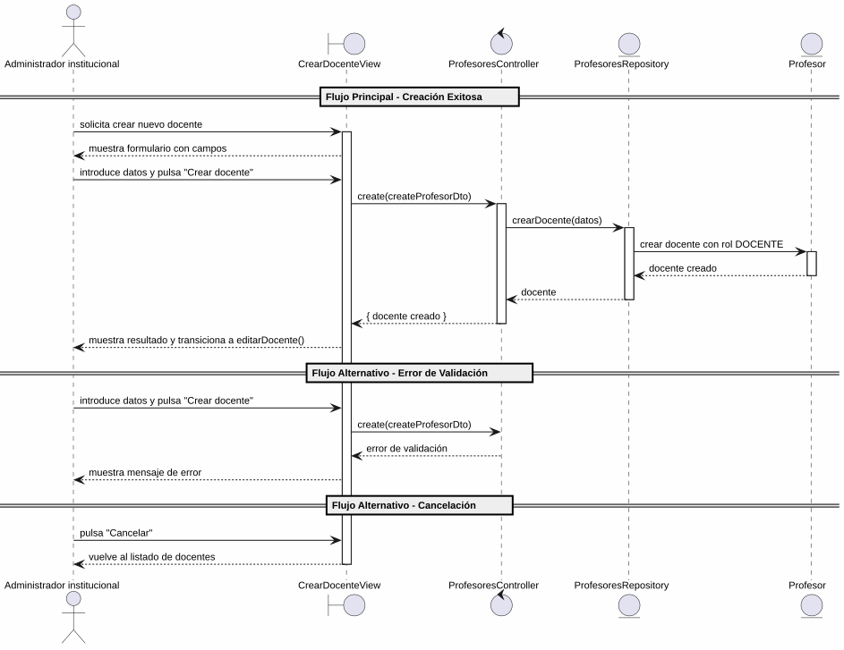

# 25-26-idsw2-sdVC > crearDocente > Análisis

## información del artefacto

- **Proyecto**: Sistema de Gestión de Exámenes Universitarios
- **Fase RUP**: Elaboration (Elaboración)
- **Disciplina**: Análisis y Diseño
- **Versión**: 1.0
- **Fecha**: 2026-05-29
- **Autor**: Marcos Gutierrez

## propósito

Análisis de colaboración del caso de uso `crearDocente()` mediante el patrón MVC, identificando las clases de análisis, sus responsabilidades y colaboraciones necesarias para cumplir con los requisitos especificados.

## diagrama de colaboración

||
|-|
|Código fuente: [colaboracion.puml](../../../modelosUML/analisis/crearDocente/colaboracion.puml)|

## clases de análisis identificadas

### clases de vista (boundary)

#### CrearDocenteView
**Estereotipo**: Vista (Boundary)
**Responsabilidades**:
- Recibir la solicitud de creación de docente desde el listado de docentes (`DOCENTES_ABIERTO`)
- Presentar formulario con campos obligatorios: Nombres, Apellidos, DNI, Correo electrónico, Nombre de usuario, Contraseña
- Validar visualmente los campos obligatorios antes de enviar
- Presentar confirmación antes de ejecutar la creación
- Visualizar el resultado final (éxito con transición a edición, o error)
- Manejar la navegación de salida y cancelación

**Colaboraciones**:
- **Entrada**: Recibe `crearDocente()` desde `DOCENTES_ABIERTO` (listado de docentes)
- **Control**: Se comunica con `ProfesoresController`
- **Salida**: Navega a `DOCENTE_ABIERTO` (éxito, abre edición) o `DOCENTES_ABIERTO2` (cancelación)

### clases de control

#### ProfesoresController
**Estereotipo**: Control
**Responsabilidades**:
- Coordinar la lógica de creación de un nuevo docente
- Validar los datos de entrada (nombre, apellidos, dni, email, password)
- Verificar que no exista duplicidad de DNI o email
- Crear el docente con rol `DOCENTE` por defecto
- Gestionar el hashing de la contraseña antes de persistir
- Gestionar la respuesta de éxito o error

**Colaboraciones**:
- **Vista**: Responde a solicitudes de `CrearDocenteView`
- **Repositorio**: Delega operaciones de persistencia a `ProfesoresRepository`

### clases de entidad (entity)

#### ProfesoresRepository
**Estereotipo**: Entidad
**Responsabilidades**:
- Abstraer el acceso a datos de docentes
- Proporcionar método para crear un docente con los datos proporcionados
- Validar la unicidad de DNI y email antes de crear
- Mantener la consistencia de los datos durante la creación

**Colaboraciones**:
- **Control**: Responde a `ProfesoresController`
- **Entidad**: Gestiona instancias de `Profesor`

#### Profesor
**Estereotipo**: Entidad
**Responsabilidades**:
- Representar un docente del sistema
- Encapsular atributos: id, nombre, apellidos, dni, email, password, rol
- Inicializar su rol como `DOCENTE` tras la creación

**Atributos relevantes**:
| Campo | Tipo | Descripción |
|-------|------|-------------|
| `id` | Int (PK) | Identificador único del docente |
| `nombre` | String | Nombre del docente |
| `apellidos` | String | Apellidos del docente |
| `dni` | String (unique) | Documento nacional de identidad |
| `email` | String (unique) | Correo electrónico |
| `password` | String | Contraseña (hasheada con bcrypt) |
| `rol` | Rol (enum) | `DOCENTE` por defecto |

**Colaboraciones**:
- **ProfesoresRepository**: Es gestionada por el repositorio

## diagrama de secuencia

||
|-|
|Código fuente: [secuencia.puml](../../../modelosUML/analisis/crearDocente/secuencia.puml)|

## flujo de colaboración

### secuencia de operaciones (flujo principal)

1. **Inicio**: `DOCENTES_ABIERTO` → `CrearDocenteView.crearDocente()`
2. **Carga del formulario**: `CrearDocenteView` muestra formulario con campos: Nombres, Apellidos, DNI, Correo electrónico, Nombre de usuario, Contraseña
3. **Introducción de datos**: Administrador institucional rellena los campos obligatorios y pulsa "Crear docente"
4. **Creación**: `CrearDocenteView` → `ProfesoresController.create(createProfesorDto)`
5. **Validación**: `ProfesoresController` valida los datos de entrada (nombre, apellidos, dni, email, password)
6. **Hashing**: `ProfesoresController` hashea la contraseña con bcrypt
7. **Persistencia**: `ProfesoresController` → `ProfesoresRepository.crearDocente(datos)`
8. **Creación de entidad**: `ProfesoresRepository` → `Profesor` → crea el docente con rol `DOCENTE`
9. **Resultado**: `ProfesoresRepository` → `ProfesoresController` → `CrearDocenteView` → Administrador: docente creado + transición a `editarDocente(nuevoDocente)`

### flujo alternativo — error en la creación

- Paso 5 falla por datos inválidos (validación del controlador) o el paso 7 por duplicidad de DNI/email (restricción de BD)
- `ProfesoresController` retorna error a `CrearDocenteView`
- `CrearDocenteView` muestra mensaje de error al Administrador
- El sistema regresa al estado `SolicitandoDatos`

### flujo alternativo — cancelación

- Administrador pulsa "Cancelar" en el formulario
- `CrearDocenteView` regresa al listado de docentes (`DOCENTES_ABIERTO2`)
- No se ejecuta ninguna creación ni persistencia

### opciones de navegación disponibles

| Acción | Destino | Descripción |
|--------|---------|-------------|
| `Crear docente` | `DOCENTE_ABIERTO` | Crea el docente y abre su edición (`editarDocente()`) |
| `Cancelar` | `DOCENTES_ABIERTO2` | Vuelve al listado sin crear |

## estados de análisis

Los estados se corresponden con el diagrama de estados detallado en `contexto/casos-de-uso/detalladoCasosDeUso/crearDocente/crearDocente.puml`:

| Estado | Descripción |
|--------|-------------|
| `SolicitandoDatos` | El administrador solicita crear un nuevo docente |
| `CreandoDocente` | El sistema presenta el formulario con campos; el administrador introduce los datos, confirma la creación o cancela |

**Transiciones clave:**
- `SolicitandoDatos` → `CreandoDocente`: Sistema presenta formulario con campos obligatorios
- `CreandoDocente` → `[*]`: Creación exitosa (salida a `DOCENTE_ABIERTO` con transición a `editarDocente()`)
- `CreandoDocente` → `DOCENTES_ABIERTO2`: Cancelación

## correspondencia con requisitos

### mapeado con especificación detallada

| Requisito del caso de uso | Clase responsable | Método/Colaboración |
|--------------------------|-------------------|---------------------|
| Mostrar formulario con campos obligatorios | `CrearDocenteView` | Nombres, Apellidos, DNI, Email, Usuario, Contraseña |
| Validar campos obligatorios | `CrearDocenteView` | Validación visual antes de enviar |
| Crear docente con datos | `ProfesoresController` | `create(createProfesorDto)` |
| Validar integridad de datos de entrada | `ProfesoresController` | Validación de DTO |
| Hashear contraseña | `ProfesoresController` | `bcrypt.hash(password, 10)` |
| Verificar unicidad de DNI/email | `ProfesoresRepository` | Validación de campos unique en BD |
| Persistir docente | `ProfesoresRepository` | `crearDocente(datos)` |
| Asignar rol DOCENTE por defecto | `ProfesoresRepository` | Valor por defecto en creación |
| Transicionar a edición tras crear | `CrearDocenteView` | Navegación a `DOCENTE_ABIERTO` con nuevo docente |
| Cancelar creación | `CrearDocenteView` | Navegación a `DOCENTES_ABIERTO2` |

### patrón de colaboración establecido

Este análisis sigue el **patrón metodológico universal** establecido para el proyecto:
- **Entrada única**: Desde `DOCENTES_ABIERTO` (listado de docentes)
- **Análisis MVC completo**: Vista, Control y Entidad claramente separados
- **Salida dual**: `DOCENTE_ABIERTO` (con transición a `editarDocente`) o `DOCENTES_ABIERTO2` (cancelación)
- **Flujo simplificado**: Solo 2 estados internos (solicitud de datos y procesamiento)

### consideraciones de filtros

`crearDocente()` **no requiere filtros de búsqueda**. Es un caso de uso transaccional de creación simple donde el administrador introduce los datos del nuevo docente. No existe listado que requiera filtrado.

## características del análisis

### separación de responsabilidades MVC

- **Vista**: Solo presentación del formulario, captura de datos e interacción con el administrador
- **Control**: Solo coordinación, validación, hashing de contraseña y lógica de creación
- **Entidad**: Solo datos, reglas de negocio de persistencia y verificación de unicidad

### agnóstico tecnológicamente

- No especifica tecnología de interfaz de usuario
- No asume implementación específica de base de datos
- Mantiene independencia de frameworks

### trazabilidad completa

- **Origen**: Caso de uso detallado `crearDocente()` y prototipo asociado
- **Destino**: Base para diseño arquitectónico e implementación
- **Conexión**: Diagrama de contexto → Análisis de colaboración → Implementación real

## trazabilidad con la implementación

| Capa | Artefacto real |
|------|----------------|
| Controlador | `src/apps/backend/src/profesores/profesores.controller.ts` (`POST /profesores`) |
| Servicio | `src/apps/backend/src/profesores/profesores.service.ts` (`create()`) |
| DTO | `src/apps/backend/src/profesores/dto/create-profesor.dto.ts` (`CreateProfesorDto`) |
| Vista | `src/apps/frontend/src/views/ProfesoresView.vue` (diálogo de creación) |
| Modelo (BD) | `src/apps/backend/prisma/schema.prisma` (Profesor) |

> **Nota:** Este caso de uso está priorizado como #13 y ya tiene implementación completa en el backend (`ProfesoresService.create()`). El análisis se ha realizado a partir de los artefactos de requisitos (diagrama de estados detallado y prototipo de interfaz) y validado contra la implementación real.

## patrones aplicados

### repository pattern
`ProfesoresRepository` abstrae el acceso a datos de docentes, encapsulando la operación de creación con verificación de unicidad.

### mvc pattern
Separación clara entre presentación (`CrearDocenteView`), lógica de aplicación (`ProfesoresController`) y datos (`Profesor`, `ProfesoresRepository`).

### navigation pattern
Las opciones de "Crear docente" y "Cancelar" permiten al administrador controlar el flujo. La creación exitosa transiciona automáticamente a `editarDocente()`.
