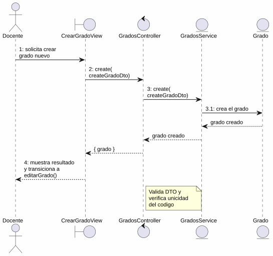
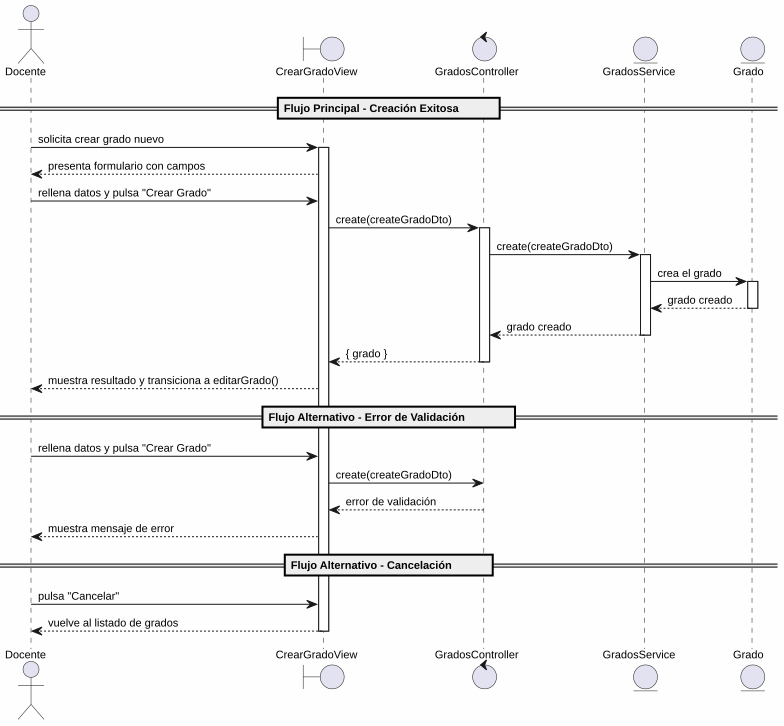

# 25-26-idsw2-sdVC > crearGrado > Análisis

## información del artefacto

- **Proyecto**: Sistema de Gestión de Exámenes Universitarios
- **Fase RUP**: Elaboration (Elaboración)
- **Disciplina**: Análisis y Diseño
- **Versión**: 1.0
- **Fecha**: 2026-06-01
- **Autor**: Marcos Gutierrez

## propósito

Análisis de colaboración del caso de uso `crearGrado()` mediante el patrón MVC, identificando las clases de análisis, sus responsabilidades y colaboraciones necesarias para cumplir con los requisitos especificados.

## diagrama de colaboración

||
|-|
|Código fuente: [colaboracion.puml](../../../modelosUML/analisis/crearGrado/colaboracion.puml)|

## clases de análisis identificadas

### clases de vista (boundary)

#### CrearGradoView
**Estereotipo**: Vista (Boundary)
**Responsabilidades**:
- Recibir la solicitud de creación de grado desde el listado de grados (`GRADOS_ABIERTO`)
- Presentar formulario con campos: Nombre del Grado, Código, Alumnos enlistados (selección inicial)
- Validar visualmente los campos obligatorios antes de enviar
- Visualizar el resultado final (éxito con transición a edición, o error)
- Manejar la navegación de salida y cancelación

**Colaboraciones**:
- **Entrada**: Recibe `crearGrado()` desde `GRADOS_ABIERTO` (listado de grados)
- **Control**: Se comunica con `GradosController`
- **Salida**: Navega a `GRADO_ABIERTO` (éxito, abre edición) o `GRADOS_ABIERTO2` (cancelación)

### clases de control

#### GradosController
**Estereotipo**: Control
**Responsabilidades**:
- Coordinar la lógica de creación de un nuevo grado
- Validar los datos de entrada (título, código)
- Verificar que no exista duplicidad de código
- Crear el grado y gestionar la respuesta de éxito o error

**Colaboraciones**:
- **Vista**: Responde a solicitudes de `CrearGradoView`
- **Repositorio**: Delega operaciones de persistencia a `GradosService`

### clases de entidad (entity)

#### GradosService
**Estereotipo**: Entidad
**Responsabilidades**:
- Abstraer el acceso a datos de grados
- Proporcionar método para crear un grado con los datos proporcionados
- Validar la unicidad del código antes de crear
- Mantener la consistencia de los datos durante la creación

**Colaboraciones**:
- **Control**: Responde a `GradosController`
- **Entidad**: Gestiona instancias de `Grado`

#### Grado
**Estereotipo**: Entidad
**Responsabilidades**:
- Representar un grado universitario del sistema
- Encapsular atributos: id, titulo, codigo
- Relacionarse con asignaturas y alumnos tras su creación

**Atributos relevantes**:
| Campo | Tipo | Descripción |
|-------|------|-------------|
| `id` | Int (PK) | Identificador único del grado |
| `titulo` | String | Nombre del grado |
| `codigo` | String (unique) | Código identificador del grado |

**Colaboraciones**:
- **GradosService**: Es gestionada por el servicio
- **Asignatura**: Relación con asignaturas asociadas
- **Alumno**: Relación con alumnos enlistados

## diagrama de secuencia

||
|-|
|Código fuente: [secuencia.puml](../../../modelosUML/analisis/crearGrado/secuencia.puml)|

## flujo de colaboración

### secuencia de operaciones (flujo principal)

1. **Inicio**: `GRADOS_ABIERTO` → `CrearGradoView.crearGrado()`
2. **Carga del formulario**: `CrearGradoView` muestra formulario con campos: Nombre del Grado, Código, Alumnos enlistados
3. **Introducción de datos**: Docente rellena los campos y pulsa "Crear Grado"
4. **Creación**: `CrearGradoView` → `GradosController.create(createGradoDto)`
5. **Validación**: `GradosController` valida los datos de entrada (titulo, codigo)
6. **Persistencia**: `GradosController` → `GradosService.create(createGradoDto)`
7. **Creación de entidad**: `GradosService` → `Grado` → crea el grado
8. **Resultado**: `GradosService` → `GradosController` → `CrearGradoView` → Docente: grado creado + transición a `editarGrado(nuevoGrado)`

### flujo alternativo — error en la creación

- Paso 5 falla por datos inválidos o paso 6 por duplicidad de código (restricción unique en BD)
- `GradosController` retorna error a `CrearGradoView`
- `CrearGradoView` muestra mensaje de error al Docente
- El sistema regresa al estado `SolicitandoDatosGrado`

### flujo alternativo — cancelación

- Docente pulsa "Cancelar" en el formulario
- `CrearGradoView` regresa al listado de grados (`GRADOS_ABIERTO2`)
- No se ejecuta ninguna creación ni persistencia

### opciones de navegación disponibles

| Acción | Destino | Descripción |
|--------|---------|-------------|
| `Crear Grado` | `GRADO_ABIERTO` | Crea el grado y abre su edición (`editarGrado()`) |
| `Cancelar` | `GRADOS_ABIERTO2` | Vuelve al listado sin crear |

## estados de análisis

Los estados se corresponden con el diagrama de estados detallado en `contexto/casos-de-uso/detalladoCasosDeUso/crearGrado/crearGrado.puml`:

| Estado | Descripción |
|--------|-------------|
| `SolicitandoDatosGrado` | El docente solicita crear un nuevo grado |
| `CreandoGrado` | El sistema presenta el formulario con campos; el docente introduce los datos, confirma la creación o cancela |

**Transiciones clave:**
- `SolicitandoDatosGrado` → `CreandoGrado`: Sistema presenta formulario con campos
- `CreandoGrado` → `[*]`: Creación exitosa (salida a `GRADO_ABIERTO` con transición a `editarGrado()`)
- `CreandoGrado` → `GRADOS_ABIERTO2`: Cancelación

## correspondencia con requisitos

### mapeado con especificación detallada

| Requisito del caso de uso | Clase responsable | Método/Colaboración |
|--------------------------|-------------------|---------------------|
| Mostrar formulario con campos | `CrearGradoView` | Nombre del Grado, Código, Alumnos enlistados |
| Validar campos obligatorios | `CrearGradoView` | Validación visual antes de enviar |
| Crear grado con datos | `GradosController` | `create(createGradoDto)` |
| Validar integridad de datos de entrada | `GradosController` | Validación de DTO |
| Verificar unicidad de código | `GradosService` | Validación de campo unique en BD |
| Persistir grado | `GradosService` | `create(createGradoDto)` |
| Transicionar a edición tras crear | `CrearGradoView` | Navegación a `GRADO_ABIERTO` con nuevo grado |
| Cancelar creación | `CrearGradoView` | Navegación a `GRADOS_ABIERTO2` |

### patrón de colaboración establecido

- **Entrada única**: Desde `GRADOS_ABIERTO` (listado de grados)
- **Análisis MVC completo**: Vista, Control y Entidad claramente separados
- **Salida dual**: `GRADO_ABIERTO` (con transición a `editarGrado`) o `GRADOS_ABIERTO2` (cancelación)
- **Flujo simplificado**: Solo 2 estados internos (solicitud de datos y procesamiento)

## trazabilidad con la implementación

| Capa | Artefacto real |
|------|----------------|
| Controlador | `src/apps/backend/src/grados/grados.controller.ts` (`POST /grados`) |
| Servicio | `src/apps/backend/src/grados/grados.service.ts` (`create()`) |
| DTO | `src/apps/backend/src/grados/dto/create-grado.dto.ts` (`CreateGradoDto`) |
| Vista | `src/apps/frontend/src/views/GradosView.vue` (diálogo de creación) |
| Modelo (BD) | `src/apps/backend/prisma/schema.prisma` (modelo `Grado`) |

> **Nota:** Este caso de uso está priorizado como #17 y ya tiene implementación completa en el backend (`GradosService.create()`). El diagrama de estados detallado y el prototipo incluyen "Alumnos enlistados" como campo del formulario; la implementación real del frontend solo gestiona Título y Código en el diálogo de creación, quedando la vinculación de alumnos para el caso de uso `editarGrado()`. El análisis se ha realizado a partir de los artefactos de requisitos y validado contra la implementación real.

## patrones aplicados

### repository pattern
`GradosService` abstrae el acceso a datos de grados, encapsulando la operación de creación con verificación de unicidad.

### mvc pattern
Separación clara entre presentación (`CrearGradoView`), lógica de aplicación (`GradosController`) y datos (`Grado`, `GradosService`).

### navigation pattern
Las opciones de "Crear Grado" y "Cancelar" permiten al docente controlar el flujo. La creación exitosa transiciona automáticamente a `editarGrado()`.
