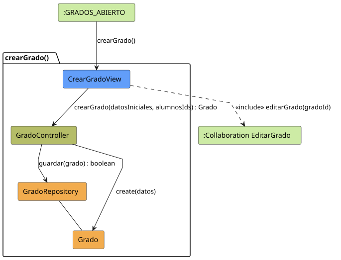
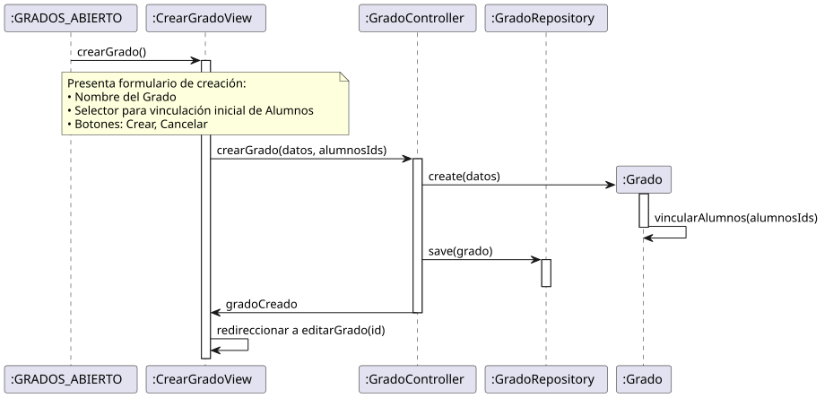

# Jorgestor > crearGrado > Análisis

> |[🏠️](/README.md)|[ 📊](../../../archivosEsenciales/casos-de-uso/diagramasDeContexto/diagramaDeContextoDocente/diagramaContexto.svg)|[Detalle](../../../archivosEsenciales/casos-de-uso/detalladoCasosDeUso/README.md#crear-grado-docente)|**Análisis**|Diseño|Desarrollo|Pruebas|
> |-|-|-|-|-|-|-|

## información del artefacto

- **Proyecto**: Jorgestor - Sistema de Gestión de Exámenes
- **Fase RUP**: Elaboración
- **Disciplina**: Análisis y Diseño
- **Versión**: 1.0
- **Fecha**: 2026-05-23
- **Autor**: Gemini CLI

## propósito

Análisis de colaboración del caso de uso `crearGrado()` mediante el patrón MVC, enfocado en la creación rápida de un grado con vinculación inicial de alumnos y redirección automática al flujo de edición completa.

## diagramas de análisis

### diagrama de colaboración

||
|-|
|Código fuente: [colaboracion.puml](colaboracion.puml)|

### diagrama de secuencia

||
|-|
|Código fuente: [secuencia.puml](secuencia.puml)|

## clases de análisis identificadas

### clases de vista (boundary)

#### CrearGradoView
**Estereotipo**: Vista (Boundary)  
**Responsabilidades**:
- Presentar el formulario de creación de grado.
- Permitir la selección inicial de alumnos para vincular al grado.
- Capturar la intención de creación o cancelación.
- Gestionar la redirección al flujo de edición tras el éxito.

**Colaboraciones**:
- **Entrada**: Recibe `crearGrado()` desde `:GRADOS_ABIERTO`.
- **Control**: Se comunica con `GradoController`.
- **Salida**: **<<include>>** `:Collaboration EditarGrado`.

### clases de control

#### GradoController
**Estereotipo**: Control  
**Responsabilidades**:
- Orquestar la creación de una nueva instancia de Grado.
- Gestionar la vinculación inicial de los alumnos proporcionados.
- Solicitar la persistencia del nuevo grado.

**Colaboraciones**:
- **Vista**: Responde a `CrearGradoView`.
- **Repositorio**: Delega en `GradoRepository`.

### clases de entidad (entity)

#### GradoRepository
**Estereotipo**: Entidad  
**Responsabilidades**:
- Abstraer la persistencia de nuevos grados.

**Colaboraciones**:
- **Control**: Responde a `GradoController`.
- **Entidad**: Gestiona instancias de `Grado`.

#### Grado
**Estereotipo**: Entidad  
**Responsabilidades**:
- Representar la información de un grado.
- Mantener la colección de alumnos vinculados.

## flujo de colaboración principal

### secuencia: crear grado

1. **Inicio**: El docente solicita crear un nuevo grado desde la vista de lista de grados.
2. **Formulario**: `CrearGradoView` muestra los campos mínimos y el selector de alumnos.
3. **Acción**: El docente introduce el nombre, selecciona alumnos y pulsa "Crear".
4. **Creación**: `GradoController` instancia `Grado` y vincula los alumnos.
5. **Persistencia**: `GradoRepository` guarda el nuevo grado en el sistema.
6. **Redirección**: `CrearGradoView` redirige automáticamente a `EditarGrado` para permitir una gestión detallada.

## patrón de creación rápida (El Delgado)

Sigue el patrón de "El Delgado" para la creación, capturando solo la información esencial y derivando inmediatamente al flujo de edición completa ("El Gordo") para el resto de gestiones.
