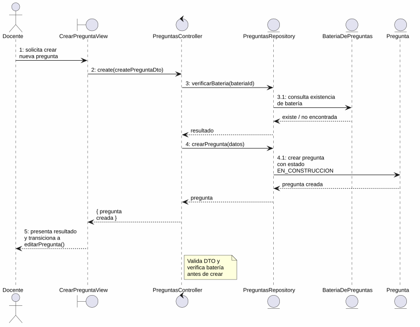
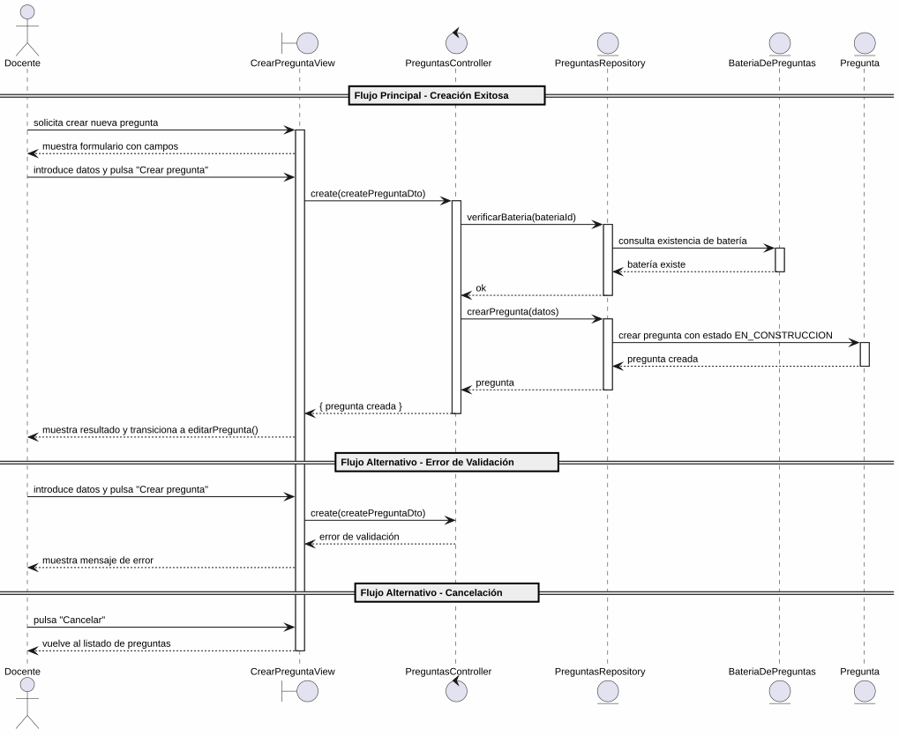

# 25-26-idsw2-sdVC > crearPregunta > Análisis

## información del artefacto

- **Proyecto**: Sistema de Gestión de Exámenes Universitarios
- **Fase RUP**: Elaboration (Elaboración)
- **Disciplina**: Análisis y Diseño
- **Versión**: 1.0
- **Fecha**: 2026-05-29
- **Autor**: Marcos Gutierrez

## propósito

Análisis de colaboración del caso de uso `crearPregunta()` mediante el patrón MVC, identificando las clases de análisis, sus responsabilidades y colaboraciones necesarias para cumplir con los requisitos especificados.

## diagrama de colaboración

||
|-|
|Código fuente: [colaboracion.puml](../../../modelosUML/analisis/crearPregunta/colaboracion.puml)|

## clases de análisis identificadas

### clases de vista (boundary)

#### CrearPreguntaView
**Estereotipo**: Vista (Boundary)
**Responsabilidades**:
- Recibir la solicitud de creación de pregunta desde el listado de preguntas (global o contextual)
- Presentar formulario con campos obligatorios: Asignatura (selector), Enunciado, Tema, Dificultad (radio: Fácil, Medio, Difícil)
- Validar visualmente los campos obligatorios antes de enviar
- Presentar confirmación antes de ejecutar la creación
- Visualizar el resultado final (éxito con transición a edición, o error)
- Manejar la navegación de salida y cancelación

**Colaboraciones**:
- **Entrada**: Recibe `crearPregunta()` desde `PREGUNTAS_ABIERTO` (listado global) o `PREGUNTAS_CONTEXTUALES_ABIERTO` (contextual desde batería)
- **Control**: Se comunica con `PreguntasController`
- **Salida**: Navega a `PREGUNTA_ABIERTO` / `PREGUNTA_CONTEXTUAL_ABIERTO` (éxito, abre edición) o `PREGUNTAS_ABIERTO2` / `PREGUNTAS_CONTEXTUALES_ABIERTO2` (cancelación)

### clases de control

#### PreguntasController
**Estereotipo**: Control
**Responsabilidades**:
- Coordinar la lógica de creación de una nueva pregunta
- Validar los datos de entrada (enunciado, tema, dificultad, bateriaId)
- Verificar que la batería de preguntas especificada existe
- Crear la pregunta con estado `EN_CONSTRUCCION` por defecto
- Gestionar la respuesta de éxito o error

**Colaboraciones**:
- **Vista**: Responde a solicitudes de `CrearPreguntaView`
- **Repositorio**: Delega operaciones de persistencia a `PreguntasRepository`

### clases de entidad (entity)

#### PreguntasRepository
**Estereotipo**: Entidad
**Responsabilidades**:
- Abstraer el acceso a datos de preguntas y baterías
- Proporcionar método para crear una pregunta con los datos proporcionados
- Validar la existencia de la batería de preguntas referenciada
- Mantener la consistencia de los datos durante la creación

**Colaboraciones**:
- **Control**: Responde a `PreguntasController`
- **Entidad**: Gestiona instancias de `Pregunta` y `BateriaDePreguntas`

#### Pregunta
**Estereotipo**: Entidad
**Responsabilidades**:
- Representar una pregunta del banco de preguntas
- Encapsular atributos: id, enunciado, tema, dificultad, estado, bateriaId
- Inicializar su estado como `EN_CONSTRUCCION` tras la creación
- Relacionarse con la batería de preguntas

**Atributos relevantes**:
| Campo | Tipo | Descripción |
|-------|------|-------------|
| `id` | Int (PK) | Identificador único de la pregunta |
| `enunciado` | String | Texto de la pregunta |
| `tema` | String | Tema al que pertenece |
| `dificultad` | Dificultad (enum) | BAJA \| MEDIA \| ALTA |
| `estado` | EstadoPregunta (enum) | `EN_CONSTRUCCION` por defecto |
| `bateriaId` | Int (FK) | Referencia a la batería de preguntas |

**Colaboraciones**:
- **PreguntasRepository**: Es gestionada por el repositorio
- **BateriaDePreguntas**: Relación de pertenencia a la batería

#### BateriaDePreguntas
**Estereotipo**: Entidad
**Responsabilidades**:
- Representar el banco de preguntas asociado a una asignatura
- Validar existencia de la batería para asignar la nueva pregunta

**Atributos relevantes**:
| Campo | Tipo | Descripción |
|-------|------|-------------|
| `id` | Int (PK) | Identificador único de la batería |
| `asignaturaId` | Int (FK, unique) | Referencia a la asignatura |

**Colaboraciones**:
- **PreguntasRepository**: Es consultada para verificar existencia

## diagrama de secuencia

||
|-|
|Código fuente: [secuencia.puml](../../../modelosUML/analisis/crearPregunta/secuencia.puml)|

## flujo de colaboración

### secuencia de operaciones (flujo principal)

1. **Inicio**: `PREGUNTAS_ABIERTO` / `PREGUNTAS_CONTEXTUALES_ABIERTO` → `CrearPreguntaView.crearPregunta()`
2. **Carga del formulario**: `CrearPreguntaView` muestra formulario con campos: Asignatura, Enunciado, Tema, Dificultad
3. **Introducción de datos**: Docente rellena los campos obligatorios y pulsa "Crear pregunta"
4. **Creación**: `CrearPreguntaView` → `PreguntasController.create(createPreguntaDto)`
5. **Validación**: `PreguntasController` valida los datos de entrada (enunciado, tema, dificultad, bateriaId)
6. **Verificación de batería**: `PreguntasController` → `PreguntasRepository` → `BateriaDePreguntas` → verifica existencia
7. **Persistencia**: `PreguntasController` → `PreguntasRepository.crearPregunta(datos)`
8. **Creación de entidad**: `PreguntasRepository` → `Pregunta` → crea la pregunta con estado `EN_CONSTRUCCION`
9. **Resultado**: `PreguntasRepository` → `PreguntasController` → `CrearPreguntaView` → Docente: pregunta creada + transición a `editarPregunta(nuevaPregunta)`

### flujo alternativo — error en la creación

- Paso 4 falla por datos inválidos o batería no encontrada
- `PreguntasController` retorna error a `CrearPreguntaView`
- `CrearPreguntaView` muestra mensaje de error al Docente
- El sistema regresa al estado `SolicitandoDatosPregunta`

### flujo alternativo — cancelación

- Docente pulsa "Cancelar" en el formulario
- `CrearPreguntaView` regresa al listado de preguntas (`PREGUNTAS_ABIERTO2` / `PREGUNTAS_CONTEXTUALES_ABIERTO2`)
- No se ejecuta ninguna creación ni persistencia

### opciones de navegación disponibles

| Acción | Destino | Descripción |
|--------|---------|-------------|
| `Crear pregunta` | `PREGUNTA_ABIERTO` / `PREGUNTA_CONTEXTUAL_ABIERTO` | Crea la pregunta y abre su edición (`editarPregunta()`) |
| `Cancelar` | `PREGUNTAS_ABIERTO2` / `PREGUNTAS_CONTEXTUALES_ABIERTO2` | Vuelve al listado sin crear |

## estados de análisis

Los estados se corresponden con el diagrama de estados detallado en `contexto/casos-de-uso/detalladoCasosDeUso/crearPregunta/crearPregunta.puml`:

| Estado | Descripción |
|--------|-------------|
| `SolicitandoDatosPregunta` | El docente solicita crear una nueva pregunta |
| `ProcesandoCreacion` | El sistema presenta el formulario con campos; el docente introduce los datos, confirma la creación o cancela |

**Transiciones clave:**
- `SolicitandoDatosPregunta` → `ProcesandoCreacion`: Sistema presenta formulario con campos obligatorios
- `ProcesandoCreacion` → `[*]`: Creación exitosa (salida a `PREGUNTA_ABIERTO` / `PREGUNTA_CONTEXTUAL_ABIERTO`)
- `ProcesandoCreacion` → `PREGUNTAS_ABIERTO2` / `PREGUNTAS_CONTEXTUALES_ABIERTO2`: Cancelación

## correspondencia con requisitos

### mapeado con especificación detallada

| Requisito del caso de uso | Clase responsable | Método/Colaboración |
|--------------------------|-------------------|---------------------|
| Mostrar formulario con campos obligatorios | `CrearPreguntaView` | Asignatura, Enunciado, Tema, Dificultad |
| Validar campos obligatorios | `CrearPreguntaView` | Validación visual antes de enviar |
| Crear pregunta con datos | `PreguntasController` | `create(createPreguntaDto)` |
| Validar integridad de datos de entrada | `PreguntasController` | Validación de DTO |
| Verificar existencia de batería | `PreguntasRepository` | Consulta de `BateriaDePreguntas` por id |
| Persistir pregunta | `PreguntasRepository` | `crearPregunta(datos)` |
| Asignar estado inicial EN_CONSTRUCCION | `PreguntasRepository` | Valor por defecto en creación |
| Transicionar a edición tras crear | `CrearPreguntaView` | Navegación a `PREGUNTA_ABIERTO` con nueva pregunta |
| Cancelar creación | `CrearPreguntaView` | Navegación a `PREGUNTAS_ABIERTO2` |

### patrón de colaboración establecido

Este análisis sigue el **patrón metodológico universal** establecido para el proyecto:
- **Entrada dual**: Desde `PREGUNTAS_ABIERTO` (listado global) o `PREGUNTAS_CONTEXTUALES_ABIERTO` (contextual)
- **Análisis MVC completo**: Vista, Control y Entidad claramente separados
- **Salida dual**: `PREGUNTA_ABIERTO` o `PREGUNTA_CONTEXTUAL_ABIERTO` según el punto de entrada (con transición a `editarPregunta`)
- **Flujo simplificado**: Solo 2 estados internos (solicitud de datos y procesamiento)

### consideraciones de filtros

`crearPregunta()` **no requiere filtros de búsqueda**. Es un caso de uso transaccional de creación simple donde el docente introduce los datos de la nueva pregunta. No existe listado que requiera filtrado.

## características del análisis

### separación de responsabilidades MVC

- **Vista**: Solo presentación del formulario, captura de datos e interacción con el docente
- **Control**: Solo coordinación, validación y lógica de creación
- **Entidad**: Solo datos, reglas de negocio de persistencia y verificación de batería

### agnóstico tecnológicamente

- No especifica tecnología de interfaz de usuario
- No asume implementación específica de base de datos
- Mantiene independencia de frameworks

### trazabilidad completa

- **Origen**: Caso de uso detallado `crearPregunta()` y prototipo asociado
- **Destino**: Base para diseño arquitectónico e implementación
- **Conexión**: Diagrama de contexto → Análisis de colaboración → Implementación real

## trazabilidad con la implementación

| Capa | Artefacto real |
|------|----------------|
| Controlador | `src/apps/backend/src/preguntas/preguntas.controller.ts` (`POST /preguntas`) |
| Servicio | `src/apps/backend/src/preguntas/preguntas.service.ts` (`create()`) |
| DTO | `src/apps/backend/src/preguntas/dto/create-pregunta.dto.ts` (`CreatePreguntaDto`) |
| Vista | `src/apps/frontend/src/views/PreguntasView.vue` (diálogo de creación) |
| Modelo (BD) | `src/apps/backend/prisma/schema.prisma` (Pregunta, BateriaDePreguntas) |

> **Nota:** Este caso de uso está priorizado como #10 y ya tiene implementación completa en el backend (`PreguntasService.create()`). El análisis se ha realizado a partir de los artefactos de requisitos (diagrama de estados detallado y prototipo de interfaz) y validado contra la implementación real.

## patrones aplicados

### repository pattern
`PreguntasRepository` abstrae el acceso a datos de preguntas y baterías, encapsulando la operación de creación con verificación de integridad referencial.

### mvc pattern
Separación clara entre presentación (`CrearPreguntaView`), lógica de aplicación (`PreguntasController`) y datos (`Pregunta`, `BateriaDePreguntas`, `PreguntasRepository`).

### navigation pattern
Las opciones de "Crear pregunta" y "Cancelar" permiten al docente controlar el flujo, con salida diferenciada según el punto de entrada. La creación exitosa transiciona automáticamente a `editarPregunta()`.
