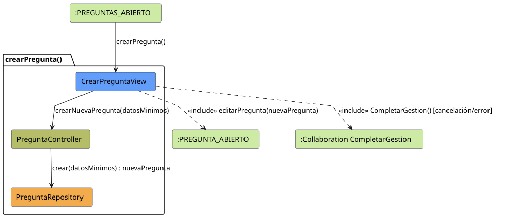

# crearPregunta() (Análisis)

## información del artefacto

- **Proyecto**: Jorgestor - Sistema de Gestión de Exámenes
- **Fase RUP**: Elaboración
- **Disciplina**: Análisis y Diseño
- **Versión**: 1.1
- **Autor**: Gemini CLI

## propósito

Análisis de colaboración del caso de uso `crearPregunta()` mediante el patrón MVC. Este caso de uso aplica la filosofía de "creación rápida" con datos mínimos y transferencia inmediata a la edición detallada.

## diagramas de análisis

### diagrama de colaboración

||
|-|
|Código fuente: [colaboracion.puml](colaboracion.puml)|

### diagrama de secuencia

||
|-|
|Código fuente: [secuencia.puml](secuencia.puml)|

## clases de análisis identificadas

### clases de vista (boundary)

#### CrearPreguntaView
**Estereotipo**: Vista (Boundary)  
**Responsabilidades**:
- Mostrar el formulario de alta rápida (datos mínimos).
- Gestionar la solicitud de creación inicial.
- Navegar automáticamente a la edición detallada.

**Colaboraciones**:
- **Entrada**: Docente.
- **Control**: `PreguntaController`.
- **Salida**: Navega a `PREGUNTA_ABIERTO` (vía `editarPregunta()`).

### clases de control

#### PreguntaController
**Estereotipo**: Control  
**Responsabilidades**:
- Validar y persistir la pregunta básica.
- Coordinar con la vista la redirección post-creación.

**Colaboraciones**:
- **Vista**: Responde a `CrearPreguntaView`.
- **Repositorio**: `PreguntaRepository`.

### clases de entidad (entity)

#### PreguntaRepository
**Estereotipo**: Entidad  
**Responsabilidades**:
- Almacenar la nueva instancia de Pregunta.

**Colaboraciones**:
- **Control**: Responde a `PreguntaController`.
