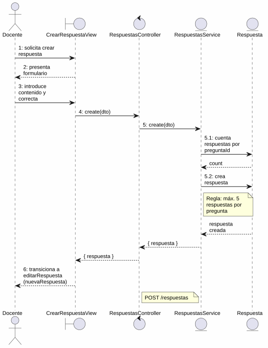
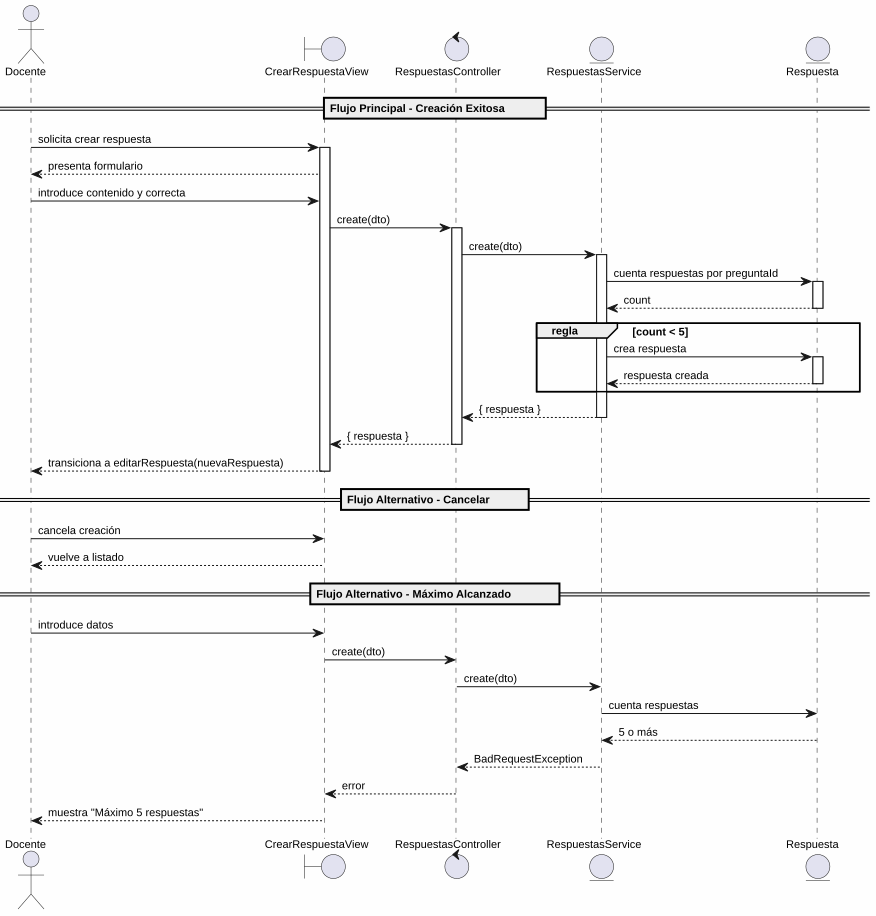

# 25-26-idsw2-sdVC > crearRespuesta > Análisis

## propósito

Análisis de colaboración del caso de uso `crearRespuesta()` mediante el patrón MVC.

## diagrama de colaboración

||
|-|
|Código fuente: [colaboracion.puml](../../../modelosUML/analisis/crearRespuesta/colaboracion.puml)|

## clases de análisis identificadas

### CrearRespuestaView (Boundary)
- Recibir solicitud desde 2 orígenes (RESPUESTAS_ABIERTO, RESPUESTAS_CONTEXTUALES_ABIERTO)
- Presentar formulario con contenido (obligatorio) y correcto/no correcto (obligatorio)
- Crear o cancelar

### RespuestasController (Control)
- Coordinar validación y creación
- `create(dto)` → `RespuestasService`

### RespuestasService (Entity)
- Validar regla de negocio: máximo 5 respuestas por pregunta
- `create(createRespuestaDto)` → persistir

### Respuesta (Entity)
- Atributos: id, contenido, correcta, preguntaId

## diagrama de secuencia

||
|-|
|Código fuente: [secuencia.puml](../../../modelosUML/analisis/crearRespuesta/secuencia.puml)|

## estados de análisis

| Estado | Descripción |
|--------|-------------|
| `SolicitandoDatosRespuesta` | Muestra formulario con campos contenido y correcta |
| `ProcesandoCreacion` | Valida regla de negocio y persiste, transiciona a editarRespuesta |

**Entradas:** RESPUESTAS_ABIERTO, RESPUESTAS_CONTEXTUALES_ABIERTO
**Salidas:** RESPUESTA_ABIERTO (a editar), RESPUESTA_CONTEXTUAL_ABIERTO (a editar), RESPUESTAS_ABIERTO2 (cancel), RESPUESTAS_CONTEXTUALES_ABIERTO2 (cancel)

## trazabilidad con la implementación

| Capa | Artefacto |
|------|-----------|
| Controlador | `src/apps/backend/src/respuestas/respuestas.controller.ts` (`POST /respuestas`) |
| Servicio | `src/apps/backend/src/respuestas/respuestas.service.ts` (`create()`) |
| Vista | `src/apps/frontend/src/views/RespuestasView.vue` |
| Modelo (BD) | `src/apps/backend/prisma/schema.prisma` (modelo `Respuesta`) |
