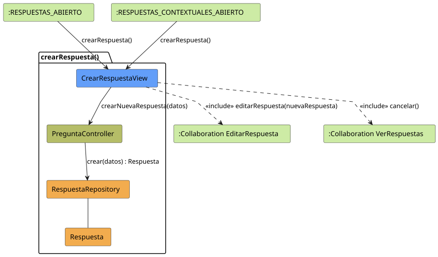

# Jorgestor > crearRespuesta > Análisis

> |[🏠️](/README.md)|[ 📊](../../../archivosEsenciales/casos-de-uso/diagramasDeContexto/diagramaDeContextoDocente/diagramaContexto.svg)|[Detalle](../../../archivosEsenciales/casos-de-uso/detalladoCasosDeUso/README.md#crear-respuesta-docente)|**Análisis**|Diseño|Desarrollo|Pruebas|
> |-|-|-|-|-|-|-|

## información del artefacto

- **Proyecto**: Jorgestor - Sistema de Gestión de Exámenes
- **Fase RUP**: Elaboración
- **Disciplina**: Análisis y Diseño
- **Versión**: 1.1
- **Fecha**: 2026-05-27
- **Autor**: Gemini CLI

## propósito

Análisis de colaboración del caso de uso `crearRespuesta()` mediante el patrón MVC. Sigue el patrón de diseño **"El Delgado"**, permitiendo la creación ágil de una respuesta con datos mínimos y redirigiendo inmediatamente a la edición completa.

## diagramas de análisis

### diagrama de colaboración

||
|-|
|Código fuente: [colaboracion.puml](colaboracion.puml)|

## clases de análisis identificadas

### clases de vista (boundary)

#### CrearRespuestaView
**Estereotipo**: Vista (Boundary)  
**Responsabilidades**:
- Capturar el contenido y el estado de veracidad de la nueva respuesta.
- Solicitar la creación al controlador.
- Redirigir a la colaboración de edición detallada tras el éxito.
- Permitir la cancelación y retorno al listado de respuestas.

**Colaboraciones**:
- **Entrada**: `crearRespuesta()` desde `:RESPUESTAS_ABIERTO` o `:RESPUESTAS_CONTEXTUALES_ABIERTO`.
- **Control**: `PreguntaController`.
- **Salida**: Redirige a `:Collaboration EditarRespuesta` o `:Collaboration VerRespuestas`.

### clases de control

#### PreguntaController
**Estereotipo**: Control  
**Responsabilidades**:
- Coordinar la creación de la entidad `Respuesta` y su vinculación con la pregunta activa.

**Colaboraciones**:
- **Repositorio**: `RespuestaRepository`.

### clases de entidad (entity)

#### RespuestaRepository
**Estereotipo**: Entidad (Repositorio)  
**Responsabilidades**: Persistir la nueva instancia de `Respuesta`.

#### Respuesta
**Estereotipo**: Entidad  
**Responsabilidades**: Almacenar los datos de la respuesta.

## flujo de colaboración principal

### secuencia: creación rápida (El Delgado)

1. **Captura**: El docente introduce el texto de la respuesta y marca si es correcta.
2. **Persistencia**: El controlador ordena la creación al repositorio.
3. **Navegación**: El sistema transita automáticamente a la edición integral de la respuesta recién creada, soportando tanto el flujo general como el contextual de asignaturas.
