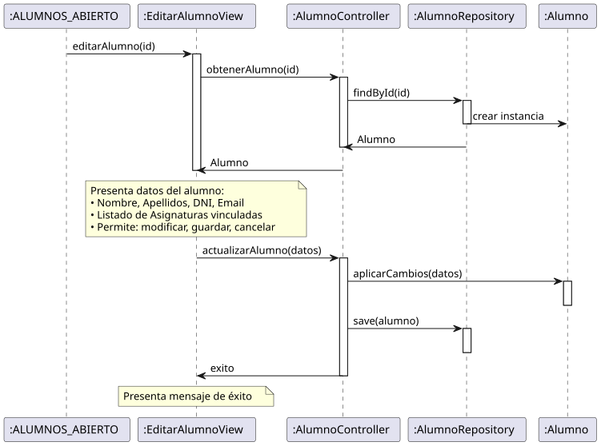

# Jorgestor > editarAlumno > Análisis

> |[🏠️](/README.md)|[ 📊](../../../archivosEsenciales/casos-de-uso/diagramasDeContexto/diagramaDeContextoDocente/diagramaContexto.svg)|[Detalle](../../../archivosEsenciales/casos-de-uso/detalladoCasosDeUso/README.md#editar-alumno-docente)|**Análisis**|Diseño|Desarrollo|Pruebas|
> |-|-|-|-|-|-|-|

## información del artefacto

- **Proyecto**: Jorgestor - Sistema de Gestión de Exámenes
- **Fase RUP**: Elaboración
- **Disciplina**: Análisis y Diseño
- **Versión**: 1.0
- **Fecha**: 2026-05-23
- **Autor**: Gemini CLI

## propósito

Análisis de colaboración del caso de uso `editarAlumno()` mediante el patrón MVC, identificando las clases de análisis, sus responsabilidades y colaboraciones necesarias para implementar la gestión integral de alumnos, incluyendo sus datos personales y vinculación con asignaturas.

## diagramas de análisis

### diagrama de colaboración

||
|-|
|Código fuente: [colaboracion.puml](colaboracion.puml)|

### diagrama de secuencia

||
|-|
|Código fuente: [secuencia.puml](secuencia.puml)|

## clases de análisis identificadas

### clases de vista (boundary)

#### EditarAlumnoView
**Estereotipo**: Vista (Boundary)  
**Responsabilidades**:
- Recibir la solicitud de edición de alumno.
- Interactuar con el controlador para obtener datos del alumno.
- Presentar datos completos de edición (Nombre, Apellidos, DNI, Email, Asignaturas).
- Permitir solicitar modificación de campos.
- Permitir solicitar guardar cambios o cancelar edición.

**Colaboraciones**:
- **Entrada**: Recibe `editarAlumno(id)` desde `:ALUMNOS_ABIERTO`, `:ALUMNO_ABIERTO` o desde `:Collaboration CrearAlumno`.
- **Control**: Se comunica con `AlumnoController`.
- **Salida**: **<<include>>** `:Collaboration AbrirAlumnos`.

### clases de control

#### AlumnoController
**Estereotipo**: Control  
**Responsabilidades**:
- Coordinar la carga de datos del alumno.
- Validar la integridad de los datos antes de actualizar.
- Procesar la persistencia de cambios en el alumno.

**Colaboraciones**:
- **Vista**: Responde a `EditarAlumnoView`.
- **Repositorio**: Delega en `AlumnoRepository`.

### clases de entidad (entity)

#### AlumnoRepository
**Estereotipo**: Entidad  
**Responsabilidades**:
- Abstraer el acceso a datos de alumnos.
- Proporcionar métodos para obtener, actualizar y eliminar registros.

**Colaboraciones**:
- **Control**: Responde a `AlumnoController`.
- **Entidad**: Gestiona instancias de `Alumno`.

#### Alumno
**Estereotipo**: Entidad  
**Responsabilidades**:
- Representar la información del alumno.
- Encapsular atributos: nombre, apellidos, dni, email.
- Mantener relaciones con Asignaturas.

## flujo de colaboración principal

### secuencia: editar alumno

1. **Inicio**: Solicitud desde lista, detalle o tras creación.
2. **Carga**: `EditarAlumnoView` → `AlumnoController.cargarAlumnoParaEdición(id)`.
3. **Obtención**: `AlumnoController` → `AlumnoRepository.obtenerPorId(id) : Alumno`.
4. **Presentación**: `EditarAlumnoView` presenta los datos al Docente.
5. **Modificación**: Docente modifica campos y solicita guardar.
6. **Actualización**: `AlumnoController` aplica cambios y solicita actualización al repositorio.
7. **Finalización**: Navegación a lista de alumnos.

## patrón de edición completa (El Gordo)

Sigue el patrón de "El Gordo" permitiendo la gestión completa de todos los aspectos de un alumno desde un único punto centralizado de edición.
