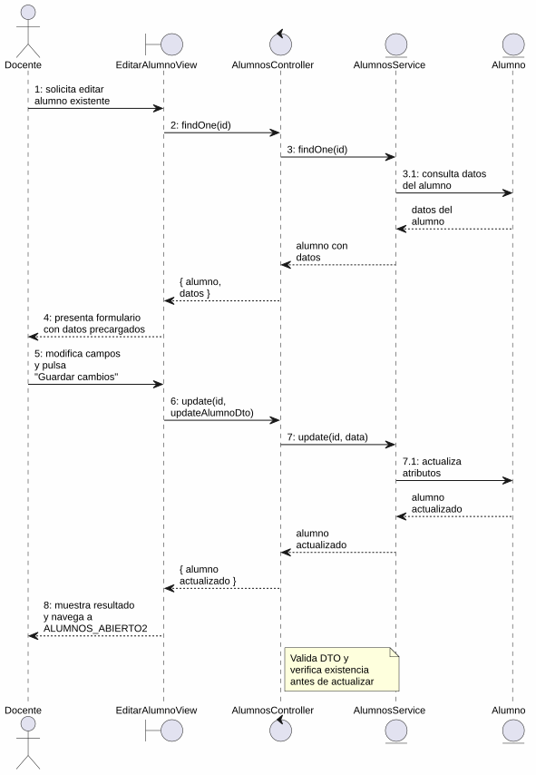
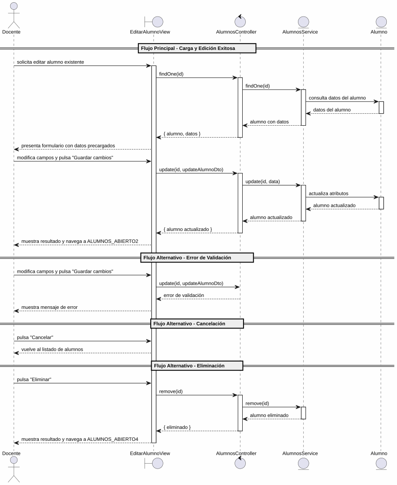

# 25-26-idsw2-sdVC > editarAlumno > Análisis

## información del artefacto

- **Proyecto**: Sistema de Gestión de Exámenes Universitarios
- **Fase RUP**: Elaboration (Elaboración)
- **Disciplina**: Análisis y Diseño
- **Versión**: 1.0
- **Fecha**: 2026-06-01
- **Autor**: Marcos Gutierrez

## propósito

Análisis de colaboración del caso de uso `editarAlumno()` mediante el patrón MVC, identificando las clases de análisis, sus responsabilidades y colaboraciones necesarias para cumplir con los requisitos especificados.

## diagrama de colaboración

||
|-|
|Código fuente: [colaboracion.puml](../../../modelosUML/analisis/editarAlumno/colaboracion.puml)|

## clases de análisis identificadas

### clases de vista (boundary)

#### EditarAlumnoView
**Estereotipo**: Vista (Boundary)
**Responsabilidades**:
- Recibir la solicitud de edición desde 2 orígenes (ALUMNOS_ABIERTO, ALUMNO_ABIERTO)
- Solicitar la carga de datos existentes del alumno
- Presentar formulario con datos precargados: DNI, Nombre, Apellidos
- Permitir modificar campos, guardar cambios, cancelar y eliminar
- Validar visualmente los campos obligatorios antes de enviar
- Visualizar el resultado final (éxito, error)

**Colaboraciones**:
- **Entrada**: Recibe `editarAlumno(id)` desde 2 orígenes (listado de alumnos, vista de alumno)
- **Control**: Se comunica con `AlumnosController`
- **Salida**: Navega a `ALUMNOS_ABIERTO2` (guardar), `ALUMNOS_ABIERTO3` (cancelar) o `ALUMNOS_ABIERTO4` (eliminar)

### clases de control

#### AlumnosController
**Estereotipo**: Control
**Responsabilidades**:
- Coordinar la carga de datos existentes del alumno a editar
- Coordinar la lógica de actualización de un alumno existente
- Validar los datos de entrada del DTO de actualización
- Verificar que el alumno existe antes de cualquier operación
- Gestionar la eliminación del alumno cuando se solicita
- Gestionar la respuesta de éxito o error

**Colaboraciones**:
- **Vista**: Responde a solicitudes de `EditarAlumnoView`
- **Repositorio**: Delega operaciones de persistencia a `AlumnosService`

### clases de entidad (entity)

#### AlumnosService
**Estereotipo**: Entidad
**Responsabilidades**:
- Abstraer el acceso a datos de alumnos
- Proporcionar método para obtener un alumno por ID con sus relaciones (grado, asignaturas)
- Proporcionar método para actualizar un alumno existente
- Proporcionar método para eliminar un alumno
- Validar la existencia del alumno antes de cada operación

**Colaboraciones**:
- **Control**: Responde a `AlumnosController`
- **Entidad**: Gestiona instancias de `Alumno` y `Grado`

#### Alumno
**Estereotipo**: Entidad
**Responsabilidades**:
- Representar un alumno del sistema
- Encapsular atributos: id, nombre, apellidos, dni, email, gradoId
- Permitir la actualización de sus atributos
- Relacionarse con grado, asignaturas y exámenes

**Atributos relevantes**:
| Campo | Tipo | Descripción |
|-------|------|-------------|
| `id` | Int (PK) | Identificador único del alumno |
| `nombre` | String | Nombre del alumno |
| `apellidos` | String | Apellidos del alumno |
| `dni` | String (unique) | Documento nacional de identidad |
| `email` | String (unique) | Correo electrónico |
| `gradoId` | Int (FK) | Referencia al grado |

**Colaboraciones**:
- **AlumnosService**: Es gestionada por el servicio
- **Grado**: Relación de pertenencia al grado

#### Grado
**Estereotipo**: Entidad
**Responsabilidades**:
- Representar un grado universitario asociado al alumno
- Proporcionar el nombre del grado para la visualización en el formulario de edición

**Colaboraciones**:
- **AlumnosService**: Es consultada para validar la existencia del grado

## diagrama de secuencia

||
|-|
|Código fuente: [secuencia.puml](../../../modelosUML/analisis/editarAlumno/secuencia.puml)|

## flujo de colaboración

### secuencia de operaciones (flujo principal — edición exitosa)

1. **Inicio**: Desde cualquiera de los 2 orígenes → `EditarAlumnoView.editarAlumno(id)`
2. **Carga de datos**: `EditarAlumnoView` → `AlumnosController.findOne(id)`
3. **Verificación**: `AlumnosController` → `AlumnosService.findOne(id)` → verifica existencia y retorna datos
4. **Devolución**: `AlumnosService` → `AlumnosController` → `EditarAlumnoView`: alumno con datos completos
5. **Presentación**: `EditarAlumnoView` muestra formulario con datos precargados (DNI, Nombre, Apellidos)
6. **Modificación**: Docente modifica campos (DNI, nombre, apellidos)
7. **Guardado**: Docente pulsa "Guardar cambios" → `EditarAlumnoView` → `AlumnosController.update(id, updateAlumnoDto)`
8. **Validación**: `AlumnosController` valida los datos de entrada
9. **Persistencia**: `AlumnosController` → `AlumnosService.update(id, data)` → verifica existencia y actualiza
10. **Resultado**: `AlumnosService` → `AlumnosController` → `EditarAlumnoView` → Docente: alumno actualizado + navegación a `ALUMNOS_ABIERTO2`

### flujo alternativo — error de validación

- Paso 8 falla por datos inválidos (validación del controlador)
- `AlumnosController` retorna error a `EditarAlumnoView`
- `EditarAlumnoView` muestra mensaje de error al Docente

### flujo alternativo — cancelación

- Docente pulsa "Cancelar" en el formulario
- `EditarAlumnoView` regresa al listado de alumnos (`ALUMNOS_ABIERTO3`)
- No se ejecuta ninguna actualización ni persistencia

### flujo alternativo — eliminación

- Docente pulsa "Eliminar" en el formulario
- `EditarAlumnoView` → `AlumnosController.remove(id)`
- `AlumnosController` → `AlumnosService.remove(id)` → verifica existencia y elimina
- `EditarAlumnoView` navega a `ALUMNOS_ABIERTO4`

### opciones de navegación disponibles

| Acción | Destino | Descripción |
|--------|---------|-------------|
| `Guardar cambios` | `ALUMNOS_ABIERTO2` | Guarda los cambios y vuelve al listado de alumnos |
| `Cancelar` | `ALUMNOS_ABIERTO3` | Vuelve al listado sin guardar |
| `Eliminar` | `ALUMNOS_ABIERTO4` | Elimina el alumno y vuelve al listado |

## estados de análisis

Los estados se corresponden con el diagrama de estados detallado en `contexto/casos-de-uso/detalladoCasosDeUso/editarAlumno/editarAlumno.puml`:

| Estado | Descripción |
|--------|-------------|
| `EditandoDatos` | El docente solicita editar un alumno existente; el sistema inicia la carga de datos |
| `GuardandoDatos` | El sistema presenta el formulario con datos precargados; el docente modifica campos, guarda cambios, cancela la edición o elimina |

**Transiciones clave:**
- `EditandoDatos` → `GuardandoDatos`: Sistema carga y presenta datos del alumno con campos editables
- `GuardandoDatos` → `EditandoDatos`: Docente solicita modificar campos
- `GuardandoDatos` → `[*]`: Docente guarda cambios (salida a `ALUMNOS_ABIERTO2`)
- `GuardandoDatos` → `ALUMNOS_ABIERTO3`: Cancelación
- `GuardandoDatos` → `ALUMNOS_ABIERTO4`: Eliminación

## correspondencia con requisitos

### mapeado con especificación detallada

| Requisito del caso de uso | Clase responsable | Método/Colaboración |
|--------------------------|-------------------|---------------------|
| Recibir solicitud de edición desde 2 orígenes | `EditarAlumnoView` | Entrada desde listado y vista de alumno |
| Cargar datos existentes del alumno | `AlumnosController` | `findOne(id)` → `AlumnosService.findOne(id)` |
| Mostrar formulario con datos precargados | `EditarAlumnoView` | DNI, Nombre, Apellidos |
| Validar campos obligatorios | `EditarAlumnoView` | Validación visual antes de enviar |
| Actualizar alumno con datos modificados | `AlumnosController` | `update(id, updateAlumnoDto)` |
| Validar integridad de datos de entrada | `AlumnosController` | Validación de DTO |
| Verificar existencia del alumno | `AlumnosService` | `findOne(id)` lanza excepción si no existe |
| Persistir actualización | `AlumnosService` | `update(id, data)` |
| Eliminar alumno | `AlumnosController` | `remove(id)` → `AlumnosService.remove(id)` |
| Transicionar a guardado exitoso | `EditarAlumnoView` | Navegación a `ALUMNOS_ABIERTO2` |
| Cancelar edición | `EditarAlumnoView` | Navegación a `ALUMNOS_ABIERTO3` |

### patrón de colaboración establecido

- **Entrada dual**: Desde 2 orígenes (listado de alumnos, vista de alumno)
- **Análisis MVC completo**: Vista, Control y Entidad claramente separados
- **Salida triple**: Guardar, Cancelar y Eliminar con destinos diferenciados
- **Flujo con carga previa**: Primero carga datos existentes, luego permite modificar y guardar

## trazabilidad con la implementación

| Capa | Artefacto real |
|------|----------------|
| Controlador | `src/apps/backend/src/alumnos/alumnos.controller.ts` (`PATCH /alumnos/:id`, `DELETE /alumnos/:id`, `GET /alumnos/:id`) |
| Servicio | `src/apps/backend/src/alumnos/alumnos.service.ts` (`update()`, `remove()`, `findOne()`) |
| DTO | `src/apps/backend/src/alumnos/dto/update-alumno.dto.ts` (`UpdateAlumnoDto`) |
| Vista | `src/apps/frontend/src/views/AlumnosView.vue` (diálogo de edición) |
| Modelo (BD) | `src/apps/backend/prisma/schema.prisma` (modelo `Alumno`) |

> **Nota:** Este caso de uso está priorizado como #16 y ya tiene implementación completa en el backend (`AlumnosService.update()`, `AlumnosService.remove()`, `AlumnosService.findOne()`). El diagrama de estados detallado y el prototipo listan como editables los campos DNI, Nombre y Apellidos; la implementación real del frontend también incluye Email y Grado como campos editables en el formulario. El análisis se ha realizado a partir de los artefactos de requisitos y validado contra la implementación real.

## patrones aplicados

### repository pattern
`AlumnosService` abstrae el acceso a datos de alumnos, encapsulando operaciones de carga, actualización y eliminación con verificación de existencia.

### mvc pattern
Separación clara entre presentación (`EditarAlumnoView`), lógica de aplicación (`AlumnosController`) y datos (`Alumno`, `Grado`, `AlumnosService`).

### navigation pattern
Las opciones de "Guardar cambios", "Cancelar" y "Eliminar" permiten al docente controlar el flujo, con salida diferenciada según la acción.
