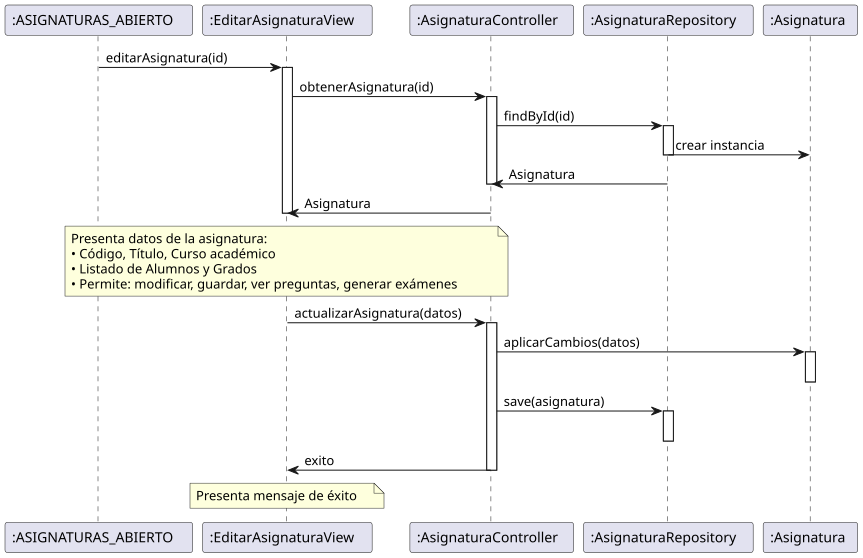

# Jorgestor > editarAsignatura > Análisis

> |[🏠️](/README.md)|[ 📊](../../../archivosEsenciales/casos-de-uso/diagramasDeContexto/diagramaDeContextoDocente/diagramaContexto.svg)|[Detalle](../../../archivosEsenciales/casos-de-uso/detalladoCasosDeUso/README.md#editar-asignatura-docente)|**Análisis**|Diseño|Desarrollo|Pruebas|
> |-|-|-|-|-|-|-|

## información del artefacto

- **Proyecto**: Jorgestor - Sistema de Gestión de Exámenes
- **Fase RUP**: Elaboración
- **Disciplina**: Análisis y Diseño
- **Versión**: 1.0
- **Fecha**: 2026-05-23
- **Autor**: Gemini CLI

## propósito

Análisis de colaboración del caso de uso `editarAsignatura()` mediante el patrón MVC, identificando las clases de análisis, sus responsabilidades y colaboraciones necesarias para implementar la gestión integral de asignaturas, incluyendo la vinculación de alumnos y grados.

## diagramas de análisis

### diagrama de colaboración

||
|-|
|Código fuente: [colaboracion.puml](colaboracion.puml)|

### diagrama de secuencia

||
|-|
|Código fuente: [secuencia.puml](secuencia.puml)|

## clases de análisis identificadas

### clases de vista (boundary)

#### EditarAsignaturaView
**Estereotipo**: Vista (Boundary)  
**Responsabilidades**:
- Recibir la solicitud de edición de asignatura.
- Interactuar con el controlador para obtener datos de la asignatura.
- Presentar datos completos de edición (Título, Código, Curso, Grados, Alumnos).
- Permitir solicitar modificación de campos y vinculaciones.
- Permitir acceso a la gestión de preguntas y generación de exámenes.
- Permitir solicitar guardar cambios, eliminar o cancelar edición.

**Colaboraciones**:
- **Entrada**: Recibe `editarAsignatura(id)` desde `:ASIGNATURAS_ABIERTO`, `:ASIGNATURA_ABIERTO` o desde `:Collaboration CrearAsignatura`.
- **Control**: Se comunica con `AsignaturaController`.
- **Salida**: **<<include>>** `:Collaboration AbrirAsignaturas`, `:Collaboration VerPreguntas` o `:Collaboration GenerarExamenes`.

### clases de control

#### AsignaturaController
**Estereotipo**: Control  
**Responsabilidades**:
- Coordinar la carga de datos de la asignatura.
- Validar la integridad de los datos y relaciones antes de actualizar.
- Procesar la persistencia de cambios en la asignatura y sus vínculos.
- Gestionar la transición a módulos de preguntas o exámenes.

**Colaboraciones**:
- **Vista**: Responde a `EditarAsignaturaView`.
- **Repositorio**: Delega en `AsignaturaRepository`.

### clases de entidad (entity)

#### AsignaturaRepository
**Estereotipo**: Entidad  
**Responsabilidades**:
- Abstraer el acceso a datos de asignaturas.
- Proporcionar métodos para obtener, actualizar y eliminar registros.
- Gestionar la persistencia de relaciones con Alumnos y Grados.

**Colaboraciones**:
- **Control**: Responde a `AsignaturaController`.
- **Entidad**: Gestiona instancias de `Asignatura`.

#### Asignatura
**Estereotipo**: Entidad  
**Responsabilidades**:
- Representar la información de la asignatura.
- Encapsular atributos: código, título, curso académico.
- Mantener relaciones con Alumnos, Grados y Batería de Preguntas.

## flujo de colaboración principal

### secuencia: editar asignatura

1. **Inicio**: Solicitud desde lista, detalle o tras creación.
2. **Carga**: `EditarAsignaturaView` → `AsignaturaController.cargarAsignaturaParaEdición(id)`.
3. **Obtención**: `AsignaturaController` → `AsignaturaRepository.obtenerPorId(id) : Asignatura`.
4. **Presentación**: `EditarAsignaturaView` presenta los datos al Docente.
5. **Modificación**: Docente modifica campos o vinculaciones y solicita guardar.
6. **Actualización**: `AsignaturaController` aplica cambios y solicita actualización al repositorio.
7. **Finalización**: Navegación a lista, preguntas o exámenes.

## patrón de edición completa (El Gordo)

Sigue el patrón de "El Gordo" permitiendo la gestión completa de todos los aspectos de una asignatura desde un único punto centralizado de edición.
