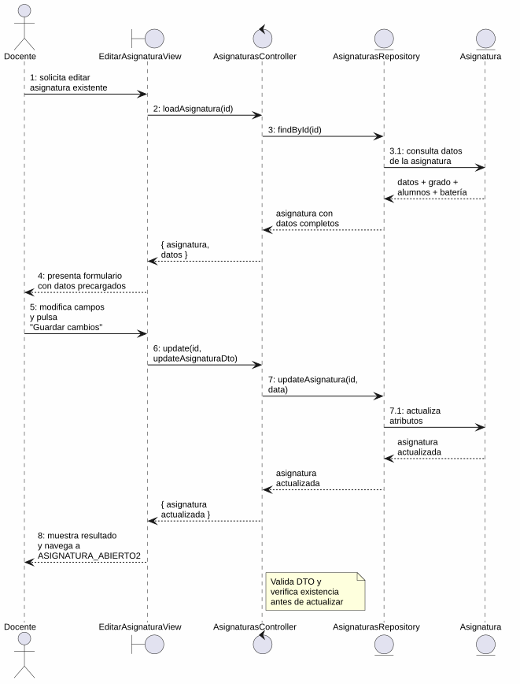
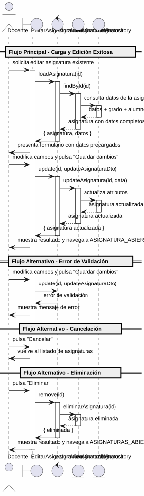

# 25-26-idsw2-sdVC > editarAsignatura > Análisis

## información del artefacto

- **Proyecto**: Sistema de Gestión de Exámenes Universitarios
- **Fase RUP**: Elaboration (Elaboración)
- **Disciplina**: Análisis y Diseño
- **Versión**: 1.0
- **Fecha**: 2026-05-29
- **Autor**: Marcos Gutierrez

## propósito

Análisis de colaboración del caso de uso `editarAsignatura()` mediante el patrón MVC, identificando las clases de análisis, sus responsabilidades y colaboraciones necesarias para cumplir con los requisitos especificados.

## diagrama de colaboración

||
|-|
|Código fuente: [colaboracion.puml](../../../modelosUML/analisis/editarAsignatura/colaboracion.puml)|

## clases de análisis identificadas

### clases de vista (boundary)

#### EditarAsignaturaView
**Estereotipo**: Vista (Boundary)
**Responsabilidades**:
- Recibir la solicitud de edición desde múltiples orígenes (ASIGNATURAS_ABIERTO, ASIGNATURA_ABIERTO, PREGUNTAS_CONTEXTUALES_ABIERTO, EXAMENES_ASIGNADOS_CONTEXTUALES)
- Solicitar la carga de datos existentes de la asignatura
- Presentar formulario con datos precargados: Código, Título, Curso Académico, Grados asociados (checkboxes), Alumnos matriculados (checkboxes)
- Permitir modificar campos, guardar cambios, cancelar, eliminar la asignatura, ver preguntas y generar examen
- Validar visualmente los campos obligatorios antes de enviar
- Visualizar el resultado final (éxito, error)

**Colaboraciones**:
- **Entrada**: Recibe `editarAsignatura(id)` desde 4 orígenes (listado de asignaturas, vista de asignatura, preguntas contextuales, exámenes asignados contextuales)
- **Control**: Se comunica con `AsignaturasController`
- **Salida**: Navega a `ASIGNATURA_ABIERTO2` (guardar), `ASIGNATURAS_ABIERTO2` (cancelar), `ASIGNATURAS_ABIERTO1` (eliminar), `PREGUNTAS_CONTEXTUALES_ABIERTO1` (ver preguntas) o `EXAMENES_GENERADOS_CONTEXTUALES` (generar examen)

### clases de control

#### AsignaturasController
**Estereotipo**: Control
**Responsabilidades**:
- Coordinar la carga de datos existentes de la asignatura a editar
- Coordinar la lógica de actualización de una asignatura existente
- Validar los datos de entrada del DTO de actualización
- Verificar que la asignatura existe antes de cualquier operación
- Gestionar la eliminación de la asignatura cuando se solicita
- Gestionar la respuesta de éxito o error

**Colaboraciones**:
- **Vista**: Responde a solicitudes de `EditarAsignaturaView`
- **Repositorio**: Delega operaciones de persistencia a `AsignaturasRepository`

### clases de entidad (entity)

#### AsignaturasRepository
**Estereotipo**: Entidad
**Responsabilidades**:
- Abstraer el acceso a datos de asignaturas, grados, alumnos y baterías
- Proporcionar método para obtener una asignatura por ID con sus relaciones (grado, alumnos, batería)
- Proporcionar método para actualizar una asignatura existente
- Proporcionar método para eliminar una asignatura
- Validar la existencia de la asignatura antes de cada operación
- Mantener la consistencia de los datos durante la actualización

**Colaboraciones**:
- **Control**: Responde a `AsignaturasController`
- **Entidad**: Gestiona instancias de `Asignatura`, `Grado`, `Alumno` y `BateriaDePreguntas`

#### Asignatura
**Estereotipo**: Entidad
**Responsabilidades**:
- Representar una asignatura del sistema
- Encapsular atributos: id, titulo, codigo, cursoAcademico, gradoId, profesorId
- Permitir la actualización de sus atributos
- Relacionarse con grado, alumnos y batería de preguntas

**Atributos relevantes**:
| Campo | Tipo | Descripción |
|-------|------|-------------|
| `id` | Int (PK) | Identificador único de la asignatura |
| `titulo` | String | Nombre de la asignatura |
| `codigo` | String | Código identificador (unique por curso) |
| `cursoAcademico` | String | Curso académico |
| `gradoId` | Int (FK) | Referencia al grado |
| `profesorId` | Int? (FK) | Referencia al profesor |

**Colaboraciones**:
- **AsignaturasRepository**: Es gestionada por el repositorio
- **Grado**: Relación de pertenencia al grado
- **Alumno**: Relación con alumnos matriculados vía `AlumnoAsignatura`
- **BateriaDePreguntas**: Relación con la batería de preguntas

#### Grado
**Estereotipo**: Entidad
**Responsabilidades**:
- Representar un grado universitario asociado a la asignatura
- Proporcionar el nombre del grado para la visualización en checkboxes

**Atributos relevantes**:
| Campo | Tipo | Descripción |
|-------|------|-------------|
| `id` | Int (PK) | Identificador único del grado |
| `nombre` | String | Nombre del grado |

**Colaboraciones**:
- **AsignaturasRepository**: Es consultada para obtener la lista de grados

#### Alumno
**Estereotipo**: Entidad
**Responsabilidades**:
- Representar un alumno matriculado en la asignatura
- Proporcionar nombre y datos del alumno para la visualización en checkboxes

**Atributos relevantes**:
| Campo | Tipo | Descripción |
|-------|------|-------------|
| `id` | Int (PK) | Identificador único del alumno |
| `nombre` | String | Nombre del alumno |
| `email` | String | Correo electrónico |

**Colaboraciones**:
- **AsignaturasRepository**: Es consultada para obtener los alumnos matriculados

#### BateriaDePreguntas
**Estereotipo**: Entidad
**Responsabilidades**:
- Representar el banco de preguntas asociado a la asignatura
- Proporcionar información sobre preguntas disponibles para la navegación a "ver preguntas"

**Atributos relevantes**:
| Campo | Tipo | Descripción |
|-------|------|-------------|
| `id` | Int (PK) | Identificador único de la batería |
| `asignaturaId` | Int (FK, unique) | Referencia a la asignatura |

**Colaboraciones**:
- **AsignaturasRepository**: Es consultada como parte de los datos de la asignatura

## diagrama de secuencia

||
|-|
|Código fuente: [secuencia.puml](../../../modelosUML/analisis/editarAsignatura/secuencia.puml)|

## flujo de colaboración

### secuencia de operaciones (flujo principal — edición exitosa)

1. **Inicio**: Desde cualquiera de los 4 orígenes → `EditarAsignaturaView.editarAsignatura(id)`
2. **Carga de datos**: `EditarAsignaturaView` → `AsignaturasController.loadAsignatura(id)`
3. **Verificación**: `AsignaturasController` → `AsignaturasRepository.findById(id)`
4. **Consulta de entidad**: `AsignaturasRepository` → `Asignatura` → consulta datos + grado + alumnos + batería
5. **Devolución**: `AsignaturasRepository` → `AsignaturasController` → `EditarAsignaturaView`: asignatura con datos completos
6. **Presentación**: `EditarAsignaturaView` muestra formulario con datos precargados (Código, Título, Curso, Grados, Alumnos)
7. **Modificación**: Docente modifica campos (título, código, curso académico, grados asociados, alumnos matriculados)
8. **Guardado**: Docente pulsa "Guardar cambios" → `EditarAsignaturaView` → `AsignaturasController.update(id, updateAsignaturaDto)`
9. **Validación**: `AsignaturasController` valida los datos de entrada
10. **Persistencia**: `AsignaturasController` → `AsignaturasRepository.updateAsignatura(id, data)`
11. **Actualización**: `AsignaturasRepository` → `Asignatura` → actualiza atributos
12. **Resultado**: `AsignaturasRepository` → `AsignaturasController` → `EditarAsignaturaView` → Docente: asignatura actualizada + navegación a `ASIGNATURA_ABIERTO2`

### flujo alternativo — error de validación

- Paso 9 falla por datos inválidos (validación del controlador)
- `AsignaturasController` retorna error a `EditarAsignaturaView`
- `EditarAsignaturaView` muestra mensaje de error al Docente
- El sistema regresa al estado `GuardandoDatos`

### flujo alternativo — cancelación

- Docente pulsa "Cancelar" en el formulario
- `EditarAsignaturaView` regresa al listado de asignaturas (`ASIGNATURAS_ABIERTO2`)
- No se ejecuta ninguna actualización ni persistencia

### flujo alternativo — eliminación

- Docente pulsa "Eliminar" en el formulario
- `EditarAsignaturaView` → `AsignaturasController.remove(id)`
- `AsignaturasController` → `AsignaturasRepository.eliminarAsignatura(id)`
- `AsignaturasRepository` verifica existencia y elimina
- `EditarAsignaturaView` navega a `ASIGNATURAS_ABIERTO1`

### flujo alternativo — ver preguntas

- Docente pulsa "Ver preguntas" en el formulario
- `EditarAsignaturaView` navega a `PREGUNTAS_CONTEXTUALES_ABIERTO1`
- No se ejecuta ninguna actualización ni persistencia

### flujo alternativo — generar examen

- Docente pulsa "Generar Examen" en el formulario
- `EditarAsignaturaView` navega a `EXAMENES_GENERADOS_CONTEXTUALES` (transición a `generarExamen()`)
- No se ejecuta ninguna actualización ni persistencia

### opciones de navegación disponibles

| Acción | Destino | Descripción |
|--------|---------|-------------|
| `Guardar cambios` | `ASIGNATURA_ABIERTO2` | Guarda los cambios y permanece en la vista de la asignatura |
| `Cancelar` | `ASIGNATURAS_ABIERTO2` | Vuelve al listado sin guardar |
| `Eliminar` | `ASIGNATURAS_ABIERTO1` | Elimina la asignatura y vuelve al listado |
| `Ver preguntas` | `PREGUNTAS_CONTEXTUALES_ABIERTO1` | Navega a las preguntas de la asignatura |
| `Generar Examen` | `EXAMENES_GENERADOS_CONTEXTUALES` | Navega a generar examen para la asignatura |

## estados de análisis

Los estados se corresponden con el diagrama de estados detallado en `contexto/casos-de-uso/detalladoCasosDeUso/editarAsignatura/editarAsignatura.puml`:

| Estado | Descripción |
|--------|-------------|
| `EditandoDatos` | El docente solicita editar una asignatura existente; el sistema inicia la carga de datos |
| `GuardandoDatos` | El sistema presenta el formulario con datos precargados; el docente modifica campos, guarda cambios, cancela, elimina la asignatura, ve preguntas o genera examen |

**Transiciones clave:**
- `EditandoDatos` → `GuardandoDatos`: Sistema carga y presenta datos de la asignatura con campos editables
- `GuardandoDatos` → `EditandoDatos`: Docente solicita modificar campos
- `GuardandoDatos` → `[*]`: Docente guarda cambios (salida a `ASIGNATURA_ABIERTO2`)
- `GuardandoDatos` → `ASIGNATURAS_ABIERTO2`: Cancelación
- `GuardandoDatos` → `ASIGNATURAS_ABIERTO1`: Eliminación
- `GuardandoDatos` → `PREGUNTAS_CONTEXTUALES_ABIERTO1`: Ver preguntas
- `GuardandoDatos` → `EXAMENES_GENERADOS_CONTEXTUALES`: Generar examen

## correspondencia con requisitos

### mapeado con especificación detallada

| Requisito del caso de uso | Clase responsable | Método/Colaboración |
|--------------------------|-------------------|---------------------|
| Recibir solicitud de edición desde 4 orígenes | `EditarAsignaturaView` | Entrada desde listado, vista, preguntas y exámenes contextuales |
| Cargar datos existentes de la asignatura | `AsignaturasController` | `loadAsignatura(id)` → `AsignaturasRepository.findById(id)` |
| Mostrar formulario con datos precargados | `EditarAsignaturaView` | Código, Título, Curso, Grados, Alumnos |
| Validar campos obligatorios | `EditarAsignaturaView` | Validación visual antes de enviar |
| Actualizar asignatura con datos modificados | `AsignaturasController` | `update(id, updateAsignaturaDto)` |
| Validar integridad de datos de entrada | `AsignaturasController` | Validación de DTO |
| Verificar existencia de la asignatura | `AsignaturasRepository` | `findById(id)` lanza excepción si no existe |
| Persistir actualización | `AsignaturasRepository` | `updateAsignatura(id, data)` |
| Eliminar asignatura | `AsignaturasController` | `remove(id)` → `AsignaturasRepository.eliminarAsignatura(id)` |
| Transicionar a guardado exitoso | `EditarAsignaturaView` | Navegación a `ASIGNATURA_ABIERTO2` |
| Cancelar edición | `EditarAsignaturaView` | Navegación a `ASIGNATURAS_ABIERTO2` |
| Navegar a ver preguntas | `EditarAsignaturaView` | Navegación a `PREGUNTAS_CONTEXTUALES_ABIERTO1` |
| Navegar a generar examen | `EditarAsignaturaView` | Navegación a `EXAMENES_GENERADOS_CONTEXTUALES` |

### patrón de colaboración establecido

Este análisis sigue el **patrón metodológico universal** establecido para el proyecto:
- **Entrada múltiple**: Desde 4 orígenes (listado de asignaturas, vista de asignatura, preguntas contextuales, exámenes asignados contextuales)
- **Análisis MVC completo**: Vista, Control y Entidad claramente separados
- **Salida quíntuple**: Guardar, Cancelar, Eliminar, Ver preguntas y Generar examen con destinos diferenciados
- **Flujo con carga previa**: Primero carga datos existentes, luego permite modificar y guardar

### consideraciones de filtros

`editarAsignatura()` **no requiere filtros de búsqueda**. Es un caso de uso transaccional donde el docente selecciona una asignatura existente y edita sus datos. La carga inicial usa el ID de la asignatura seleccionada.

## características del análisis

### separación de responsabilidades MVC

- **Vista**: Solo presentación del formulario con datos precargados, captura de modificaciones e interacción con el docente
- **Control**: Solo coordinación de carga de datos, validación, actualización y eliminación
- **Entidad**: Solo datos, reglas de negocio de persistencia y verificación de existencia

### agnóstico tecnológicamente

- No especifica tecnología de interfaz de usuario
- No asume implementación específica de base de datos
- Mantiene independencia de frameworks

### trazabilidad completa

- **Origen**: Caso de uso detallado `editarAsignatura()` y prototipo asociado
- **Destino**: Base para diseño arquitectónico e implementación
- **Conexión**: Diagrama de contexto → Análisis de colaboración → Implementación real

## trazabilidad con la implementación

| Capa | Artefacto real |
|------|----------------|
| Controlador | `src/apps/backend/src/asignaturas/asignaturas.controller.ts` (`PATCH /asignaturas/:id`, `DELETE /asignaturas/:id`) |
| Servicio | `src/apps/backend/src/asignaturas/asignaturas.service.ts` (`update()`, `remove()`, `findOne()`) |
| DTO | `src/apps/backend/src/asignaturas/dto/update-asignatura.dto.ts` (`UpdateAsignaturaDto`) |
| Vista | `src/apps/frontend/src/views/AsignaturasView.vue` (diálogo de edición) |
| Modelo (BD) | `src/apps/backend/prisma/schema.prisma` (Asignatura, Grado, Alumno, AlumnoAsignatura, BateriaDePreguntas) |

> **Nota:** Este caso de uso está priorizado como #12 y ya tiene implementación completa en el backend (`AsignaturasService.update()`, `AsignaturasService.remove()`). El análisis se ha realizado a partir de los artefactos de requisitos (diagrama de estados detallado y prototipo de interfaz) y validado contra la implementación real.

## patrones aplicados

### repository pattern
`AsignaturasRepository` abstrae el acceso a datos de asignaturas, grados y alumnos, encapsulando operaciones de carga, actualización y eliminación con verificación de existencia.

### mvc pattern
Separación clara entre presentación (`EditarAsignaturaView`), lógica de aplicación (`AsignaturasController`) y datos (`Asignatura`, `Grado`, `Alumno`, `BateriaDePreguntas`, `AsignaturasRepository`).

### navigation pattern
Las opciones de "Guardar cambios", "Cancelar", "Eliminar", "Ver preguntas" y "Generar Examen" permiten al docente controlar el flujo, con salida diferenciada según la acción. Los 4 orígenes de entrada convergen en un único flujo de edición.
