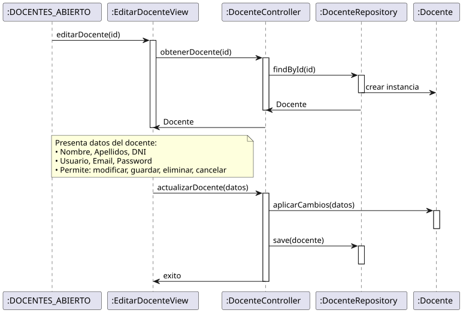

# Jorgestor > editarDocente > Análisis

> |[🏠️](/README.md)|[ 📊](../../../archivosEsenciales/casos-de-uso/diagramasDeContexto/diagramaDeContextoAdministradorInstitucional/diagramaContexto.svg)|[Detalle](../../../archivosEsenciales/casos-de-uso/detalladoCasosDeUso/README.md#editar-docente-administrador-institucional)|**Análisis**|Diseño|Desarrollo|Pruebas|
> |-|-|-|-|-|-|-|

## información del artefacto

- **Proyecto**: Jorgestor - Sistema de Gestión de Exámenes
- **Fase RUP**: Elaboración
- **Disciplina**: Análisis y Diseño
- **Versión**: 1.0
- **Fecha**: 2026-05-23
- **Autor**: Gemini CLI

## propósito

Análisis de colaboración del caso de uso `editarDocente()` mediante el patrón MVC, identificando las clases de análisis para la gestión integral de perfiles de profesores.

## diagramas de análisis

### diagrama de colaboración

||
|-|
|Código fuente: [colaboracion.puml](colaboracion.puml)|

### diagrama de secuencia

||
|-|
|Código fuente: [secuencia.puml](secuencia.puml)|

## clases de análisis identificadas

### clases de vista (boundary)

#### EditarDocenteView
**Estereotipo**: Vista (Boundary)  
**Responsabilidades**:
- Recibir la solicitud de edición de docente.
- Interactuar con el controlador para obtener datos del docente.
- Presentar datos completos de edición (Identidad y Credenciales).
- Permitir solicitar modificación de campos.
- Permitir solicitar guardar cambios, eliminar o cancelar edición.

**Colaboraciones**:
- **Entrada**: Recibe `editarDocente(id)` desde `:DOCENTES_ABIERTO`, `:DOCENTE_ABIERTO` o desde `:Collaboration CrearDocente`.
- **Control**: Se comunica con `DocenteController`.
- **Salida**: **<<include>>** `:Collaboration AbrirDocentes`.

### clases de control

#### DocenteController
**Estereotipo**: Control  
**Responsabilidades**:
- Coordinar la carga de datos del docente.
- Validar la integridad de los datos (DNI, formato de email, etc.).
- Procesar la persistencia de cambios en el perfil.
- Gestionar la eliminación del docente.

**Colaboraciones**:
- **Vista**: Responde a `EditarDocenteView`.
- **Repositorio**: Delega en `DocenteRepository`.

### clases de entidad (entity)

#### DocenteRepository
**Estereotipo**: Entidad  
**Responsabilidades**:
- Abstraer el acceso a datos de docentes.
- Proporcionar métodos para obtener, actualizar y eliminar registros.

**Colaboraciones**:
- **Control**: Responde a `DocenteController`.
- **Entidad**: Gestiona instancias de `Docente`.

#### Docente
**Estereotipo**: Entity  
**Responsabilidades**:
- Representar la información completa de un profesor.
- Encapsular atributos: DNI, nombre, apellidos, email, usuario, password.

## flujo de colaboración principal

### secuencia: editar docente

1. **Inicio**: Solicitud desde lista, detalle o tras creación.
2. **Carga**: `EditarDocenteView` → `DocenteController.cargarDocenteParaEdición(id)`.
3. **Obtención**: `DocenteController` → `DocenteRepository.obtenerPorId(id) : Docente`.
4. **Presentación**: `EditarDocenteView` presenta los datos al Administrador.
5. **Modificación**: Administrador modifica campos y solicita guardar.
6. **Actualización**: `DocenteController` aplica cambios y solicita actualización al repositorio.
7. **Finalización**: Navegación de regreso a la lista de docentes.

## patrón de edición completa (El Gordo)

Sigue el patrón de "El Gordo", permitiendo una gestión detallada y continua de toda la información del docente en una única sesión de edición.
