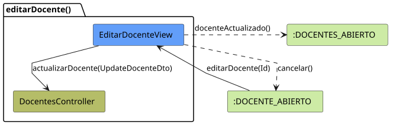
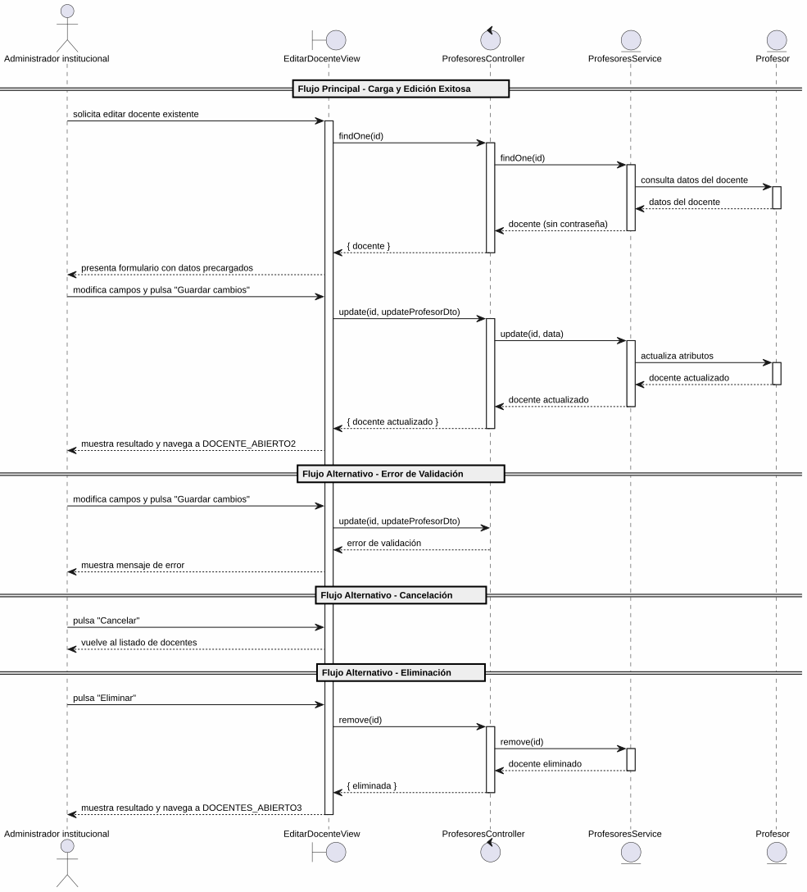

# 25-26-idsw2-sdVC > editarDocente > Análisis

## información del artefacto

- **Proyecto**: Sistema de Gestión de Exámenes Universitarios
- **Fase RUP**: Elaboration (Elaboración)
- **Disciplina**: Análisis y Diseño
- **Versión**: 1.0
- **Fecha**: 2026-06-01
- **Autor**: Marcos Gutierrez

## propósito

Análisis de colaboración del caso de uso `editarDocente()` mediante el patrón MVC, identificando las clases de análisis, sus responsabilidades y colaboraciones necesarias para cumplir con los requisitos especificados.

## diagrama de colaboración

||
|-|
|Código fuente: [colaboracion.puml](../../../modelosUML/analisis/editarDocente/colaboracion.puml)|

## clases de análisis identificadas

### clases de vista (boundary)

#### EditarDocenteView
**Estereotipo**: Vista (Boundary)
**Responsabilidades**:
- Recibir la solicitud de edición desde 2 orígenes (DOCENTES_ABIERTO, DOCENTE_ABIERTO)
- Solicitar la carga de datos existentes del docente
- Presentar formulario con datos precargados: Nombre, Apellidos, DNI, Nombre de usuario, Email, Contraseña
- Permitir modificar campos, guardar cambios, cancelar y eliminar
- Validar visualmente los campos obligatorios antes de enviar
- Visualizar el resultado final (éxito, error)

**Colaboraciones**:
- **Entrada**: Recibe `editarDocente(id)` desde 2 orígenes (listado de docentes, vista de docente)
- **Control**: Se comunica con `ProfesoresController`
- **Salida**: Navega a `DOCENTE_ABIERTO2` (guardar), `DOCENTES_ABIERTO2` (cancelar) o `DOCENTES_ABIERTO3` (eliminar)

### clases de control

#### ProfesoresController
**Estereotipo**: Control
**Responsabilidades**:
- Coordinar la carga de datos existentes del docente a editar
- Coordinar la lógica de actualización de un docente existente
- Validar los datos de entrada del DTO de actualización
- Verificar que el docente existe antes de cualquier operación
- Gestionar la eliminación del docente cuando se solicita
- Gestionar la respuesta de éxito o error

**Colaboraciones**:
- **Vista**: Responde a solicitudes de `EditarDocenteView`
- **Repositorio**: Delega operaciones de persistencia a `ProfesoresService`

### clases de entidad (entity)

#### ProfesoresService
**Estereotipo**: Entidad
**Responsabilidades**:
- Abstraer el acceso a datos de docentes
- Proporcionar método para obtener un docente por ID (omitir contraseña)
- Proporcionar método para actualizar un docente existente con hashing de contraseña
- Proporcionar método para eliminar un docente
- Validar la existencia del docente antes de cada operación

**Colaboraciones**:
- **Control**: Responde a `ProfesoresController`
- **Entidad**: Gestiona instancias de `Profesor`

#### Profesor
**Estereotipo**: Entidad
**Responsabilidades**:
- Representar un docente (profesor) del sistema
- Encapsular atributos: id, nombre, apellidos, dni, email, password, rol
- Permitir la actualización de sus atributos

**Atributos relevantes**:
| Campo | Tipo | Descripción |
|-------|------|-------------|
| `id` | Int (PK) | Identificador único del docente |
| `nombre` | String | Nombre del docente |
| `apellidos` | String | Apellidos del docente |
| `dni` | String (unique) | Documento nacional de identidad |
| `email` | String (unique) | Correo electrónico |
| `password` | String | Contraseña cifrada con bcrypt |
| `rol` | Rol (enum) | DOCENTE \| ADMIN |

**Colaboraciones**:
- **ProfesoresService**: Es gestionada por el servicio

## diagrama de secuencia

||
|-|
|Código fuente: [secuencia.puml](../../../modelosUML/analisis/editarDocente/secuencia.puml)|

## flujo de colaboración

### secuencia de operaciones (flujo principal — edición exitosa)

1. **Inicio**: Desde cualquiera de los 2 orígenes → `EditarDocenteView.editarDocente(id)`
2. **Carga de datos**: `EditarDocenteView` → `ProfesoresController.findOne(id)`
3. **Verificación**: `ProfesoresController` → `ProfesoresService.findOne(id)` → verifica existencia y retorna datos (sin contraseña)
4. **Devolución**: `ProfesoresService` → `ProfesoresController` → `EditarDocenteView`: docente con datos completos
5. **Presentación**: `EditarDocenteView` muestra formulario con datos precargados (Nombre, Apellidos, DNI, Email, Nombre de usuario)
6. **Modificación**: Administrador institucional modifica campos y/o contraseña
7. **Guardado**: Administrador pulsa "Guardar cambios" → `EditarDocenteView` → `ProfesoresController.update(id, updateProfesorDto)`
8. **Validación**: `ProfesoresController` valida los datos de entrada
9. **Persistencia**: `ProfesoresController` → `ProfesoresService.update(id, data)` → si hay password, la cifra con bcrypt
10. **Resultado**: `ProfesoresService` → `ProfesoresController` → `EditarDocenteView` → Administrador: docente actualizado + navegación a `DOCENTE_ABIERTO2`

### flujo alternativo — error de validación

- Paso 8 falla por datos inválidos (validación del controlador)
- `ProfesoresController` retorna error a `EditarDocenteView`
- `EditarDocenteView` muestra mensaje de error al Administrador

### flujo alternativo — cancelación

- Administrador pulsa "Cancelar" en el formulario
- `EditarDocenteView` regresa al listado de docentes (`DOCENTES_ABIERTO2`)
- No se ejecuta ninguna actualización ni persistencia

### flujo alternativo — eliminación

- Administrador pulsa "Eliminar" en el formulario
- `EditarDocenteView` → `ProfesoresController.remove(id)`
- `ProfesoresController` → `ProfesoresService.remove(id)` → verifica existencia y elimina
- `EditarDocenteView` navega a `DOCENTES_ABIERTO3`

### opciones de navegación disponibles

| Acción | Destino | Descripción |
|--------|---------|-------------|
| `Guardar cambios` | `DOCENTE_ABIERTO2` | Guarda los cambios y permanece en la vista del docente |
| `Cancelar` | `DOCENTES_ABIERTO2` | Vuelve al listado sin guardar |
| `Eliminar` | `DOCENTES_ABIERTO3` | Elimina el docente y vuelve al listado |

## estados de análisis

Los estados se corresponden con el diagrama de estados detallado en `contexto/casos-de-uso/detalladoCasosDeUso/editarDocente/editarDocente.puml`:

| Estado | Descripción |
|--------|-------------|
| `EditandoDatos` | El administrador institucional solicita editar un docente existente; el sistema inicia la carga de datos |
| `GuardandoDatos` | El sistema presenta el formulario con datos precargados; el administrador modifica campos, guarda cambios, cancela la edición o elimina |

**Transiciones clave:**
- `EditandoDatos` → `GuardandoDatos`: Sistema carga y presenta datos del docente con campos editables
- `GuardandoDatos` → `EditandoDatos`: Administrador solicita modificar campos
- `GuardandoDatos` → `[*]`: Administrador guarda cambios (salida a `DOCENTE_ABIERTO2`)
- `GuardandoDatos` → `DOCENTES_ABIERTO2`: Cancelación
- `GuardandoDatos` → `DOCENTES_ABIERTO3`: Eliminación

## correspondencia con requisitos

### mapeado con especificación detallada

| Requisito del caso de uso | Clase responsable | Método/Colaboración |
|--------------------------|-------------------|---------------------|
| Recibir solicitud de edición desde 2 orígenes | `EditarDocenteView` | Entrada desde listado y vista de docente |
| Cargar datos existentes del docente | `ProfesoresController` | `findOne(id)` → `ProfesoresService.findOne(id)` |
| Mostrar formulario con datos precargados | `EditarDocenteView` | Nombre, Apellidos, DNI, Email, Nombre de usuario |
| Validar campos obligatorios | `EditarDocenteView` | Validación visual antes de enviar |
| Actualizar docente con datos modificados | `ProfesoresController` | `update(id, updateProfesorDto)` |
| Validar integridad de datos de entrada | `ProfesoresController` | Validación de DTO |
| Verificar existencia del docente | `ProfesoresService` | `findOne(id)` lanza excepción si no existe |
| Cifrar contraseña con bcrypt | `ProfesoresService` | `update()` si `data.password` presente |
| Persistir actualización | `ProfesoresService` | `update(id, data)` |
| Eliminar docente | `ProfesoresController` | `remove(id)` → `ProfesoresService.remove(id)` |
| Transicionar a guardado exitoso | `EditarDocenteView` | Navegación a `DOCENTE_ABIERTO2` |
| Cancelar edición | `EditarDocenteView` | Navegación a `DOCENTES_ABIERTO2` |

### patrón de colaboración establecido

- **Entrada dual**: Desde 2 orígenes (listado de docentes, vista de docente)
- **Análisis MVC completo**: Vista, Control y Entidad claramente separados
- **Salida triple**: Guardar, Cancelar y Eliminar con destinos diferenciados
- **Flujo con carga previa**: Primero carga datos existentes, luego permite modificar y guardar
- **Operación sensible**: La contraseña se cifra con bcrypt antes de persistir; nunca se incluye en respuestas

## trazabilidad con la implementación

| Capa | Artefacto real |
|------|----------------|
| Controlador | `src/apps/backend/src/profesores/profesores.controller.ts` (`PATCH /profesores/:id`, `DELETE /profesores/:id`, `GET /profesores/:id`) |
| Servicio | `src/apps/backend/src/profesores/profesores.service.ts` (`update()`, `remove()`, `findOne()`) |
| DTO | `src/apps/backend/src/profesores/dto/update-profesor.dto.ts` (`UpdateProfesorDto`) |
| Vista | `src/apps/frontend/src/views/ProfesoresView.vue` (diálogo de edición) |
| Modelo (BD) | `src/apps/backend/prisma/schema.prisma` (modelo `Profesor`) |

> **Nota:** Este caso de uso está priorizado como #15 y ya tiene implementación completa en el backend (`ProfesoresService.update()`, `ProfesoresService.remove()`, `ProfesoresService.findOne()`). La entidad se denomina `Profesor` en la implementación (Prisma/NestJS), mientras que el caso de uso usa el término `Docente`. El análisis se ha realizado a partir de los artefactos de requisitos (diagrama de estados detallado y prototipo de interfaz) y validado contra la implementación real.

## patrones aplicados

### repository pattern
`ProfesoresService` abstrae el acceso a datos de docentes, encapsulando operaciones de carga, actualización con hashing y eliminación con verificación de existencia.

### mvc pattern
Separación clara entre presentación (`EditarDocenteView`), lógica de aplicación (`ProfesoresController`) y datos (`Profesor`, `ProfesoresService`).

### navigation pattern
Las opciones de "Guardar cambios", "Cancelar" y "Eliminar" permiten al administrador controlar el flujo, con salida diferenciada según la acción.
