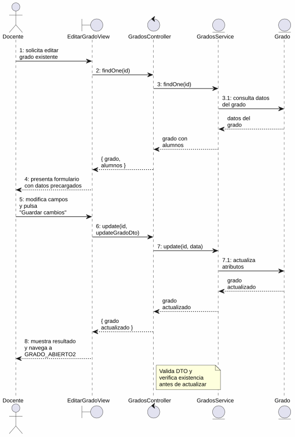
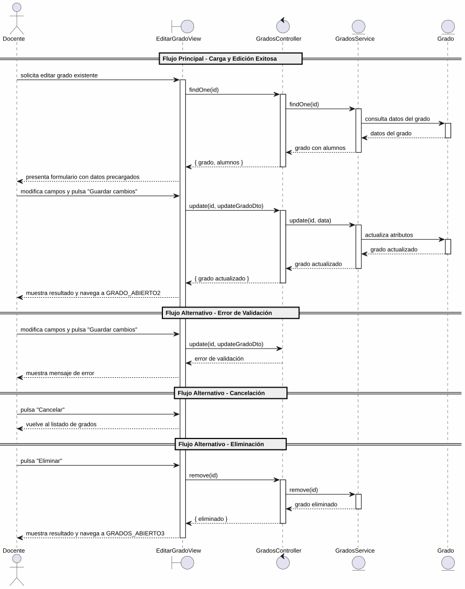

# 25-26-idsw2-sdVC > editarGrado > Análisis

## información del artefacto

- **Proyecto**: Sistema de Gestión de Exámenes Universitarios
- **Fase RUP**: Elaboration (Elaboración)
- **Disciplina**: Análisis y Diseño
- **Versión**: 1.0
- **Fecha**: 2026-06-01
- **Autor**: Marcos Gutierrez

## propósito

Análisis de colaboración del caso de uso `editarGrado()` mediante el patrón MVC, identificando las clases de análisis, sus responsabilidades y colaboraciones necesarias para cumplir con los requisitos especificados.

## diagrama de colaboración

||
|-|
|Código fuente: [colaboracion.puml](../../../modelosUML/analisis/editarGrado/colaboracion.puml)|

## clases de análisis identificadas

### clases de vista (boundary)

#### EditarGradoView
**Estereotipo**: Vista (Boundary)
**Responsabilidades**:
- Recibir la solicitud de edición desde 2 orígenes (GRADO_ABIERTO, GRADOS_ABIERTO)
- Solicitar la carga de datos existentes del grado
- Presentar formulario con datos precargados: Nombre del Grado, Código Oficial, Alumnos enlistados
- Permitir modificar campos, guardar cambios, cancelar y eliminar
- Validar visualmente los campos obligatorios antes de enviar
- Visualizar el resultado final (éxito, error)

**Colaboraciones**:
- **Entrada**: Recibe `editarGrado(id)` desde 2 orígenes (vista de grado, listado de grados)
- **Control**: Se comunica con `GradosController`
- **Salida**: Navega a `GRADO_ABIERTO2` (guardar), `GRADOS_ABIERTO2` (cancelar) o `GRADOS_ABIERTO3` (eliminar)

### clases de control

#### GradosController
**Estereotipo**: Control
**Responsabilidades**:
- Coordinar la carga de datos existentes del grado a editar
- Coordinar la lógica de actualización de un grado existente
- Validar los datos de entrada del DTO de actualización
- Verificar que el grado existe antes de cualquier operación
- Gestionar la eliminación del grado cuando se solicita
- Gestionar la respuesta de éxito o error

**Colaboraciones**:
- **Vista**: Responde a solicitudes de `EditarGradoView`
- **Repositorio**: Delega operaciones de persistencia a `GradosService`

### clases de entidad (entity)

#### GradosService
**Estereotipo**: Entidad
**Responsabilidades**:
- Abstraer el acceso a datos de grados
- Proporcionar método para obtener un grado por ID con sus relaciones (asignaturas, alumnos)
- Proporcionar método para actualizar un grado existente
- Proporcionar método para eliminar un grado
- Validar la existencia del grado antes de cada operación

**Colaboraciones**:
- **Control**: Responde a `GradosController`
- **Entidad**: Gestiona instancias de `Grado` y `Alumno`

#### Grado
**Estereotipo**: Entidad
**Responsabilidades**:
- Representar un grado universitario del sistema
- Encapsular atributos: id, titulo, codigo
- Permitir la actualización de sus atributos
- Relacionarse con asignaturas y alumnos

**Atributos relevantes**:
| Campo | Tipo | Descripción |
|-------|------|-------------|
| `id` | Int (PK) | Identificador único del grado |
| `titulo` | String | Nombre del grado |
| `codigo` | String (unique) | Código identificador del grado |

**Colaboraciones**:
- **GradosService**: Es gestionada por el servicio
- **Alumno**: Relación con alumnos enlistados

## diagrama de secuencia

||
|-|
|Código fuente: [secuencia.puml](../../../modelosUML/analisis/editarGrado/secuencia.puml)|

## flujo de colaboración

### secuencia de operaciones (flujo principal — edición exitosa)

1. **Inicio**: Desde cualquiera de los 2 orígenes → `EditarGradoView.editarGrado(id)`
2. **Carga de datos**: `EditarGradoView` → `GradosController.findOne(id)`
3. **Verificación**: `GradosController` → `GradosService.findOne(id)` → verifica existencia y retorna datos con alumnos
4. **Devolución**: `GradosService` → `GradosController` → `EditarGradoView`: grado con datos completos
5. **Presentación**: `EditarGradoView` muestra formulario con datos precargados (Nombre, Código, Alumnos)
6. **Modificación**: Docente modifica campos (nombre, código, gestión de alumnos)
7. **Guardado**: Docente pulsa "Guardar cambios" → `EditarGradoView` → `GradosController.update(id, updateGradoDto)`
8. **Validación**: `GradosController` valida los datos de entrada
9. **Persistencia**: `GradosController` → `GradosService.update(id, data)` → verifica existencia y actualiza
10. **Resultado**: `GradosService` → `GradosController` → `EditarGradoView` → Docente: grado actualizado + navegación a `GRADO_ABIERTO2`

### flujo alternativo — error de validación

- Paso 8 falla por datos inválidos (validación del controlador)
- `GradosController` retorna error a `EditarGradoView`
- `EditarGradoView` muestra mensaje de error al Docente

### flujo alternativo — cancelación

- Docente pulsa "Cancelar" en el formulario
- `EditarGradoView` regresa al listado de grados (`GRADOS_ABIERTO2`)
- No se ejecuta ninguna actualización ni persistencia

### flujo alternativo — eliminación

- Docente pulsa "Eliminar" en el formulario
- `EditarGradoView` → `GradosController.remove(id)`
- `GradosController` → `GradosService.remove(id)` → verifica existencia y elimina
- `EditarGradoView` navega a `GRADOS_ABIERTO3`

### opciones de navegación disponibles

| Acción | Destino | Descripción |
|--------|---------|-------------|
| `Guardar cambios` | `GRADO_ABIERTO2` | Guarda los cambios y permanece en la vista del grado |
| `Cancelar` | `GRADOS_ABIERTO2` | Vuelve al listado sin guardar |
| `Eliminar` | `GRADOS_ABIERTO3` | Elimina el grado y vuelve al listado |

## estados de análisis

Los estados se corresponden con el diagrama de estados detallado en `contexto/casos-de-uso/detalladoCasosDeUso/editarGrado/editarGrado.puml`:

| Estado | Descripción |
|--------|-------------|
| `EditandoDatos` | El docente solicita editar un grado existente; el sistema inicia la carga de datos |
| `GuardandoDatos` | El sistema presenta el formulario con datos precargados; el docente modifica campos, guarda cambios, cancela la edición o elimina |

**Transiciones clave:**
- `EditandoDatos` → `GuardandoDatos`: Sistema carga y presenta datos del grado con campos editables
- `GuardandoDatos` → `EditandoDatos`: Docente solicita modificar campos
- `GuardandoDatos` → `[*]`: Docente guarda cambios (salida a `GRADO_ABIERTO2`)
- `GuardandoDatos` → `GRADOS_ABIERTO2`: Cancelación
- `GuardandoDatos` → `GRADOS_ABIERTO3`: Eliminación

## correspondencia con requisitos

### mapeado con especificación detallada

| Requisito del caso de uso | Clase responsable | Método/Colaboración |
|--------------------------|-------------------|---------------------|
| Recibir solicitud de edición desde 2 orígenes | `EditarGradoView` | Entrada desde vista y listado de grados |
| Cargar datos existentes del grado | `GradosController` | `findOne(id)` → `GradosService.findOne(id)` |
| Mostrar formulario con datos precargados | `EditarGradoView` | Nombre, Código, Alumnos |
| Validar campos obligatorios | `EditarGradoView` | Validación visual antes de enviar |
| Actualizar grado con datos modificados | `GradosController` | `update(id, updateGradoDto)` |
| Validar integridad de datos de entrada | `GradosController` | Validación de DTO |
| Verificar existencia del grado | `GradosService` | `findOne(id)` lanza excepción si no existe |
| Persistir actualización | `GradosService` | `update(id, data)` |
| Eliminar grado | `GradosController` | `remove(id)` → `GradosService.remove(id)` |
| Transicionar a guardado exitoso | `EditarGradoView` | Navegación a `GRADO_ABIERTO2` |
| Cancelar edición | `EditarGradoView` | Navegación a `GRADOS_ABIERTO2` |

### patrón de colaboración establecido

- **Entrada dual**: Desde 2 orígenes (vista de grado, listado de grados)
- **Análisis MVC completo**: Vista, Control y Entidad claramente separados
- **Salida triple**: Guardar, Cancelar y Eliminar con destinos diferenciados
- **Flujo con carga previa**: Primero carga datos existentes, luego permite modificar y guardar

## trazabilidad con la implementación

| Capa | Artefacto real |
|------|----------------|
| Controlador | `src/apps/backend/src/grados/grados.controller.ts` (`PATCH /grados/:id`, `DELETE /grados/:id`, `GET /grados/:id`) |
| Servicio | `src/apps/backend/src/grados/grados.service.ts` (`update()`, `remove()`, `findOne()`) |
| DTO | `src/apps/backend/src/grados/dto/update-grado.dto.ts` (`UpdateGradoDto`) |
| Vista | `src/apps/frontend/src/views/GradosView.vue` (diálogo de edición) |
| Modelo (BD) | `src/apps/backend/prisma/schema.prisma` (modelo `Grado`) |

> **Nota:** Este caso de uso está priorizado como #19 y ya tiene implementación completa en el backend (`GradosService.update()`, `GradosService.remove()`, `GradosService.findOne()`). El diagrama de estados detallado y el prototipo incluyen "Alumnos enlistados" como campo gestionable en la edición; la implementación real del frontend solo gestiona Título y Código en el diálogo de edición. El análisis se ha realizado a partir de los artefactos de requisitos y validado contra la implementación real.

## patrones aplicados

### repository pattern
`GradosService` abstrae el acceso a datos de grados, encapsulando operaciones de carga, actualización y eliminación con verificación de existencia.

### mvc pattern
Separación clara entre presentación (`EditarGradoView`), lógica de aplicación (`GradosController`) y datos (`Grado`, `GradosService`).

### navigation pattern
Las opciones de "Guardar cambios", "Cancelar" y "Eliminar" permiten al docente controlar el flujo, con salida diferenciada según la acción.
